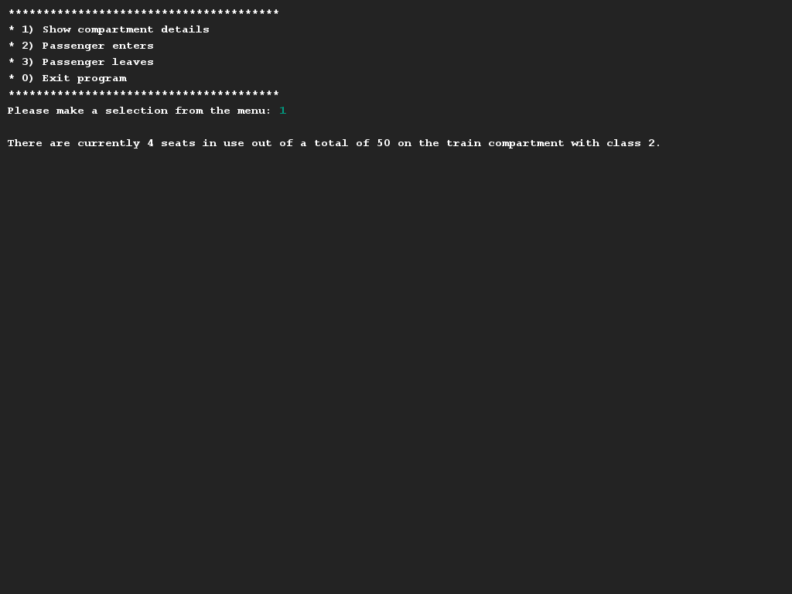
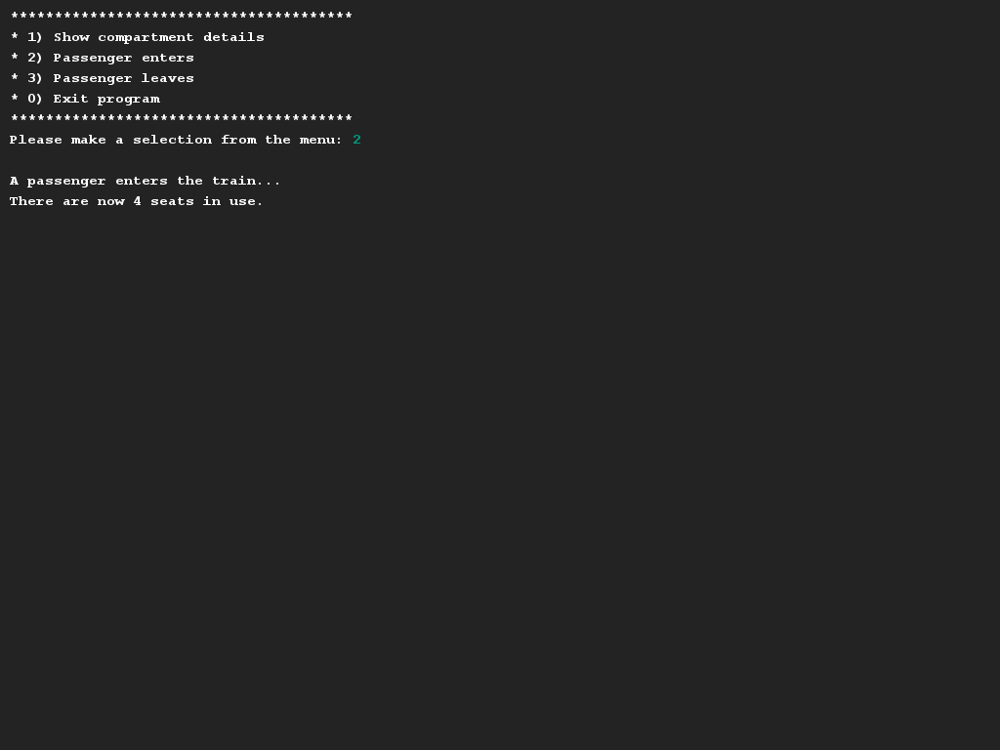

# Train compartment
## Difficulty:    

View the `TrainCompartment` class. Your task is to properly apply encapsulation to this class. Make sure that: 
- All public variables are shielded from the outside world.
- Each compartment has 50 seats as standard, 2nd class and 0 filled seats. 
- There are getters methods for the different variables
- There is a method `enter()`by which one new passenger enters the train. This is only allowed when there are still seats available. If there are no more seats available this will be printed out.
- There is a method `leave()` with which one passenger leaves the train. So now another seat becomes available. If no-one is left to leave, print a message.

Make an instance of the `TrainCompartment` and test if your implementation works correctly. Also test the situations that can go wrong.

## Examples for inspiration

In case the train is empty:

## Relevant links
* [Java documentation for the SaxionApp](https://saxionapp.hboictlab.nl/nl/saxion/app/SaxionApp.html)
