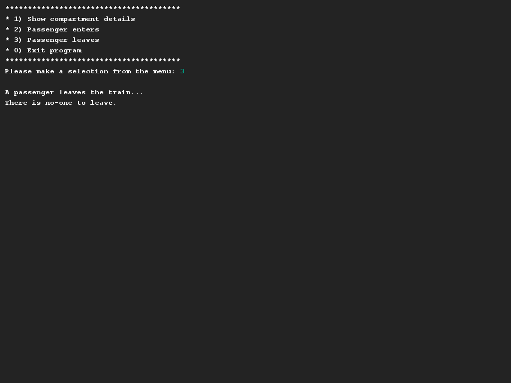

# Treincoupé
## Moeilijkheid:    

Bekijk de klasse `TrainCompartment`. Jouw taak is om encapsulatie goed toe te passen op deze klasse. Zorg ervoor dat: 
- alle publieke variabelen afgeschermd worden van de buitenwereld.
- Elke coupé standaard 50 zitjes hebben, 2e klasse zijn en 0 gevulde stoeltjes hebben. 
- Er getters methoden zijn voor de verschillende variabelen
- Er een methode `enter()` is, waarmee er één nieuwe passagier de trein binnenstapt. Dit is enkel toegestaan wanneer er nog stoelen beschikbaar zijn. Indien er geen stoelen meer beschikbaar zijn wordt dit geprint.
- Er een methode `leave()` is, waarmee er één passagier de trein verlaat. Er komt dus nu weer een stoel vrij. Als er niemand in de trein zit wordt dit ook geprint.

Maak een instantie van de `TrainCompartment` en test of je implementatie correct werkt.

## Voorbeelden

## Relevante links
* [Java documentatie van de SaxionApp](https://saxionapp.hboictlab.nl/nl/saxion/app/SaxionApp.html)

