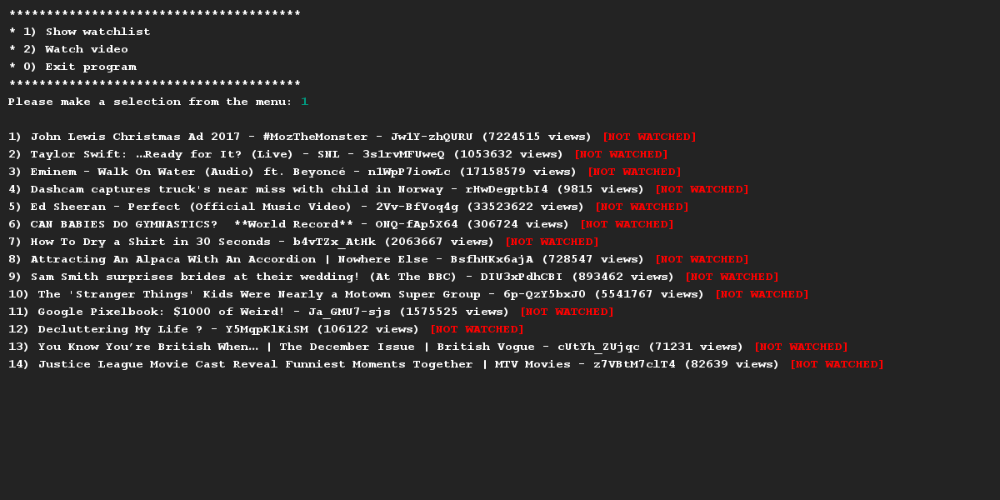
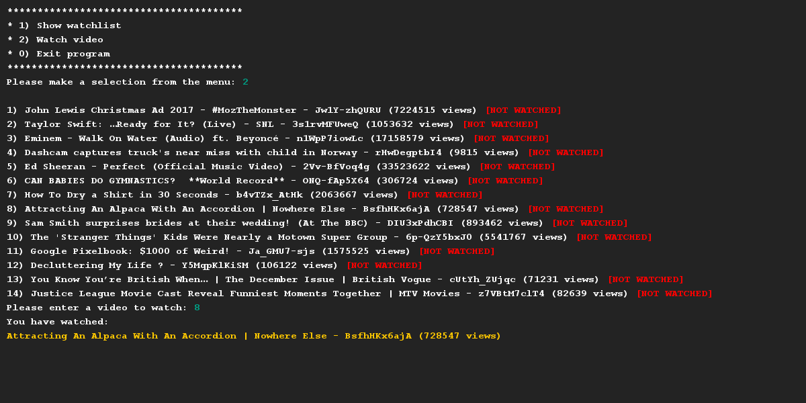
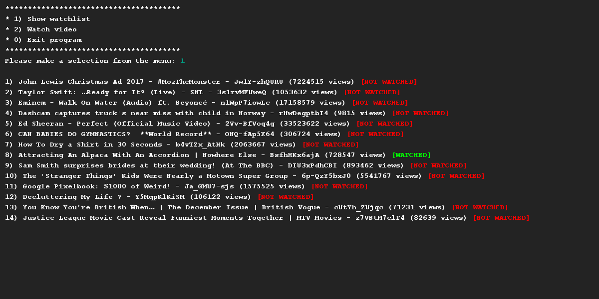

# YouTube Video
## Difficulty:    

Implement a class `Video` and build an application to keep track of your watched videos. For each video, we must save: the Youtube identifier, the title, the number of views and whether or not you watched it.

- Apply encapsulation; make sure that the instance variables of your class are shielded.
- Create a corresponding getter/setters where necessary. 
- Write a toString() method that prints the attributes of the video and neatly (see output below, it's the menu item).The last part of the line ([NOT WATCHED] or [WATCHED]) cannot be printed by the toString() method due to the fact that it must be printed in color. 
- Create a method `watch()`, which simulates that the video is being watched. Make sure that the video is marked as watched in the overview.

We have provided a dataset for you to use.

## Examples for inspiration

## Relevant links
* [Java documentation for the SaxionApp](https://saxionapp.hboictlab.nl/nl/saxion/app/SaxionApp.html)

