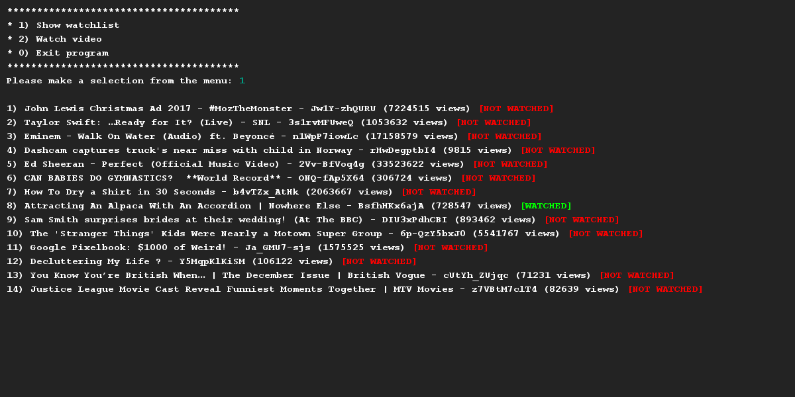

# YouTube Video
## Moeilijkheid:    

Implementeer een klasse `Video` waarmee je een applicatie bouwt die een kijk-lijst van Youtube video bijhoudt. Van een video moet worden opgeslagen: de Youtube-id, de titel, het aantal views en of jij de video al gezien hebt.

- Pas encapsulatie toe; zorg ervoor dat de instantievariabelen van je klasse afgeschermd zijn.
- Maak een bijbehorende getters/setters waar nodig. 
- Schrijf een toString() methode die de attributen van de video op en nette manier print (zie de menuitems in het voorbeeld). Het [NOT WATCHED] (of [WATCHED]) deel moet in kleur geprint worden en kan daarom niet worden opgenomen in de toString().
- Maak een methode `watch()`, die simuleert dat de video wordt bekeken en deze afstreept van de lijst.

We hebben een dataset opgeleverd die je kan gebruiken voor deze opdracht.

## Voorbeelden

## Relevante links
* [Java documentatie van de SaxionApp](https://saxionapp.hboictlab.nl/nl/saxion/app/SaxionApp.html)

