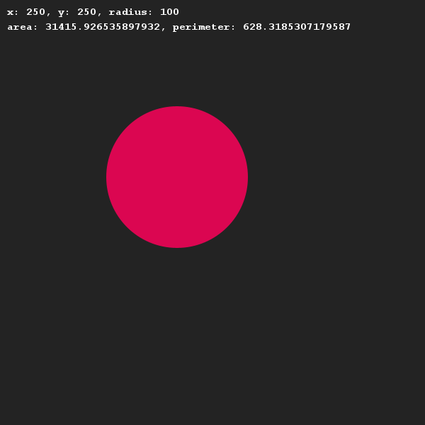
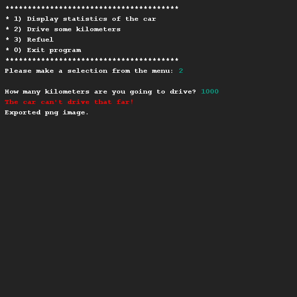

# Fueling a car
## Difficulty:    

We are going to build a class and implement methods to simulate the use of a new car. Read through all the requirements before you start building!

Create a car class that includes the following characteristics: brand, license plate, tank size in litres, current tank position, fuel consumption (consumption 16 means 16 km on 1 litre of petrol) and mileage.

####Requirements:
- Make sure you have a constructor with which you can set the brand, license plate, tank size and fuel consumption.
- As soon as an instance of the Auto class is created, the tank must be full and the mileage reading must be set to 0.
- Create getters and setters for the information that must be available to the outside world, but make sure, for example, that fuel consumption and mileage reading cannot be adjusted by the outside world.
- Create the following methods:
  - `drive(int km)`: This method simulates that the car is driving. Based on the number of kilometres driven, the amount of petrol in the tank decreases (and the odometer reading increases). When the tank is empty, the car stops.
  - `fuel(int litres)`: This method simulates that the tank is refilled. Note that the tank cannot be refilled beyond the maximum tank size.
- Create a toString() method that produces the next string: *brand* (*license plate*), tank info: (*current* / *max*)) and mileage.

## Examples for inspiration

## Relevant links
* [Java documentation for the SaxionApp](https://saxionapp.hboictlab.nl/nl/saxion/app/SaxionApp.html)

