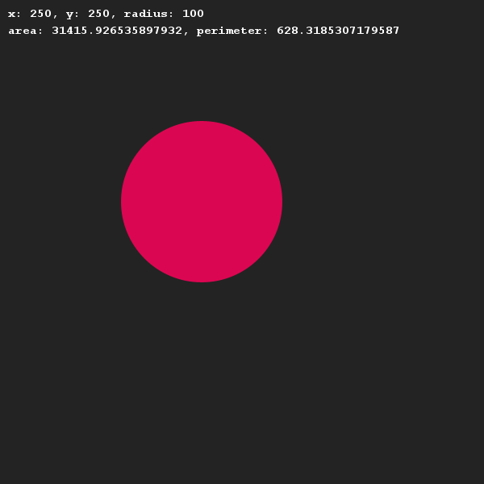
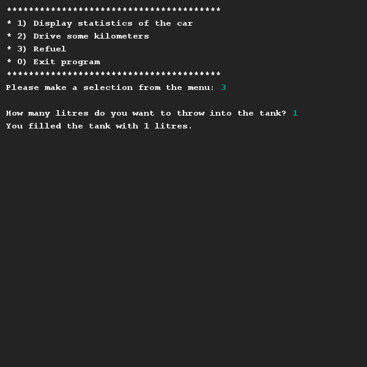
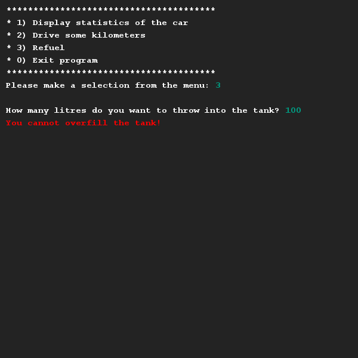
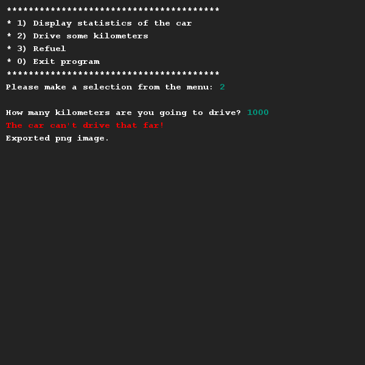

# Autoverbruik
## Moeilijkheid:    

We gaan zo een klasse bouwen en methoden implementeren waarmee we gebruik van een nieuwe auto gaan simuleren. Lees eerst alle eisen door voordat je begint met bouwen!

Maak een Auto klasse die de volgende eigenschappen op slaat: merk, kenteken, tank grootte in liters, huidige tank stand, verbruik (verbruik 16 betekent 16 km op 1 liter benzine) en de kilometerstand.

####Eisen:
- Zorg ervoor dat je een constructor hebt waarmee je het merk, kenteken, tank grootte en verbruik kunt instellen.
- Zodra een instantie van de Auto klasse wordt aangemaakt moet de tank vol zijn en de kilometerstand op 0 staan.
- Maak getters en setters aan voor de informatie die voor de buitenwereld beschikbaar moeten zijn, maar zorg ervoor dat bijvoorbeeld verbruik en kilometerstand niet kunnen worden aangepast door de buitenwereld.
- Maak de volgende methoden:
  - `drive(int km)`: Deze methode simuleert dat de auto rijdt. Op basis van het aantal kilometer dat er gereden wordt neemt de hoeveelheid benzine in de tank af (en de kilometerstand toe). Als de tank leeg is stopt de auto.
  - `fuel(int liters)`: Deze methode simuleert dat de tank wordt bijgevuld. Let op dat de tank niet verder bijgevuld kan worden dan de maximale tank grootte.
- Maak een toString() methode die de volgende string oplevert: *merk* (*kenteken*), tankstand: (*huidig* / *maximaal*)) en kilometerstand.

## Voorbeelden

## Relevante links
* [Java documentatie van de SaxionApp](https://saxionapp.hboictlab.nl/nl/saxion/app/SaxionApp.html)

