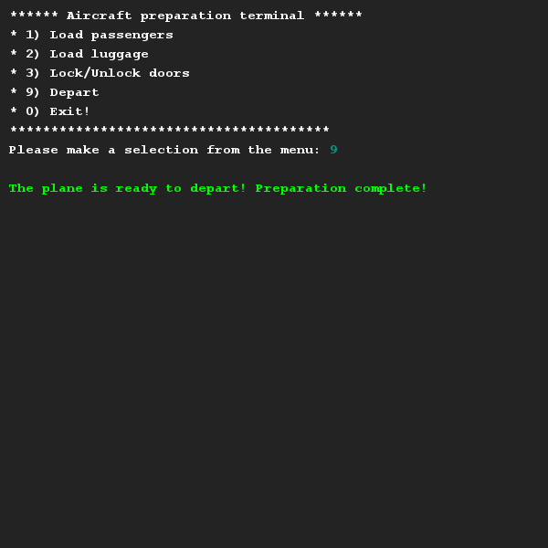
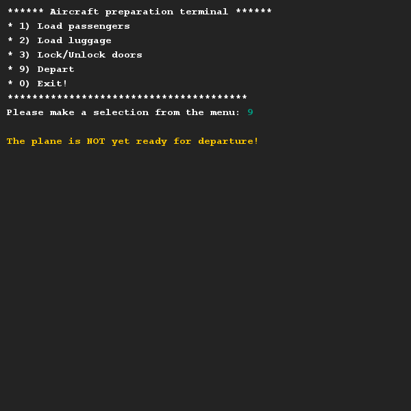
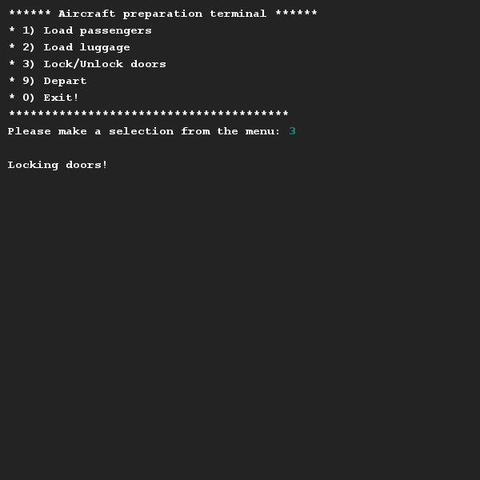
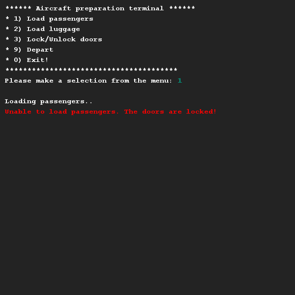

# Airplane
## Difficulty:    

Write a class `Airplane` that represents an airplane. We are going to use this class to write a program, which allows you to check if an aircraft is _ready to depart_. A plane is ready to depart if 3 conditions are met:
1. All passengers have boarded (represented by the method `loadPassengers()`).
2. All luggage has been loaded (represented by the `loadLuggage()` method).
3. The doors of the aircraft are locked (presented by the method `lockDoors()` and `unlockDoors()`).

Especially this last condition (of the doors) is problematic and may clash with the previous conditions. After all, if the doors are closed, no passengers and luggage can be loaded. So the doors really need to be _unlocked_ before loading can begin.

You need to implement the above methods yourself. You don't have to model individual passengers, a boolean value indicating that _everyone is on board_ and _all luggage is on board_ is sufficient.

Finally, implement the method `depart()` which allows you to make the plane depart. This method should check the conditions listed above. If something is wrong (e.g. the doors are not closed), a correct error message should be given.

To test your program easily, we have already given you a menu that you can use, including 3 scenarios that you can run yourself. Think about possible variations of these scenarios and test them too! Testing is an important part of programming.

## Examples for inspiration
After hitting menu options 1, 2 and 3 first.. we can depart.

In case either of options 1, 2 or 3 haven't been done yet.. we can NOT depart!

The doors can toggle. In this case only the locking situation is shown.

And obviously, you cannot load luggage or passengers whenever the doors are locked.

## Relevant links
* [Java documentation for the SaxionApp](https://saxionapp.hboictlab.nl/nl/saxion/app/SaxionApp.html)

