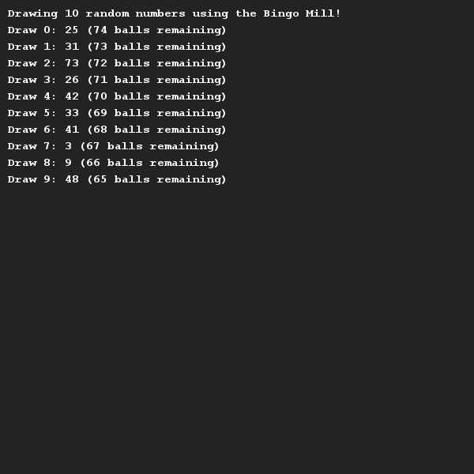

# Bingo mill
## Difficulty:   

With this assignment we are going to build a bingo mill. Next week you will build the rest of the game. Read the assignment carefully before you start programming!

A bingo mill is a device that is used to determine the next number for the game of bingo. The balls in the mill run from 1 to 75.
When playing the game, each number can only be drawn once! You will also need to build a `reset()` function so that the game can be played again.

#### Requirements:
- Make sure you have a constructor with which the bingo mill can be built and all balls (numbers 1 to 75 in a list) can be added.
- Once the numbers have been created, the list must be shuffled (see **shuffle**).
- A `getNumberOfBallsRemaining()` method indicating how many balls are left in the device.
- A `draw()` method that returns the next ball. When someone calls the `draw()` method and there are no more balls left in the device, this method returns the value -1.
- A `reset()` method that resets the device.

####Shuffle:
To make sure that we constantly get a new random ball out of the bingo mill we are going to build <u>our own</u> shuffle algorithm.
As soon as the bingo mill is created, or when someone invokes the `reset()` method, the numbers 1 to 75 will be added to the machine.
Then we can shuffle the list with the following algorithm steps:
- Generate 2 random indexes and swap the elements in these two places.
- Repeat this a few hundred times.

By first filling in the list with all unique values (1-75) and then shuffling it, we can be sure that all numbers appear and there are no duplicates. Now you still have to figure out how to return the numbers 1-for-1!

## Example

## Relevant links
* [Rules of Bingo](https://en.wikipedia.org/wiki/Bingo_(American_version))
* [Java documentation for the SaxionApp](https://saxionapp.hboictlab.nl/nl/saxion/app/SaxionApp.html)
* [Overview of Shuffle algorithms](https://en.wikipedia.org/wiki/Fisher%E2%80%93Yates_shuffle)

