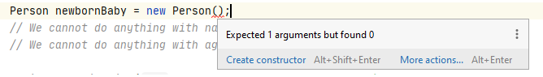

# Encapsulation
Competency: _I understand the concept of encapsulation and can apply the relevant associated concepts (public / private, getters and setters, constructors) ._

The assignments can be found in the separate modules.

# Introduction
One of the pillars of object-oriented programming is _encapsulation_ (_encapsulation_ literally means _encapsulate_ or _wrap_). In this lesson we will therefore learn what encapsulation means, what exactly you should do with it as a programmer, how you can ensure that your classes are _encapsulated_ and especially: _why_ do you want certain classes _encapsulated_?

To properly explain encapsulation, it is necessary to know a little more about (the design of) classes and the attributes that are included in the classes. Encapsulation serves to ensure _that the state of an object (an instance of a class) remains valid at all times_. But what are we talking about when talking about the state of an object? And when is a "state" valid? And is there such a thing as an "invalid state"?

In short: Before we can talk about encapsulation, we must first talk about the _state_ of objects.

## States of objects
A _state_ of an object is determined by looking at the overall picture of the object and in particular the values of the attributes in the object. Take the class "Person" below for example:

``` java
public class Person {
    String name = "";
    int age = 0;
}
```

In this class you see 2 attributes (name and age) and together this information represents a person. In our program it is mandatory to enter these values because we want to use them to find (eg) "the youngest person" and print his / her name. Normally you write the following code:

``` java
Person p = new Person ();
p.name = "John Smith";
p.age = 25;
```

What we have now done is to give the object an "initial state". The object now represents a 25 year old person named "John Smith". It's not hard to imagine "that this could be", since the chosen values for the attributes `name` and` age` are logically chosen (25 is a valid age, "John" is a valid name). In object-oriented programming we therefore speak of _this object_ in a _valid state_, all values have been entered with valid values and have a certain logical meaning.

This can of course also be done differently! Take this piece of code for example:

``` java
Person p = new Person ();
p.name = "J|_+a%$@neHa42#@@#rrison";
p.age = -15;
```

In this case, you will probably soon see what the problems are here. Semantically (what the attribute represents in this class) both the name and age are of course completely wrong! The name is separate and contains (for the most places in the world) invalid characters and what exactly does a negative age represent? Does that mean this person is not yet born? Or is this a programming error?

Let's say that within our program, with which we want to find a youngest person from a list of persons, the name is still acceptable (after all, it is a valid String), but of course the age will cause problems: This person will probably always youngest person to be found. Of course, things like calculating an average age will probably just go wrong with this type of person.

Within object oriented programming we speak in this case about the fact that _this Person object has ended up in an ** invalid ** state_. It contains values that are illogical (or just shouldn't be) and could potentially bug the rest of your application.

(Technically there are also reasons why your object can get into an invalid state, e.g. due to values that are not filled in, but we'll talk about this later!)

You may understand that invalid states of objects is an undesirable thing in programming. Therefore, as a programmer you should always be vigilant about the _condition_ of your program and you must at all times try to prevent you, your users or fellow programmers from doing anything that makes this possible. For example, think about the age problem. A simple age check (`if (age <0) {// ERROR!})`) Is sufficient in most cases to solve these kinds of problems.

And thinking about your own software in this way is the core of _encapsulation_. You are going to provide certain parts of your code (eg your attributes) with a layer of code ("encapsulation") to prevent your program from getting into an invalid state.

## Encapsulation as a protective layer

So how do you actually prevent your program from entering an invalid state? Let's take a look at this with an example:

We use the Person class from the previous example:

``` java
public class Person {
    String name = "";
    int age = 0;
}
```

If you then have to write a piece of functionality with which you have to add a new person to the administration (because a baby is being born, for example), you can do that with:
``` java
Person newbornBaby = new Person ();
newbornBaby.name = "John";
newbornBaby.age = 0; // No birthday's yet!

SaxionApp.printLine ("Baby" + newbornBaby.name + "is currently" + newbornBaby.age + "years old!");
```

In terms of code, there is little wrong with this code: You create a new instance of the class `Person` and give it some initial value. But what if this baby gets older? It is fairly easy to understand that once the baby's birthday you need to increase the value of the `age` attribute. And this is of course also very easy to program:
``` java
p.age = p.age + 1 // Or: p.age ++;
```

But just as easily as you can make someone a year older, you can also make this person a year younger. Or instead of the person becoming 1 year older on their birthday, someone can suddenly become 10 years older due to a mistake! Or someone can even enter a negative age .. which can get your object back to an invalid state!

All these problems can be traced back to "uncontrolled" access to the `age` attribute. Whether you are working in the Person class or in a part of your program where you use a Person variable: you can always change the value at `age` without any control. There is no control whatsoever!

And that brings us right to a first solution: shielding attributes. We will prevent that you can get "directly" to the variable `age` by including a piece as a protection.

## Private and public attributes
The problem that you can make an age negative stems from the fact that you can adjust the `age` attribute directly from your software. You can do this from the code within the class itself, but also from any other point where you use the class in your code. And this is exactly the problem: _as a developer of the class `Person` you have no control over what exactly happens with the value of` age`!_

*(You could make the argument that this is not your problem since "the other programmer" just has to pay more attention, but you understand that of course that is not neat and you as a developer must ensure that there are no crazy things with you. code can happen! And in this module, we're going to teach you how to do this neatly.)

The easiest solution to prevent the value of `age` from being changed to something that is not valid, is to simply prevent this value from being changed by others at all. So we want to protect the attribute `age` from the _outside world_ (all code that is not in the class` Person`) and we can do this by creating the attribute _private_. A _private_ attribute is an attribute that can _not_ be used from outside the class.

You create a _private_ attribute by literally putting the word "private" in front of the attribute:
  
``` java
public class Person {
    String name = "";
    private int age = 0;
}
```
(We intentionally leave the `name` attribute public for a while to show the difference. However, you can imagine that this attribute may also need to be protected!)

By adding the word `private` you say in your code that it is no longer possible to change the attribute` age` directly. You will be able to see the result immediately if you are using IntelliJ and look at the error message:

```! [Access-denied] (resources / error-private-access.png)```

In this way we have solved our previously posed problem and the object will no longer be able to get into an invalid state (due to its age), since you now have no access to the attribute _age_ at all (unless you write code yourself in _Person. Java_)! Note that we can no longer read the value of `age` for printing, for example. The choice to be able to access the attribute from "outside the class" is hard: you can either allow to see the attribute and thus automatically read and edit it or you can not allow anything. Do this by placing the words `public` and` private` before an attribute in your class. (Until now we have never put anything there, you can now compare this with public.) There is no further way to get, for example, a "read-only" option directly on an attribute. So it is "either all" or "nothing" in terms of access to attributes.

But how do you make sure that you * can * do something with this age? So how can you read the value and use it in your program, without it being immediately adjustable? The answer is simple: _with methods_. We are going to extend the class `Person` with a number of methods to get the functionality

and that we need, but also can perform the checks that will ensure that our program always works correctly.

For our example we need 2 pieces of functionality that we are currently missing, namely being able to increase the age by 1 (if someone's birthday) and request the value so that we can print it.

You can implement this as follows:
``` java
public class Person {
    String name;
    private int age;

    public void haveBirthday () {
        age ++;
    }

    public int getAge () {
        return age;
    }
}
```
(To be clear: The `haveBirthday` method has no parameters, so every time the method is called it will increment the value of the` age` attribute of this instance by 1. This behavior always remains the same for each call. the method `getAge`, which returns a * copy * of the value of the variable` age` that cannot be further edited, so you cannot do something like `newbornBaby.getAge () = 13;`.)

Now if we want to do the same as before, the code to use the class becomes:

``` java
Person newbornBaby = new Person ();
newbornBaby.name = "John";
// We cannot do anything with age directly!

SaxionApp.printLine ("Baby" + newbornBaby.name + "is currently" + newbornBaby.getAge () + "years old!"); // John is by default 0 years old.
newbornBaby.haveBirthday ();

SaxionApp.printLine ("Baby" + newbornBaby.name + "is currently" + newbornBaby.getAge () + "years old!"); // John is now 1 year old!

```
We have now created a class `Person` that manages the variable "age" as it were and will ensure that this attribute cannot be given an invalid value (just check: can you still enter a negative age? getting younger?).

However, we are not quite done with the 'Person' class yet. A new person always has an age of 0 when it is created. This is fine for babies, of course, but it is easy to imagine that we also want to add people who are not just born to our system. And you might imagine that making a loop to call the `haveBirthDay ()` 25 times now, for a person of 25 years old, could never be the intention!

We also have a problem with the name of a person: this attribute can also be adjusted from the outside and it is also possible that someone forgets to put a name. In that case the person will be called "" (empty String). This is also something that is not desirable.

It is therefore time to look at the next part of encapsulation: Using _constructors_.

## Constructors
Until now we have taught you to specify default values for all attributes so that if an attribute is not overwritten, something could always be displayed. You may understand that this is not quite the correct way of working: Sometimes an attribute is optional and that attribute does not have to have a value in itself (e.g. a phone number) and sometimes you want an attribute _always_ to have a valid value because otherwise the instance cannot be used properly (e.g. the name of a person in our previous example).

You can control and influence this behavior by using _constructors_. You can best think of a constructor as a _special method that is called when creating a new instance_. Just like normal methods you can also give constructors parameters that you can then use to provide the attributes with a value.

Suppose we want to apply this technique to achieve the following: To instantiate a class `Person` **a name** must be entered. Then it looks like this:

``` java
package nl.saxion.oop.week1;

public class Person {
    private String name;
    private int age;
    
    public Person (String providedName) {// <--- THIS IS THE CONSTRUCTOR
        name = providedName; // Read as: Overwrite the variable name from the Person instance with the value of providedName
    }
    
   public void haveBirthday () {
       age ++;
   }

   public int getAge () {
       return age;
   }

   public String getName () {
        return name;
    }
}
```
(Note how the constructor differs from a normal method: **no** return type is specified and the method name is always the name of the class itself.)

For the sake of completeness, we immediately made the attribute `name` private and the Person class has been provided with a method to retrieve the value of the name. You can say that the attribute has now been made "read-only" as it is not possible to change the value of `name` after executing the constructor.

If we look at our code example you will also see that the way we now have to create a `Person` instance has changed. The total example now looks like this:

``` java
Person newbornBaby = new Person ("John"); // Note that
the value of "John" is passed to this instance of Person and cannot be changed after setting it like this!
// We cannot do anything with name directly!
// We cannot do anything with age directly!

SaxionApp.printLine ("Baby" + newbornBaby.getName () + "is currently" + newbornBaby.getAge () + "years old!"); // John is by default 0 years old.
newbornBaby.haveBirthday ();

SaxionApp.printLine ("Baby" + newbornBaby.getName () + "is currently" + newbornBaby.getAge () + "years old!"); // John is now 1 year old!
```

Note in particular that the name ("John") is now mandatory when creating the instance. If you forget this you will (of course) receive an error message:



It is now no longer possible to create a `Person` instance without a name. You will always have to give this from now on.

## Getters and setters
The last part of encapsulation that needs to be covered now is the use of "getters and setters". This term is used to indicate a group of methods that actually have only 1 function: being able to (controlled) read out attributes (_getters_) or (controlled) adapting the values of attributes (_setters_). In this competency you have already seen 2 _getters_, namely `getAge ()` and `getName ()`. Note that the names of this method also start literally with _get_. This is not so much required for your code to work, but is very common and increases readability. We therefore _well_ regard it as an obligation.

A _setter_ is a method that can override a certain value of an attribute. In the previous example we could have included a method `setAge` in the class` Person` that allows us to set the age of an individual person. This can look like:
``` java
public void setAge (int newAge) {
   age = newAge;
}
```
Of course, thanks to this method, we can also perform a check for invalid entries (i.e. a negative age):

``` java
public void setAge (int newAge) {
    if (newAge> 0) {
        age = newAge;
    } else {
        // ERROR
    }
}
```

When using getters and setters you should always ask yourself if you want them at all. In our earlier example, we had stated that an age could only be increased in steps of 1 year. (And if we want an age other than 0 to start, we might as well adjust the constructor!) That's why we deliberately chose not to include this setter (`setAge (int newAge)`) _not_ in our program.

### Intermezzo: using "this" in your own class

If you are looking for code samples (or you have getters / setters generated automatically) you will probably often see that setters are often written with this, e.g. in the form of:
``` java
public void setAge (int age) {
   this.age = age;
}
```

The word `this` is added here to distinguish between the argument in the method (named` age`) and the `age` attribute from the Person class. After all, the same name is used for both the argument and the attribute. The word `this` ensures that you refer to the attribute (of the class). So you should read this method as: _Change the value of the `age` attribute of this object to the value of the argument` age`_.

## Conclusion
It's a common (and easy) mistake to create too many getters and setters in your class too quickly. Therefore, use the following guidelines when designing getters / setters for your own classes:

Check per (private) attribute.
1) whether the value of this attribute should be readable: If so, you have to create a getter. If not, omit the getter.
2) whether the value of this attribute should be modifiable: If so, you need to create a setter. If not, you omit the setter.
3) If you have decided that a value is editable, check for yourself if there are any _checks_ to be done on the values before editing it.

(Of course you also have the question: _"If an attribute has to be readable and editable and you don't want to check it, why make the attribute private?"_)

# Relevant videos
[](http://www.youtube.com/watch?v=MgFuRlQ4InI)

Note: The video above has been borrowed from an earlier iteration of the course. The assignment mentioned at the end has been replaced by other assignments. (So you don't have to look for it!)

[](http://www.youtube.com/watch?v=wz6ESsbBYoE)
[](http://www.youtube.com/watch?v=r5jiH5oXqw4)
[](http://www.youtube.com/watch?v=FJbiXRKC-vc)

## Videos from our archives
The following videos are from our archive and don't quite match what you need to do in terms of code examples, but are still very informative!

[](http://www.youtube.com/watch?v=rSfPvgHqktI)

[](http://www.youtube.com/watch?v=l6PsoOykjhU)

# An overcomplete example: A fully developed Person class.

The techniques you learned above will enable you to write a full-fledged class that can be used by multiple developers in a "safe" way. Because we made some choices in the previous examples that you may not agree with, here we show a person class as we could well imagine it in a system that the municipality can use to keep track of which residents live in the municipality.

The system must therefore be able to take into account new people being born, but also that people are dying. Furthermore, people must be able to marry another person and possibly choose to adopt a different surname. All these things together give the class `Person` a lot of responsibilities! We will now show you a possible elaboration to study. (Try to understand for yourself why we make certain choices!)

```java
public class Person {
    private String firstName;
    private String lastName;

    private LocalDate birthDate;
    private LocalDate dateOfDeath;

    private Person registeredPartner;

    public Person(String firstName, String lastName, LocalDate birthDate) {
        this.firstName = firstName;
        this.lastName = lastName;
        this.birthDate = birthDate;

        dateOfDeath = null; // We set this explicitly to null for your understanding. This is however redundant.
        registeredPartner = null; // Same..
    }

    public String getFirstName() {
        return firstName;
    }

    // Note: no setters for first name!

    public String getLastName() {
        return lastName;
    }

    // Suppose someone wants to change their last name in case of marriage (or something else). - Setter allowed!
    public void setLastName(String lastName) {
        this.lastName = lastName;
    }
    
    public void marry(Person otherPerson) {
        if(registeredPartner == null) {
            registeredPartner = otherPerson;
        } else {
            // Uhm.. this is awkward and unhandled for now!
        }
    }
    
    public void divorce() {
        registeredPartner = null; // Explicitly remove the link to the other person.
    }

    public void reportDead() {
        dateOfDeath = LocalDate.now();
    }

    /**
     * Note that this is not actually a getter, but a computed value based on the person's date of birth.
     * If the person has died, the age of the person at the moment of death is returned.
     * @return the number of years the person is / was alive (for)
     */
    public int getAge() {
        if(dateOfDeath != null) {
            return Period.between(birthDate, LocalDate.now()).getYears();
        } else {
            return Period.between(birthDate, dateOfDeath).getYears();
        }
    }

    @Override
    public String toString() {
        return firstName + " " +  lastName;
    }
}
```
