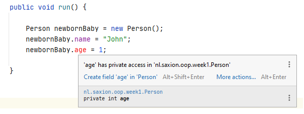
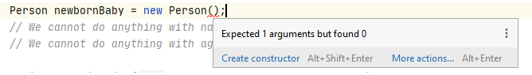

# Encapsulatie
Competentie: _Ik begrijp het concept encapsulatie en kan de relevante bijbehorende concepten (public / private, getters en setters, constructoren) toepassen._

De opdrachten kunnen gevonden worden in de losse modulen. 

# Introductie
Een van de pilaren van het object georienteerd programmeren is _encapsulatie_ (_encapsulation_ betekent letterlijk _inkapselen_ of _omwikkelen_). In deze les gaan we daarom leren wat encapsulatie inhoudt, wat je er precies mee moet als programmeur, hoe je er voor kan zorgen dat jouw classes _encapsulated_ zijn en vooral: _waarom_ wil je bepaalde klassen _encapsulaten_?

Om encapsulatie goed uit te leggen is het nodig om iets meer te weten van (het ontwerp van) classes en de attributen die in de classes zijn opgenomen. Encapsulatie dient er namelijk voor om te zorgen _dat de toestand van een object (een instantie van een klasse) ten alle tijde geldig blijft_. Maar waar hebben we het over als het hebben over de toestand van een object? En wanneer is een "toestand" geldig? En bestaat er ook zoiets als een "ongeldige toestand"?

Kortom: Voordat we het over encapsulatie kunnen hebben moeten we het eerst hebben over de _toestand_ van objecten.

## Toestanden van objecten
Een _toestand_ van een object wordt bepaald door te kijken naar het totaal plaatje van het object en dan met name naar de waarden van de attributen in het object. Neem bijvoorbeeld onderstaande klasse "Person":  

```java
public class Person {
    String name = "";
    int age = 0;
}
```

In deze klasse zie je 2 attributen (name en age) en samen representeert deze informatie een persoon. In ons programma is het verplicht om deze waarden in te vullen want we willen deze gebruiken om (bijv.) "de jongste persoon" te vinden en van deze persoon zijn/haar naam te printen. Normaal gesproken schrijf je dan de volgende code:

```java
Person p = new Person();
p.name = "John Smith";
p.age = 25;
```

Wat we nu gedaan hebben is het object een "initiele toestand" gegeven. Het object representeert nu een 25 jarige persoon genaamd "John Smith". Het is niet moeilijk om je te kunnen voorstellen "dat dit zo kan zijn", aangezien de gekozen waarden voor de attributen `name` en `age` logisch gekozen zijn (25 is een geldige leeftijd, "John" is een geldige naam). Binnen het objectgeorienteerd programmeren spreken we er dan ook van dat _dit object_ in een _geldige toestand verkeert_, alle waarden zijn met geldige waarden ingevuld en hebben een zekere logisch betekenis.

Dit kan natuurlijk ook anders! Neem bijvoorbeeld dit stuk code:

```java
Person p = new Person();
p.name = "J|_+a%$@ne Ha42#@@#rrison";
p.age = -15;
```

In dit geval zie je waarschijnlijk al snel wat hier de problemen zijn. Semantisch gezien (wat het attribuut voorstelt in deze klasse) kloppen zowel de naam als leeftijd natuurlijk niet! De naam is apart en bevat (voor de meerste plekken in de wereld) ongeldige tekens en wat precies stelt een negatieve leeftijd voor? Betekent dat deze persoon nog niet geboren is? Of gaat het hier om een programmeerfout?

Laten we stellen dat binnen ons programma, waarmee we een jongste persoon uit een lijst met personen willen vinden, de naam nog acceptabel is (het is immers een geldige String), maar de leeftijd gaat natuurlijk voor problemen zorgen: Deze persoon zal waarschijnlijk altijd als jongste persoon gevonden gaan worden. Ook zaken als het berekenen van een gemiddelde leeftijd gaan natuurlijk met dit soort personen waarschijnlijk gewoon mis.  

Binnen het object georienteerd programmeren spreken we in dit geval over het feit dat _dit Person object in een **on**geldige toestand is terechtgekomen_. Het bevat waarden die onlogisch zijn (of gewoon niet zouden moeten kunnen) en mogelijk voor fouten in de rest van je applicatie kunnen zorgen.

(Technisch gezien zijn er ook nog redenen waardoor je object in een _ongeldige_ toestand kan komen, bijv. door waarden die niet ingevuld worden, maar hier hebben we het later over!)

Je snapt misschien dat _ongeldige toestanden van objecten_ een onwenselijk iets is tijdens het programmeren. Daarom zal je als programmeur altijd waakzaam moeten zijn over de _toestand_ van je programma en moet je ten alle tijde proberen te voorkomen dat jij, je gebruikers of medeprogrammeurs iets kunnen doen waardoor dit mogelijk is. Denk bijvoorbeeld nog even aan het leeftijd-probleem. Een eenvoudige controle op de leeftijd (`if(age < 0) { // ERROR! })`) volstaat in de meeste gevallen al om dit soort problemen op te lossen.

En op deze manier nadenken over je eigen programmatuur is de kern van _encapsulatie_. Je gaat bepaalde delen van je code (bijv. je attributen) voorzien van een laagje code ("inkapselen") om te voorkomen dat je programma in een ongeldige toestand kan komen.

## Encapsulatie als beschermlaag

Dus hoe voorkom je nu eigenlijk dat je programma in een ongeldige toestand komt? Laten we dit bekijken aan de hand van een voorbeeld:

We gebruiken de klasse Person uit het eerdere voorbeeld:

```java
public class Person {
    String name = "";
    int age = 0;
}
```

Als je vervolgens een stukje functionaliteit moet schrijven waarmee je een nieuw persoon toe moet voegen aan de administratie (want er wordt bijv. een baby geboren), dan kan je dat doen met:
```java
Person newbornBaby = new Person();
newbornBaby.name = "John";
newbornBaby.age = 0; // No birthday's yet!

SaxionApp.printLine("Baby " + newbornBaby.name + " is currently " + newbornBaby.age + " years old!");
```

Qua code is er weinig mis met deze code: Je maakt een nieuwe instantie van de klasse `Person` aan en geeft deze wat initiele waarde. Maar wat nu als deze baby ouder wordt? Het is redelijk eenvoudig om in te zien dat je, zodra de baby jarig is, de waarde van het `age` attribuut moet verhogen. En dit is natuurlijk ook erg eenvoudig te programmeren:
```java
p.age = p.age + 1 // Or: p.age++;
```

Maar net zo gemakkelijk als je iemand een jaar ouder kan maken, kan je deze persoon ook een jaar jonger maken. Of in plaats van dat de persoon op zijn verjaardag 1 jaar ouder wordt, kan er zomaar door een foutje iemand opeens 10 jaar ouder worden! Of iemand kan zelfs een negatieve leeftijd invoeren.. wat je object weer in een _ongeldige toestand_ kan krijgen! 

Al deze problemen zijn te herleiden aan het "ongecontroleerd" toegang hebben tot het attribuut `age`. Of je nu in de klasse Person bezig bent of in een stuk van je programma waar je een Person variabele gebruikt: je kan altijd zomaar bij `age` en zonder enige controle de waarde aanpassen.. Er zit geen enkele controle op!

En dat brengt ons gelijk bij een eerste oplossing: het afschermen van attributen. We gaan voorkomen dat je "direct" bij de variabele `age` kan komen door een stukje als bescherming op te nemen.

## Private en public attributen
Het probleem dat je een leeftijd negatief kan maken komt voort uit het feit dat je het attribuut `age` direct kan aanpassen vanuit je programmatuur. Dit kan je doen vanuit de code binnen de klasse zelf, maar ook vanuit elk ander punt waar je de klasse in je code gebruikt. En hier schuilt precies het probleem: _Als ontwikkelaar van de klasse `Person` heb je geen controle over wat met de waarde van `age` precies gebeurd!_*

(* Je zou het argument kunnen maken dat dit niet jouw probleem is aangezien "de andere programmeur" maar gewoon beter moet opletten, maar je snapt dat dat natuurlijk niet netjes is en jij als ontwikkelaar er voor moet zorgen dat er geen gekke dingen met je code kan gebeuren! En in deze module gaan we je leren hoe je dit netjes doet.)

De makkelijkste oplossing om te voorkomen dat de waarde van `age` wordt aangepast naar iets wat niet geldig is, is het gewoon voorkomen dat deze waarde uberhaupt door anderen aangepast kan worden. We willen het attribuut `age` dus als het ware afschermen voor de _buitenwereld_ (alle code die niet in de klasse `Person` staat) en dit kunnen doen door het attribuut _private_ te maken. Een _private_ attribuut is een attribuut wat _niet_ meer van buiten de klasse te gebruiken is.

Je maakt een attribuut _private_ door letterlijk het woordje "private" voor het attribuut te zetten:
  
```java
public class Person {
    String name = "";
    private int age = 0;
}
```
(Het attribuut `name` laten we opzettelijk nog even publiek om het verschil te laten zien. Je kan je echter voorstellen dat dit attribuut mogelijk ook afgeschermd moet worden!)

Door de toevoeging van het woord `private` zeg je in je code dat het niet langer meer mogelijk is om de attribuut `age` direct aan te passen. Je zal het resultaat hiervan direct kunnen zien als je gebruik maakt van IntelliJ en kijkt naar de foutmelding:



Op deze manier hebben we ons eerder gestelde probleem opgelost en zal het object niet meer in een _ongeldige toestand kunnen komen_ (door de leeftijd), aangezien je nu helemaal geen toegang hebt tot het attribuut _age_ (behalve als je dus zelf code schrijft in _Person.java_)! Merk op dat we de waarde van `age` dus nu ook niet meer kunnen uitlezen om bijvoorbeeld te printen. De keuze om het attribuut te kunnen benaderen van "buiten de klasse" is hard: je kan of toestaan om het attribuut te kunnen zien en daarmee automatisch te kunnen lezen en aanpassen of je kan niets toestaan. Dit doe door de woorden `public` en `private` te plaatsen voor een attribuut in je klasse. (Tot nu toe hebben wij er nog nooit iets neergezet, dit mag je nu vergelijken met public.) Er is verder geen manier om bijv. een "read-only" mogelijkheid direct op een attribuut te krijgen. Het is dus "of alles" of "niets" voor wat betreft toegang tot attributen. 

Maar hoe zorg je er nu voor dat je *wel* iets met deze leeftijd kan doen? Dus hoe kan je de waarde wel uitlezen en gebruiken in je programma, zonder dat deze onmiddelijk aanpasbaar is? Het antwoord er op is simpel: _met methoden_. We gaan de klasse `Person` uitbreiden met een aantal methoden waarmee we de functionaliteit kunnen krijgen die we nodig hebben, maar ook de controles kunnen uitvoeren die er voor gaan zorgen dat ons programma altijd correct werkt.

Voor ons voorbeeld hebben we 2 stukken functionaliteit nodig die we nu missen, namelijk het kunnen ophogen van de leeftijd met 1 (als iemand jarig is) en het opvragen van de waarde zodat we deze kunnen printen.

Dit kan je als volgt implementeren:
```java
public class Person {
    String name;
    private int age;

    public void haveBirthday() {
        age++;
    }

    public int getAge() {
        return age;
    }
}
```
(Voor de duidelijkheid: De methode `haveBirthday` heeft geen parameters en zal dus elke keer als de methode wordt aangeroepen de waarde van het attribuut `age` van deze instantie ophogen met 1. Dit gedrag blijft altijd hetzelfde voor elke aanroep. Hetzelfde geldt voor de methode `getAge`. Deze levert een *kopie* van de waarde van de variabele `age` op die verder niet meer aangepast kan worden. Je kan dus niet iets doen als `newbornBaby.getAge() = 13;`.)

Als we nu hetzelfde willen doen als eerder wordt de code om de klasse te gebruiken:

```java
Person newbornBaby = new Person();
newbornBaby.name = "John";
// We cannot do anything with age directly!

SaxionApp.printLine("Baby " + newbornBaby.name + " is currently " + newbornBaby.getAge() + " years old!"); // John is by default 0 years old.
newbornBaby.haveBirthday();

SaxionApp.printLine("Baby " + newbornBaby.name + " is currently " + newbornBaby.getAge() + " years old!"); // John is now 1 year old!
```

We hebben nu een klasse `Person` gemaakt die de variabele "age" als het ware beheert en er voor zal zorgen dat dit attribuut geen ongeldige waarde kan krijgen (ga maar na: kan je nu nog een negatieve leeftijd invullen? Kan iemand nu nog jonger worden?).

We zijn echter nu nog niet helemaal klaar met de klasse `Person`. Een nieuw persoon heeft namelijk altijd een leeftijd van 0 als deze wordt aangemaakt. Voor babies is dit natuurlijk prima, maar het is eenvoudig voor te stellen dat we ook mensen die niet net geboren zijn willen toevoegen aan ons systeem. En je kan je misschien voorstellen dat een lusje maken om nu, voor een persoon van 25 jaar oud, 25 keer de `haveBirthDay()` aan te roepen ook nooit de bedoeling kan zijn!

Daarbij hebben we nog een probleem met de naam van een persoon: dit attribuut is ook van buitenaf aan te passen en het is ook mogelijk dat iemand vergeet een naam te zetten. In dat geval zal de persoon dus "" (lege String) heten. Ook dit is iets wat niet wenselijk is. 

Het is daarom tijd om naar het volgende onderdeel van encapsulatie te gaan kijken: Het gebruik van _constructors_.

## Constructors
Tot nu toe hebben wij jullie aangeleerd om bij alle attributen standaardwaarden op te geven zodat, mocht een attribuut niet worden overschreven, er altijd iets getoond kon worden. Je snapt misschien dat dit niet helemaal de juiste manier van werken is: Soms is een attribuut optioneel en hoeft dat attribuut op zich geen waarde te hebben (bijv. een telefoonnummer) en soms wil je dat een attribuut _altijd_ een geldige waarde krijgt omdat anders de instantie niet goed te gebruiken is (bijv. de naam van een persoon in ons vorige voorbeeld).

Je kan controle en invloed hebben op dit gedrag door het gebruik van _constructors_. Je kan een constructor het beste zien als een _speciale methode die bij het aanmaken van een nieuwe instantie wordt aangeroepen_. Net zoals normale methoden kan je constructors ook parameters geven die je dan weer kan gebruiken om bijv. de attributen van een waarde te voorzien.

Stel dat we deze techniek willen toepassen om het volgende te bereiken: Om een klasse `Person` te instantieren **moet** een naam worden ingevuld. Dan ziet dit er als volgt uit:

```java
package nl.saxion.oop.week1;

public class Person {
    private String name;
    private int age;
    
    public Person(String providedName) { // <--- THIS IS THE CONSTRUCTOR
        name = providedName; // Read as: Overwrite the variable name from the Person instance with the value of providedName 
    }
    
   public void haveBirthday() {
       age++;
   }

   public int getAge() {
       return age;
   }

   public String getName() {
        return name;
    }
}
```
(Let op hoe de constructor verschilt van een normale methode: Er wordt **geen** returntype gespecificeerd en de naam van de methode is altijd de naam van de klasse zelf.)

Voor de volledigheid hebben wij het attribuut `name` gelijk ook maar private gemaakt en is de klasse Person voorzien van een methode om de waarde van de naam op te halen. Je kan bij deze stellen dat het attribuut nu "read-only" is gemaakt aangezien het niet mogelijk is om, na het uitvoeren van de constructor, de waarde van `name` nog te wijzigen.

Als we naar ons code-voorbeeld kijken zal je ook zien dat de manier waarop wij nu een `Person` instantie moeten aanmaken veranderd is. Het totale voorbeeld ziet er nu als volgt uit:

```java
Person newbornBaby = new Person("John"); // Note that the value of "John" is passed to this instance of Person and cannot be changed after setting it like this!
// We cannot do anything with name directly!
// We cannot do anything with age directly!

SaxionApp.printLine("Baby " + newbornBaby.getName() + " is currently " + newbornBaby.getAge() + " years old!"); // John is by default 0 years old.
newbornBaby.haveBirthday();

SaxionApp.printLine("Baby " + newbornBaby.getName() + " is currently " + newbornBaby.getAge() + " years old!"); // John is now 1 year old!
```

Merk vooral op dat de naam ("John") nu verplicht is bij het aanmaken van de instantie. Als je dit vergeet krijg je hier (uiteraard) een foutmelding van:



Het is nu niet langer mogelijk om een `Person` instantie aan te maken zonder naam. Deze zal je vanaf nu dus altijd moeten meegeven. 

## Getters en setters
Het laatste onderdeel van encapsulatie wat nu behandeld moet worden is het gebruik van "getters en setters". Deze term wordt gebruikt om een groep van methoden aan te duiden die eigenlijk maar 1 functie hebben: het (gecontroleerd) uit kunnen lezen van attributen (_getters_) of het (gecontroleerd) kunnen aanpassen van de waarden van attributen (_setters_). In deze competentie heb je al 2 _getters_ gezien, namelijk `getAge()` en `getName()`. Merk op dat de namen van deze methode ook letterlijk beginnen met _get_. Dit is niet zozeer verplicht om je code te laten werken, maar wel zeer gebruikelijk en verhoogt de leesbaarheid. Wij beschouwen het daarom _wel_ als een verplichting.

Een _setter_ is een methode die een bepaalde waarde van een attribuut kan overschrijven. In het vorige voorbeeld hadden we prima een methode `setAge` kunnen opnemen in de klasse `Person` waarmee wij de leeftijd van een individueel persoon kunnen instellen. Dit kan er dan uit zien als:
```java
public void setAge(int newAge) {
   age = newAge;
}
```
Uiteraard kunnen we dankzij deze methode hier ook gelijk een controle doorvoeren voor ongeldige invoer (dus bijv. een negatieve leeftijd):

```java
public void setAge(int newAge) {
    if(newAge > 0) {
        age = newAge;
    } else {
        // ERROR
    }   
}
``` 

Bij het gebruik van getters en setters moet je je altijd de vraag stellen _of_ je ze uberhaupt wilt hebben. In ons eerdere voorbeeld hadden we gesteld dat een leeftijd uitsluitend met stapjes van 1 jaar verhoogd mocht worden. (En als we een andere leeftijd dan 0 willen hebben om te beginnen, kunnen we net zo goed de constructor aanpassen!) Daarom hebben wij er bewust voor gekozen om deze setter (`setAge(int newAge)`) _niet_ op te nemen in in ons programma.

### Intermezzo: het gebruik van "this" in je eigen klasse

Als je op zoek gaat naar codevoorbeelden (of je laat getters/setters automatisch aanmaken) zal je waarschijnlijk vaak zien dat setters vaak geschreven worden met this, bijv. in de vorm van: 
```java
public void setAge(int age) {
   this.age = age;
}
```

Het woordje `this` wordt hier toegevoegd om een onderscheid te maken tussen het argument in de methode (genaamd `age`) en het attribuut `age` uit de klasse Person. Dezelfde naam wordt immers gebruikt voor zowel het argument als het attribuut. Het woordje `this` zorgt er voor dat je verwijst naar het attribuut (van de klasse). Je moet deze methode dus lezen als: _Verander de waarde van het attribuut `age` van dit object naar de waarde van het argument `age`_.  

## Conclusie
Het is een veel voorkomende (en gemakkelijke) fout om te snel en te veel getters en setters in je klasse aan te maken. Gebruik daarom de volgende richtlijnen als je getters / setters bedenkt voor je eigen klassen:

Ga per (private) attribuut na..
1) of de waarde van dit attribuut uitleesbaar moet zijn: Zo ja, dan moet je een getter aanmaken. Zo nee, dan laat je de getter weg.
2) of de waarde van dit attribuut aanpasbaar moet zijn: Zo ja, dan moet je een setter maken. Zo nee, dan laat je de setter weg.
3) Als je besloten hebt dat een waarde aanpasbaar is, ga dan voor jezelf na of er nog _controles_ moeten plaatsvinden op de waarden voordat je deze aanpast.

(Uiteraard heb je ook nog de vraag: _"Als een attribuut uitleesbaar en aanpasbaar moet zijn en je wil er geen controles op uitvoeren, waarom maak je het attribuut dan private?"_)

De juiste keuzes maken is lastig, maar goed te doen als je per attribuut na blijft gaan waar je het voor wil gebruiken en wat voor belang het heeft voor andere programmeurs. Om hier een voorbeeld van te geven werken we de klasse `Person` nog wat verder uit tot een mooiere (en uitgebreidere) oplossing! 

# Relevant videomateriaal
[](http://www.youtube.com/watch?v=Dpo1KFc77Qo)

Let op: De bovenstaande video komt uit een eerdere uitvoering van de module en bevat aan het eind een verwijzing naar een opdracht die is vervangen. Deze hoef je dus niet te zoeken of uit te voeren.

[](http://www.youtube.com/watch?v=rukYDgb-aMo)
[](http://www.youtube.com/watch?v=qWczdnfYRXg)
[](http://www.youtube.com/watch?v=LCAFEmgHmMQ)

## Videos uit ons archief
De volgende video's komen uit ons archief en sluiten qua codevoorbeelden niet helemaal aan bij wat jullie moeten doen, maar zijn nog steeds zeer leerzaam!

[](http://www.youtube.com/watch?v=AhaHbLMdEDE)
[](http://www.youtube.com/watch?v=UomAMppH1Oc)

# Een uitgebreider voorbeeld: een volwaardige Person klasse!

De technieken die je hier boven hebt geleerd stellen je in staat om een volwaardige klasse te schrijven die door meerdere ontwikkelaars gebruikt kan worden op een "veilige" manier. Omdat wij in de vorige voorbeelden wat keuzes hebben gemaakt waar je mogelijk het niet mee eens kan zijn tonen wij hier een persoon klasse zoals wij ons deze goed voor zouden kunnen stellen in een systeem dat de gemeente kan gebruiken om bij te houden welke bewoners er in de gemeente wonen. 

Het systeem moet dus rekening kunnen houden met nieuwe mensen die geboren worden, maar ook dat er mensen doodgaan. Verder moeten mensen kunnen trouwen met een ander persoon en daarbij mogelijk er voor kunnen kiezen om een andere achternaam aan te nemen. Al deze dingen bij elkaar zorgt er voor dat de klasse `Person` opeens een hoop verantwoordelijkheden krijgt! Wij tonen je hier nu een mogelijke uitwerking om te bestuderen. (Probeer zelf te snappen waarom wij bepaalde keuzes maken!)

```java
public class Person {
    private String firstName;
    private String lastName;

    private LocalDate birthDate;
    private LocalDate dateOfDeath;

    private Person registeredPartner;

    public Person(String firstName, String lastName, LocalDate birthDate) {
        this.firstName = firstName;
        this.lastName = lastName;
        this.birthDate = birthDate;

        dateOfDeath = null; // We set this explicitly to null for your understanding. This is however redundant.
        registeredPartner = null; // Same..
    }

    public String getFirstName() {
        return firstName;
    }

    // Note: no setters for first name!

    public String getLastName() {
        return lastName;
    }

    // Suppose someone wants to change their last name in case of marriage (or something else). - Setter allowed!
    public void setLastName(String lastName) {
        this.lastName = lastName;
    }
    
    public void marry(Person otherPerson) {
        if(registeredPartner == null) {
            registeredPartner = otherPerson;
        } else {
            // Uhm.. this is awkward and unhandled for now!
        }
    }
    
    public void divorce() {
        registeredPartner = null; // Explicitly remove the link to the other person.
    }

    public void reportDead() {
        dateOfDeath = LocalDate.now();
    }

    /**
     * Note that this is not actually a getter, but a computed value based on the person's date of birth.
     * If the person has died, the age of the person at the moment of death is returned.
     * @return the number of years the person is / was alive (for)
     */
    public int getAge() {
        if(dateOfDeath != null) {
            return Period.between(birthDate, LocalDate.now()).getYears();
        } else {
            return Period.between(birthDate, dateOfDeath).getYears();
        }
    }

    @Override
    public String toString() {
        return firstName + " " +  lastName;
    }
}
```
