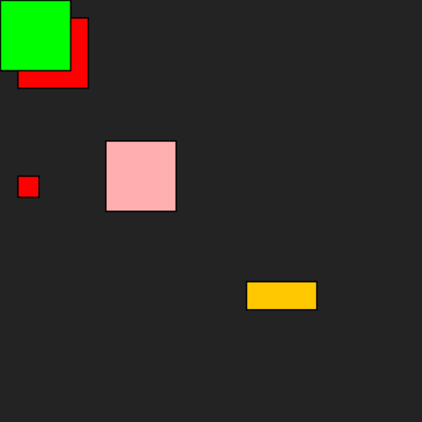

# Rectangle
## Difficulty:    

In this assignment, you are going to practice using method overloading. We are going to create a `Rectangle` class with some default properties:
- `x` and `y` are set to 0 by default.
- `width` and `height` have the value 100 by default.
- `color` is red by default (we are using the `Color` class from the package `java.awt`).

Create this class and make sure that the instance variables are set to these values by default.
Now we are going to add some constructors to set different properties when creating:
- `Rectangle()`
- `Rectangle(int x, int y)`
- `Rectangle(int x, int y, int width, int height)`
- `Rectangle(Color color)`
- `Rectangle(int x, int y, Color color)`
- `Rectangle(int x, int y, int width, int height, Color color)`

Try to avoid code duplication by having constructors call each other.

Finally, add the method `draw()` that can draw the rectangle in the SaxionApp.
Test your application by taking the code in the `Application` class out of comments. Create some rectangles of your own.
The result of the sample code should look like this:

## Relevant links
* [Java documentation of the SaxionApp](https://saxionapp.hboictlab.nl/nl/saxion/app/SaxionApp.html)
