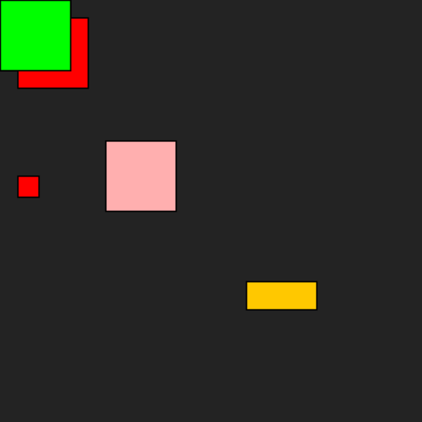

# Rechthoek
## Moeilijkheid:    

Bij deze opdracht ga je oefenen met het gebruik van overloading van methoden. We gaan een `Rectangle` klasse maken met een aantal standaard eigenschappen:
- `x` en `y` staan standaard op 0.
- `width` en `height` hebben standaard de waarde 100.
- `color` is standaard rood (we gebruiken de `Color` klasse uit de package `java.awt`).

Maak deze klasse en zorg ervoor dat de instantievariabelen standaard op deze waarden worden gezet.
Nu gaan we een aantal constructoren toevoegen om verschillende eigenschappen te kunnen instellen bij het aanmaken:
- `Rectangle()`
- `Rectangle(int x, int y)`
- `Rectangle(int x, int y, int width, int height)`
- `Rectangle(Color color)`
- `Rectangle(int x, int y, Color color)`
- `Rectangle(int x, int y, int width, int height, Color color)`

Probeer code duplicatie te voorkomen door constructoren elkaar aan te laten roepen.

Voeg tot slotte de methode `draw()` toe die de rechthoek kan tekenen in de SaxionApp.
Test je applicatie door de code in de `Application` klasse uit commentaar te halen. Maak zelf ook een aantal rechthoeken aan.
Het resultaat van de voorbeeldcode zou er als volgt uit moeten zien:

## Voorbeelden

## Relevante links
* [Java documentatie van de SaxionApp](https://saxionapp.hboictlab.nl/nl/saxion/app/SaxionApp.html)