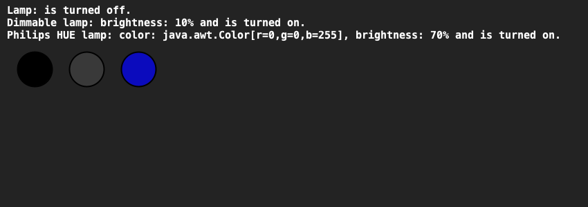

# Home automation
## Difficulty:    

Create a system that consists of 3 classes: Lamp, DimmableLamp and PhilipsHUELamp:
- A Lamp can be turned on and off and you can query whether the lamp is on or off.
- A DimmableLamp can do everything a Lamp can, but also has an adjustable brightness (0% to 100%).
- A PhilipsHUELamp can do everything a DimbareLamp can do (and therefore also what a Lamp can do), but also has a certain light color that you can adjust. By default, the color is white.

Write the above classes, where:
- Classes has multiple constructors (so you can set the brightness and color right away when creating).
- Each class has a neat `toString()` method to describe the state of the light. Hint: make use of the `toString()` of your superclass.
- Also, create a `draw(int x, int y, int size)` method in each lamp type that can draw the lamp in the SaxionApp at a particular position.
- A lamp that is off should be drawn in black.
- Get the example code in the `Application` from comments to test your program.

## Examples
The first image shows 3 lamps:
1. This lamp is a normal lamp and it is on (hence the white color).
2. This lamp is a dimmable lamp and it is on at 50% brightness (hence the gray color instead of white).
3. This bulb is a Philips Hue bulb turned on with the color green and a brightness of 100% (hence the bright green color). 

The second image shows the same 3 lamps, but now with custom settings:
1. This lamp is now off (hence the black color).
2. This lamp now has a brightness of 10% (hence the dark gray color).
3. This lamp now has a blue color and a brightness of 70%.

## Hints:
- You can create colors with transparency (transparency) by using the constructor `new Color(int red, int green, int blue, int alpha`.
- Here each parameter must have a number between 0 and 255. 0 at alpha means completely transparent, 255 at alpha means completely visible.

## Relevant links
* Java documentation SaxionApp](https://saxionapp.hboictlab.nl/nl/saxion/app/SaxionApp.html)
* [Java documentation Color class](https://docs.oracle.com/en/java/javase/11/docs/api/java.desktop/java/awt/Color.html#%3Cinit%3E(int,int,int))