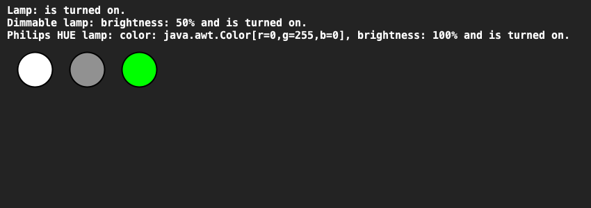

# Home automation
## Moeilijkheid:    

Maak een systeem dat bestaat uit 3 classes: Lamp, DimmableLamp en PhilipsHUELamp:
- Een Lamp kun je aan-en uitzetten en je kunt opvragen of de lamp aan of uit is.
- Een DimbareLamp kan alles wat een Lamp kan, maar heeft ook een aanpasbare helderheid (0% tot 100%).
- Een PhilipsHUELamp kan alles wat een DimbareLamp kan (en dus ook wat een Lamp kan), maar heeft daarnaast ook een bepaalde lichtkleur die je kunt instellen. Standaard is de kleur wit.

Schrijf de bovenstaande klassen, waarbij:
- Klassen meerdere constructoren hebben (zodat je gelijk de brightness en kleur kunt instellen bij het aanmaken).
- Elke klasse een nette `toString()` methode heeft om de toestand van de lamp te beschrijven. Hint: maak gebruik van de `toString()` van je superklasse.
- Maak ook een `draw(int x, int y, int size)` methode in elke type lamp die de lamp kan tekenen in de SaxionApp op een bepaalde positie.
- Een lamp die uitstaat moet in het zwart worden getekend.
- Haal de voorbeeldcode in de `Application` uit commentaar om je programma te testen.

## Voorbeelden
De eerste afbeelding toont 3 lampen:
1. Deze lamp is een normale lamp en deze staat aan (vandaar de witte kleur).
2. Deze lamp is een dimmable lamp die aan staat met een helderheid van 50% (vandaar de grijzige kleur i.p.v. wit).
3. Deze lamp is een Philips Hue lamp die aan staat met de kleur groen en een helderheid van 100% (vandaar de fel groene kleur). 

De tweede afbeelding toont dezelfde 3 lampen, maar nu met aangepaste instellingen:
1. Deze lamp staat nu uit (vandaar de zwarte kleur).
2. Deze lamp heeft nu een brightness van 10% (daarom is de kleur donkergrijs).
3. Deze lamp heeft nu een blauwe kleur en een brightness van 70%.

## Hints:
- Je kunt kleuren maken met transparantie (doorzichtigheid) door gebruik te maken van de constructor `new Color(int red, int green, int blue, int alpha)`.
- Hierbij moet iedere parameter een getal hebben tussen 0 en 255. 0 bij alpha betekent volledig doorzichtig, 255 bij alpha betekent volledig zichtbaar.

## Relevant links
* [Java documentatie SaxionApp](https://saxionapp.hboictlab.nl/nl/saxion/app/SaxionApp.html)
* [Java documentatie Color class](https://docs.oracle.com/en/java/javase/11/docs/api/java.desktop/java/awt/Color.html#%3Cinit%3E(int,int,int,int))
