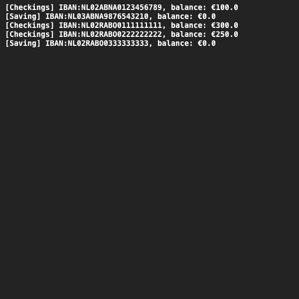
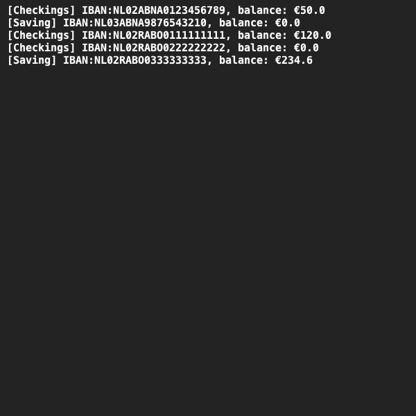

# Bank accounts
## Difficulty:    

We are going to build a simulation of bank accounts. There are two types of bank accounts: checking accounts and savings accounts.
With a checking account, you can deposit money, withdraw money and transfer money to another account. Your current account allows you to be overdrawn up to a maximum amount. This is set when you create the account and cannot be changed.

A savings account is similar to a checking account but has a number of restrictions. You can deposit money into the savings account, but you cannot withdraw money from your savings account.
You can transfer money, but only from your savings account to your checking account. 
In addition, you will receive interest on your savings account every year. When you create your savings account you specify how much interest you will receive annually. You are not allowed to be in the red on your savings account!

We now want to build classes for the checking and savings accounts.
Since there are a number of attributes and methods that are used in both classes it might be useful to create a common superclass in which these correspondences are stored.

Pay attention to the following points when implementing your code:
- Make sure the savings account knows to which checking accounts money can be transferred.
- Create the methods: `deposit(double amount)`, `withdraw(double amount)` and `transfer(double amount, BankAccount otherAccount)`.
- Create an `addYearlyInterest()` method at the savings account that adds the definied amount of interest to the account.
- Provide convenient constructors for your class.
- Create `toString()` methods to clearly print the status of the accounts.
- Make sure that the attributes of your account cannot be changed just like that, but only by the `deposit()`, `withdraw()` and `transfer()` methods.
- Take care of proper error handling.

## Examples

## Relevant links
* Java documentation SaxionApp](https://saxionapp.hboictlab.nl/nl/saxion/app/SaxionApp.html)

