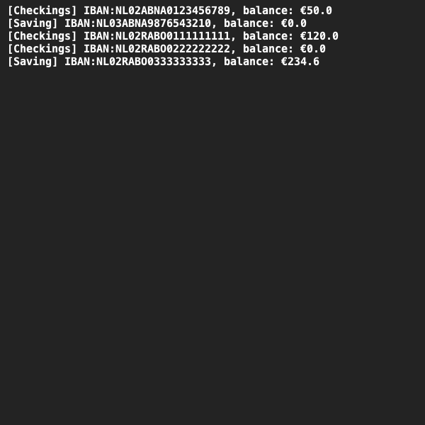

# Bankrekeningen
## Moeilijkheid:    

We gaan een simulatie bouwen van bankrekeningen. Er zijn twee soorten bankrekeningen: betaalrekeningen en spaarrekeningen.
Met een betaalrekening kun je geld storten (deposit), geld opnemen (withdraw) en geld overmaken naar een andere rekening (transfer). Bij je betaalrekening mag je rood staan tot een maximum bedrag. Dit is instelbaar wanneer je de rekening aanmaakt en kan daarna NIET meer gewijzigd worden.

Een spaarrekening lijkt op een betaalrekening maar heeft een aantal ristricties. Je kunt wel geld storten op de spaarrekening, maar niet direct geld opnemen van je spaarrekening.
Je kunt wel geld overboeken (transfer), maar enkel van je spaarrekening naar je betaalrekening. 
Daarnaast krijg je ieder jaar rente op je spaarrekening. Bij het aanmaken van de spaarrekening geef je mee hoeveel rente je jaarlijks krijgt. Op je spaarrekening mag je niet rood staan!

We willen nu klassen gaan bouwen voor de betaalrekening en de spaarrekening.
Aangezien er een aantal attributen en methoden zijn die in beide klassen gebruikt worden zou het handig kunnen zijn om een gemeenschappelijke superklasse te maken waarin deze overeenkomstigheden worden opgeslagen.

Let bij het implementeren van je code op de volgende punten:
- Maak de methoden: `deposit(double amount)`, `withdraw(double amount)` en `transfer(double amount, BankAccount otherAccount)`.
- Zorg dat de spaarrekening weet naar welke betaalrekeningen er geld overgemaakt kan worden. Zorg er voor dat de `transfer` methode hier ook op controleert.
- Maak een `addYearlyInterest()` methode bij de spaarrekening die je ingestelde rente toevoegt aan de rekening.
- Zorg voor handige constructors bij je klasse.
- Maak `toString()` methoden om overzichtelijk de status van de rekeningen te kunnen printen.
- Zorg ervoor dat de attributen van je rekening niet zomaar aangepast kunnen worden, maar enkel door de `deposit()`, `withdraw()` en `transfer()` methoden.
- Zorg in alle situaties voor juiste foutafhandeling.

## Voorbeelden

## Relevant links
* [Java documentation SaxionApp](https://saxionapp.hboictlab.nl/nl/saxion/app/SaxionApp.html)
