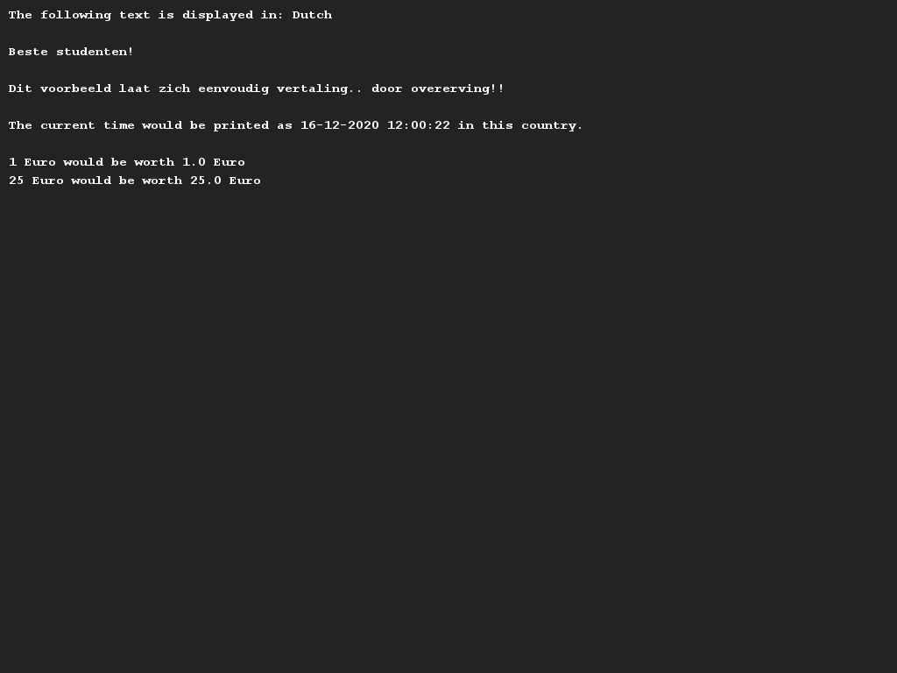
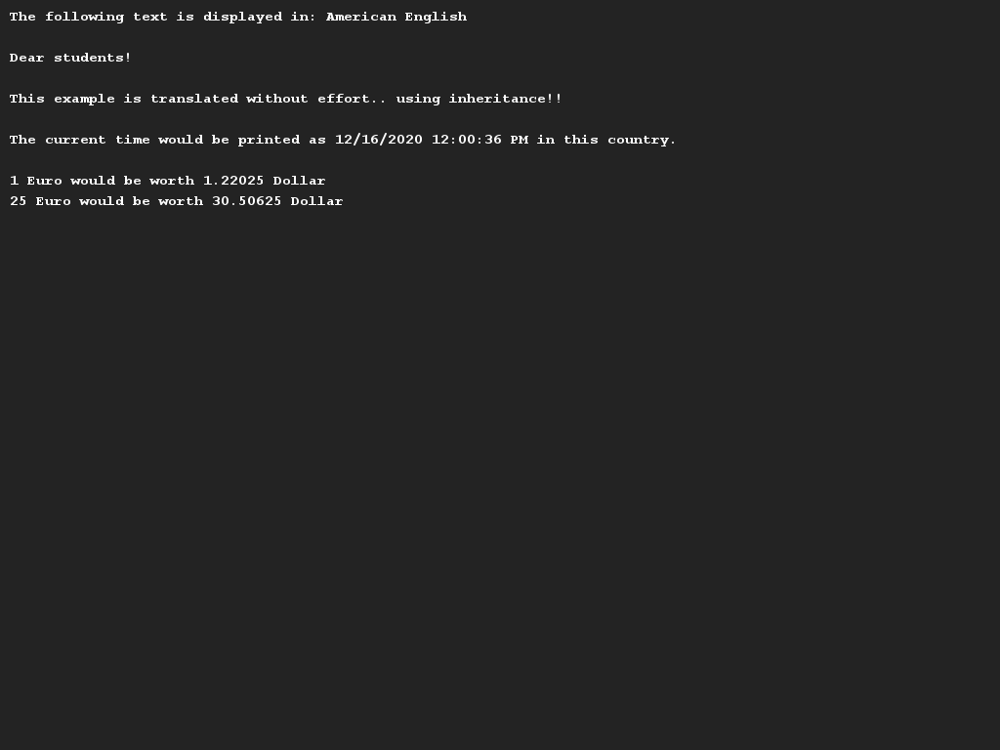
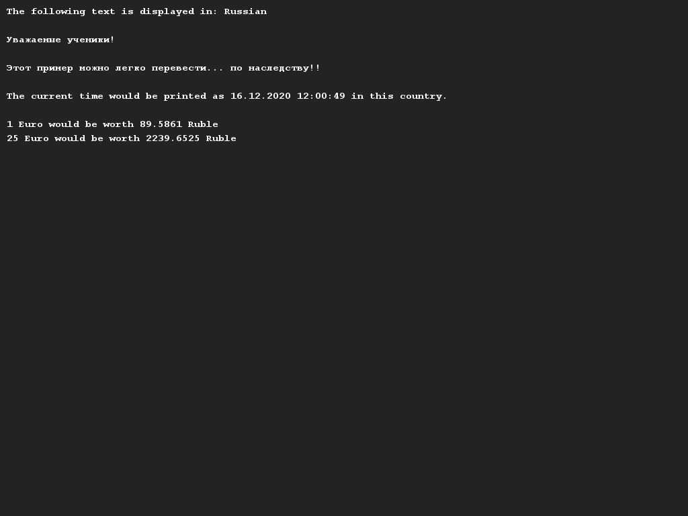

# Multilingualism
## Difficulty:    

In this assignment, we are going to create an application that supports multiple languages. Given is the class `Translator` which can be used to implement a specific language.
This class contains the following attributes: the name of the language, the currency symbol (e.g. $ or €), the conversion rate to the euro, and the time format (e.g. 24-hour or 12-hour with AM and PM).
In addition, there are:
- methods described for standard reports that we can print.
- a method that converts an amount in euros to an amount in the currency of the translator.
- a method that returns the current time in the correct time format.
    - Tip: We suggest that you look at the class `DateTimeFormatter` (which is in Java). Have a look at how to use this class using the Internet.

We will now implement three specific languages: Dutch, Russian and English (American).
Create new classes that inherit from the Translator class and make sure you include the correct values in the call to the `super()` constructor.
Then overwrite the methods with default messages in your class and put a translation in it. (Tip: use Google Translate if you are not familiar with the Russian language).
## Examples

(Disclaimer: As no teachers speak Russian, our translations are created using tooling. If these texts are incorrect and you want to suggest a better alternative, please let us know!)

## Relevant links
* [Java documentation for the SaxionApp](https://saxionapp.hboictlab.nl/nl/saxion/app/SaxionApp.html)
