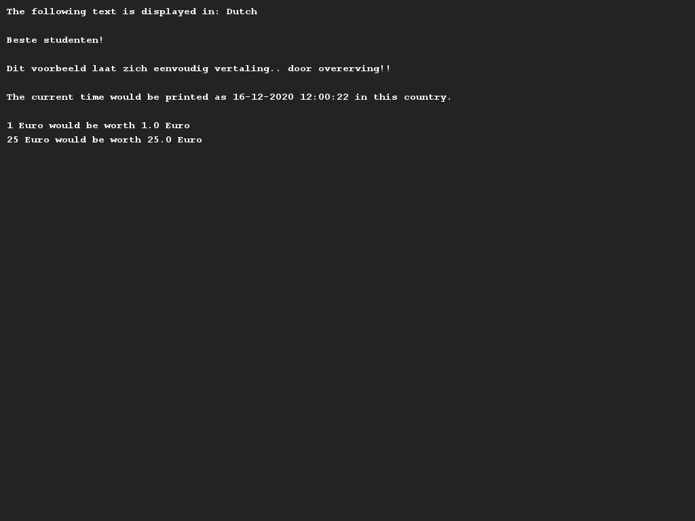
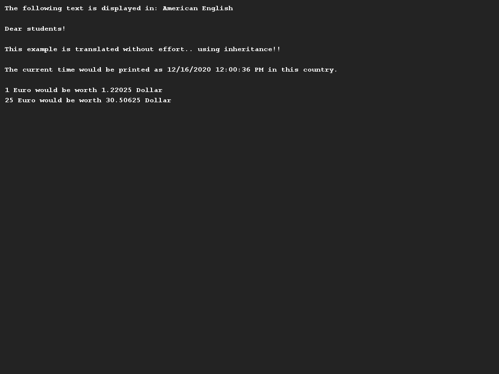
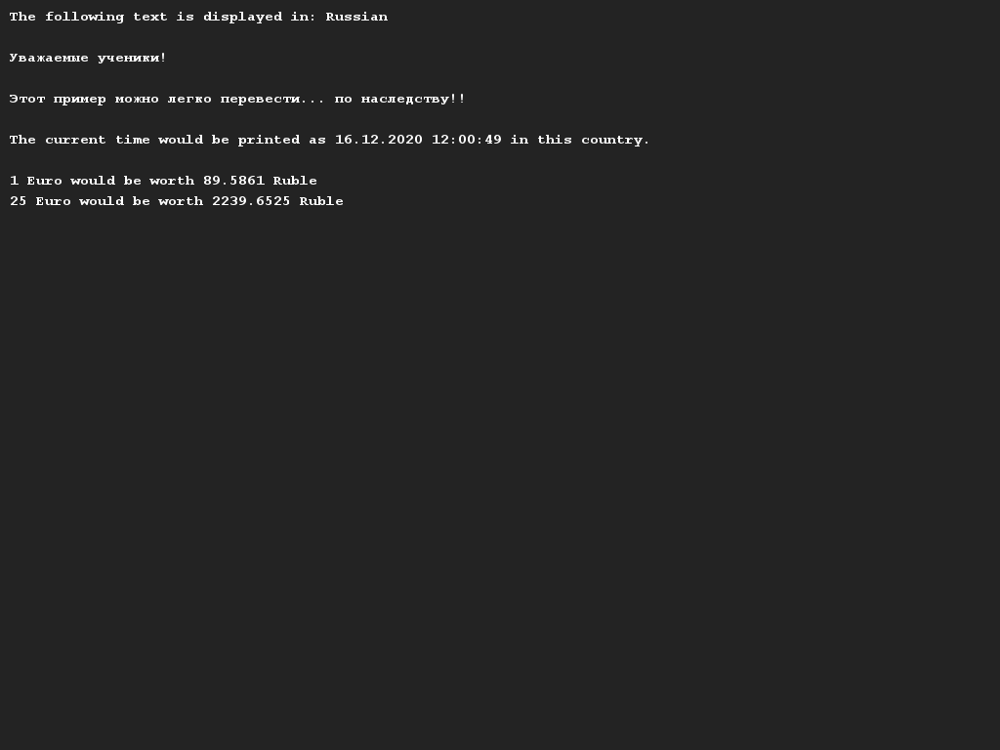

# Meertaligheid
## Moeilijkheid:    

Bij deze opdracht gaan we een applicatie maken die meerdere talen ondersteunt. Gegeven is de klasse `Translator` die gebruikt kan worden om een specifieke taal te implementeren.
Deze klasse bevat de volgende attributen: de naam van de taal, het valuta symbool (bijvoorbeeld $ of €), de omrekenkoers met de euro en het tijdformaat (bijvoorbeeld 24-uurs of 12-uurs met AM en PM).

Daarnaast zijn er:
- methoden beschreven voor standaard meldingen die we kunnen printen.
- een methode die een bedrag in euro's converteert naar een bedrag in de valuta van de translator.
- een methode die de huidige tijd teruggeeft in het juiste tijdformaat.
    - Tip: Gebruik hier de java klasse `DateTimeFormatter` voor. Zoek op internet naar de beschrijving hoe deze klasse precies werkt.

We gaan nu drie specifieke talen implementeren: Nederlands, Russisch en Engels (Amerikaans).
Maak nieuwe klassen aan die erven van de Translator klasse en zorg dat je in de aanroep naar de `super()` constructor de juiste waarden meestuurt.
Overschrijf vervolgens de methoden met standaardmeldingen in je klasse en plaats er een vertaling in. (tip: gebruik Google Translate als je niet bekend bent met de Russische taal).

## Voorbeelden

(Disclaimer: Geen van de docenten spreekt Russisch, dus mocht je het gevoel hebben dat de tekst niet klopt en je denkt ons te kunnen verbeteren, laat dit dan vooral weten!)

## Relevante links
* [Java documentatie SaxionApp](https://saxionapp.hboictlab.nl/nl/saxion/app/SaxionApp.html)
