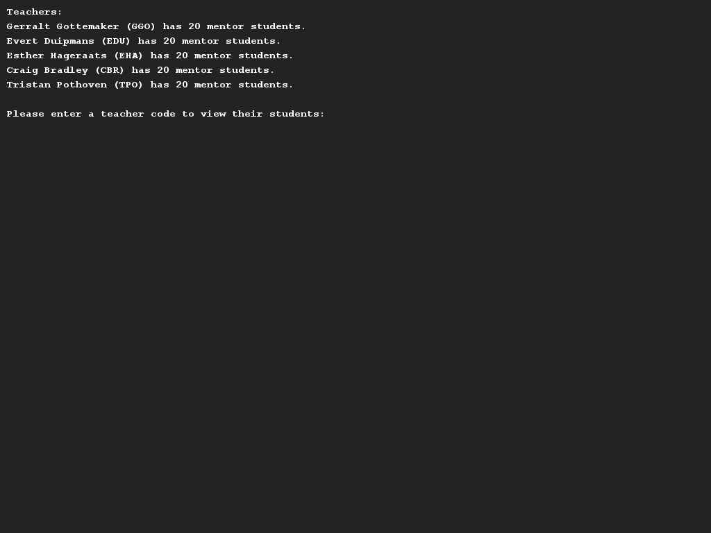
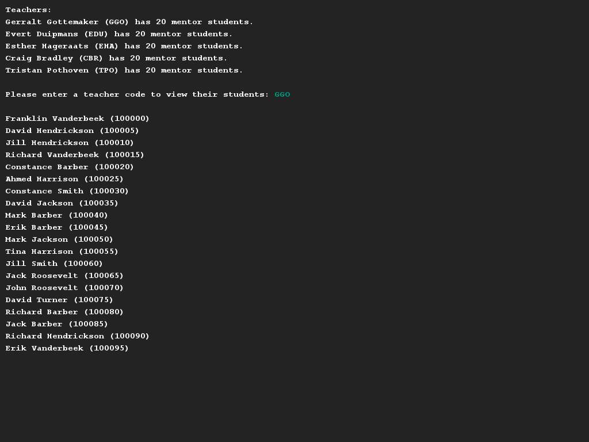
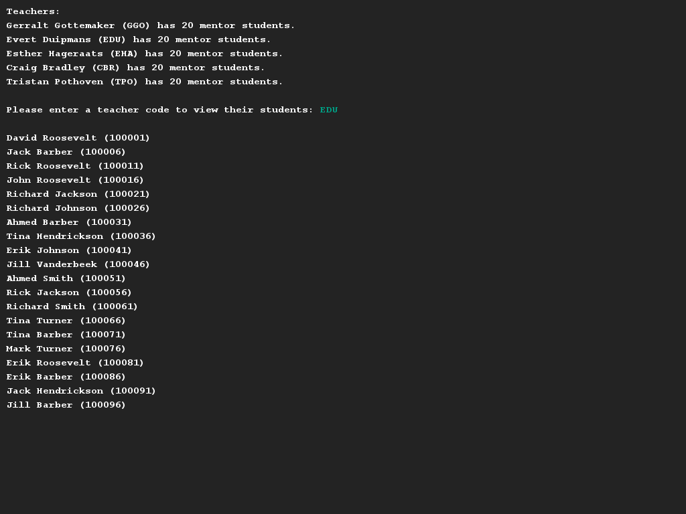

# Mentoring students
## Difficulty:    

In this assignment you will develop a small part of the Saxion student administration, namely the part in which students are linked to mentors.

Write a program in which a csv file with students will be imported and the students automatically are distributed among the various mentors.

We advise you to start modelling a student:
* A first and last name of each student is known and this information can be read from `students.csv`. It should be mandatory to provide a first and last name when instantiating the class.
* Each student is assigned an unique student number during the reading of the students file. A student number is a number with a value between 100000 and 999999 (6 digits).
* None of the attributes (first name, surname, student number) are changeable after setting.

You then should model the teacher:
* A first name and last name of each lecturer is known and these details must be provided when you instantiate this class. (Just like with a student!)
* Each teacher also has a teacher code based on the first and last name of this teacher. The abbreviation can be generated by merging the first letter of the first name and the first *two* letters of the surname (in capital letters).
  **G**erralt **Go**temaker e.g. thus becomes "GGO" and **E**sther **Ha**geraats "EHA".
* A lecturer also always has an overview of students under his/her care. However, it is not intended that once a mentor has made a decision, this can simply be changed. Therefore, implement the following methods for a teacher:
    * addMentorStudent(Student s), adds a way of adding a specific student to this teacher for mentorship.
    * getNrOfMentorStudents(), provides the number of students currently being assigned to this teacher.
    * printMentorStudents(), prints an overview of all students that this teacher is mentor of.

Finally, write an interface using the SaxionApp in which you can ask each teacher which mentor pupils he/she has.

## Examples

## Relevant links
* [Java documentation for the SaxionApp](https://saxionapp.hboictlab.nl/nl/saxion/app/SaxionApp.html)
