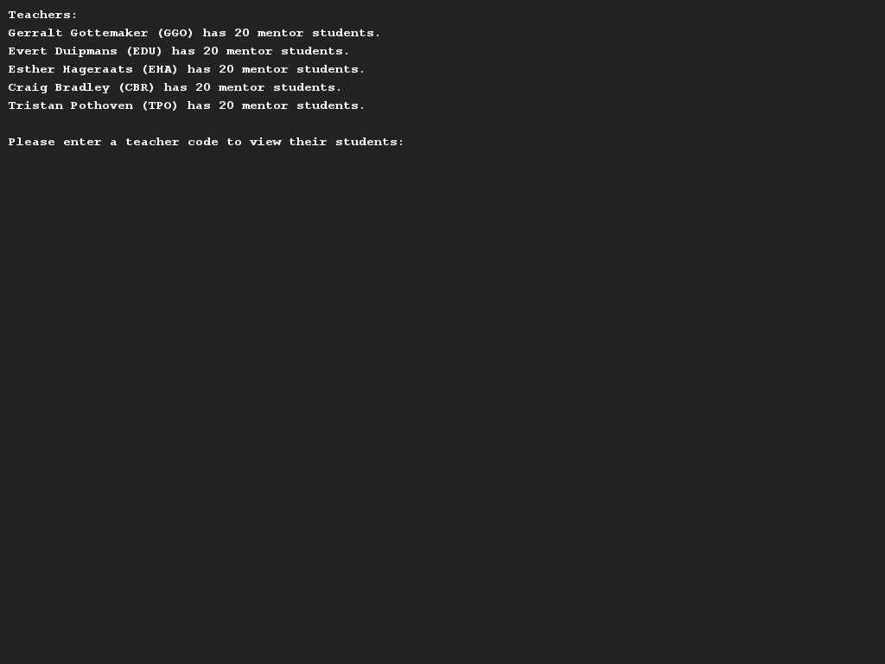

# Toekennen van studenten aan mentoren
## Moeilijkheid:    

In deze opdracht ga je een klein stukje van de Saxion studentadministratie ontwikkelen, namelijk het onderdeel waarin studenten aan mentoren worden gekoppeld.

Schrijf een programma waarin een csv bestand met studenten wordt ingelezen en worden verdeeld over de verschillende docenten.

We raden je aan om te beginnen met het modelleren van een student:
* Van elke student is een voor- en achternaam bekend en deze gegevens mogen worden ingelezen uit `students.csv`. Het is verplicht om een voor- en achternaam mee te geven bij het instantieren van de klasse.
* Elke student krijgt een uniek studentnummer toegewezen tijdens het inlezen. Een studentnummer is een getal met een waarde tussen 100000 en 999999 (6 cijfers).
* Geen van de attributen (voornaam, achternaam, studentnummer) zijn aanpasbaar.

Vervolgens modelleer je de docent: 
* Van elke docent is een voor- en achternaam bekend en deze gegevens moeten meegegeven worden bij het instantieren van deze klasse. (Net zoals bij een student!)
* Ook kent elke docent een afkorting die gebaseerd is op de voor- en achternaam van deze docent. De afkorting kan gegenereerd worden door de eerste letter van de voornaam en de eerste *twee* letters van de achternaam samen te voegen (in hoofdletters).
    * **G**erralt **Go**ttemaker wordt dus bijv. "GGO" en **E**sther **Ha**geraats "EHA".
* Een docent heeft ook altijd een overzicht van studenten die onder zijn/haar hoede vallen. Het is echter niet de bedoeling dat, zodra een mentor eenmaal besloten is, dit zomaar gewijzigd kan worden. Implementeer daarom de volgende methoden voor een docent:
    * addMentorStudent(Student s), deze methode voegt een student toe aan een mentor.
    * getNrOfMentorStudents(), levert het aantal studenten op waarvan deze docent de mentor is.
    * printMentorStudents(), print een overzicht van de studenten waarvan deze docent de mentor is.

Schrijf tenslotte een interface met behulp van de SaxionApp waarin je per docent kan uitvragen welke mentorleerlingen hij/zij heeft.

## Voorbeelden

## Relevant links
* [Java documentation SaxionApp](https://saxionapp.hboictlab.nl/nl/saxion/app/SaxionApp.html)
