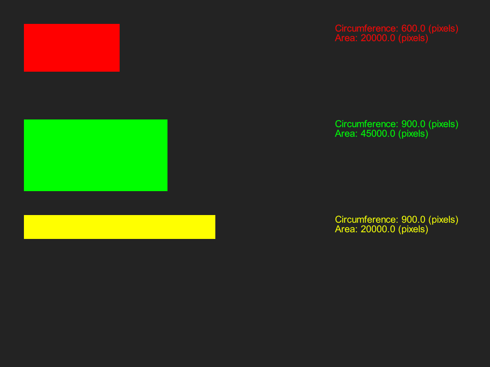
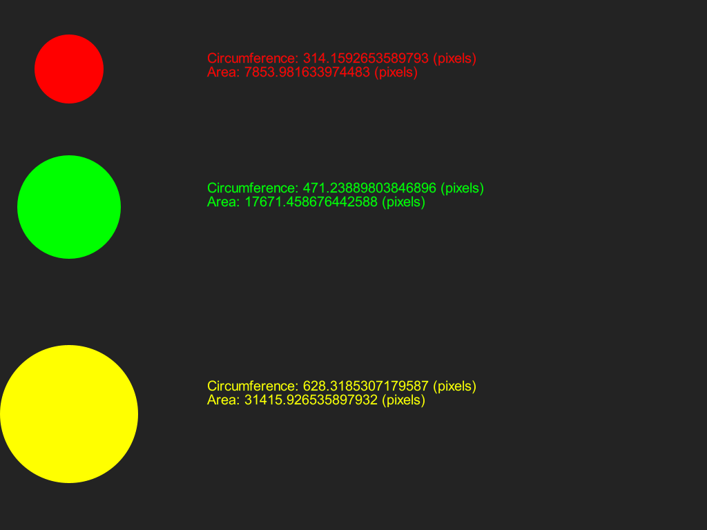
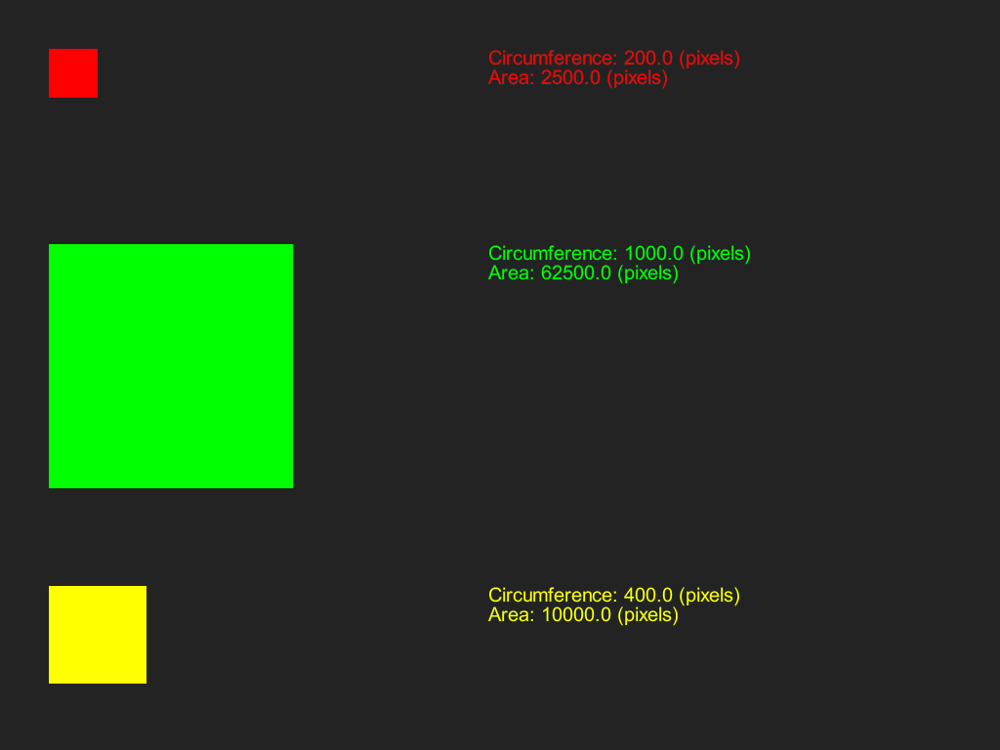

# Vormen tekenen
## Moeilijkheid:    

Schrijf een programma waarmee je een rechthoek, cirkel en vierkant kan tekenen op elke willekeurige positie en met elke willekeurige kleur. Schrijf hiervoor een superklasse _Shape_ en de bijbehorende subklassen _Rectangle_, _Circle_ en _Square_. 

Met alle _Shape_ instanties moet je het volgende kunnen doen:
- Bij het aanmaken van een Shape moet je een positie (x, y coordinaat) mee kunnen geven en een kleur waarin het figuur getekend moet worden.
- Het moet mogelijk zijn om het oppervlak te berekenen (methode: _getArea()_, levert een double op).
- Het moet mogelijk zijn om de omtrek te berekenen (methode: _getCircumference()_, levert een double op).
- Het moet mogelijk zijn om het figuur daadwerkelijk te tekenen m.b.v. de SaxionApp, d.m.v. het aanroepen van de _draw()_ methode. Deze methode zorgt er tevens voor dat de kleur goed gezet wordt en een eventuele border wordt uitgezet.

Om je op weg te helpen hebben wij alvast een implementatie gegeven van de `Application` klasse zodat je kan zien wat er precies geprint moet worden. Het is natuurlijk aan jou om de juiste implementaties van de overige klassen te geven.

## Voorbeeld

## Relevant links
* [Java documentation SaxionApp](https://saxionapp.hboictlab.nl/nl/saxion/app/SaxionApp.html)
