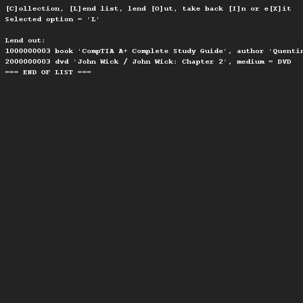

# Library
## Difficulty:    () 

We are going to create a library application. You can borrow books and/or DVDs. The objects to be
objects to lend out all have a barcode (a string of numbers) and a title.
Furthermore, books have an ISBN number (text) and an author. DVDs have, besides 
barcode and title, but also a medium type.

The library contains a list of books and a list of DVDs, where every object to be borrowed (i.e. book or DVD) has an ISBN.
The library contains a list of books and a list of DVDs, whereby each object to be lent (i.e. book or DVD) has a status of either lent or not. These lists
(the books and DVDs) must be read from the supplied files 'books.csv' and 'books.csv' respectively.
"books.csv" and "dvds.csv" respectively.

Please make sure that reading is carried out for the right object. For example, opening a file is
For example, opening a file is functionality for a library class, but reading the elements of a single book is
elements of a single book is specific to a book. Attention: reading in the
barcode and title is something that books and DVDs have in common, so...

At the start of the application, all objects are read in automatically. Then
The librarian (user) has the possibility to:
* print the list of books, 
* print the list of DVDs,
* lend out a book or DVD (by bar code) or
* take back a book or DVD (with barcode).

When printing books or DVDs, indicate the loaned copies with an '*'.

In practice, every book and DVD has a barcode and the librarian will read this barcode with a barcode reader.
librarian will read this barcode with a barcode scanner. This number is therefore unique across the entire
collection of books and DVDs. It is therefore not necessary to indicate whether a 
barcode belongs to a book or a DVD.

A barcode is always 10 digits long. The input of an invalid or non-existing
barcode must be intercepted by the code.

Lending out an object that has already been lent out or returning an object that has not been lent out is not allowed. 
object that has not been lent is an error in the process and should generate an Exception. 
generated. This too must then be neatly dealt with in the code.

## Examples

## Relevant links
* Java documentation SaxionApp](https://saxionapp.hboictlab.nl/nl/saxion/app/SaxionApp.html)

