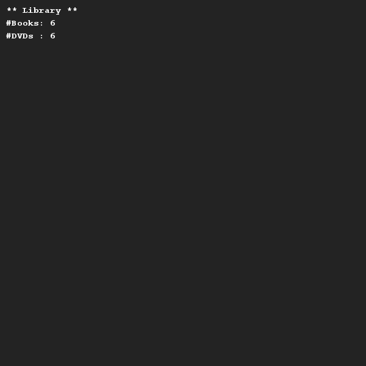
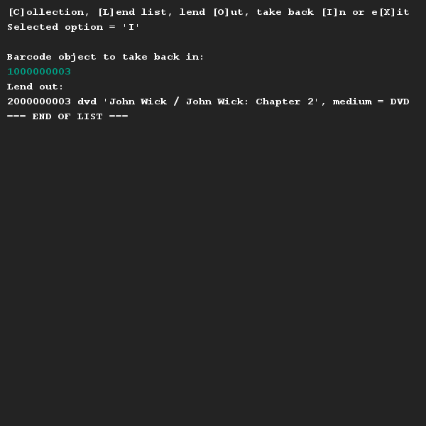
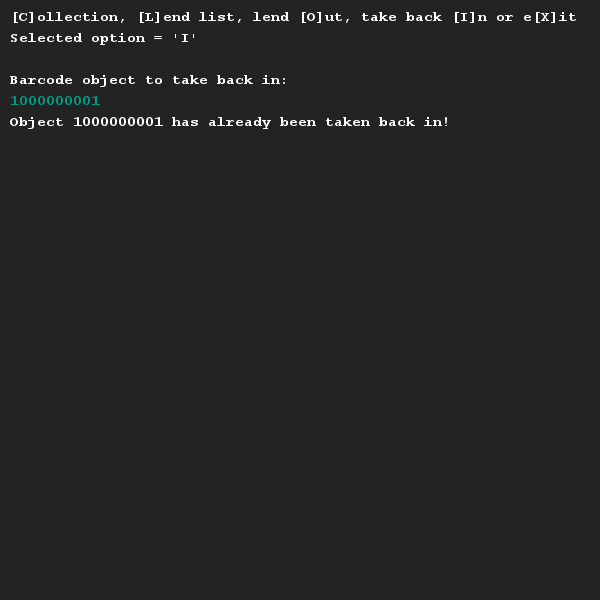
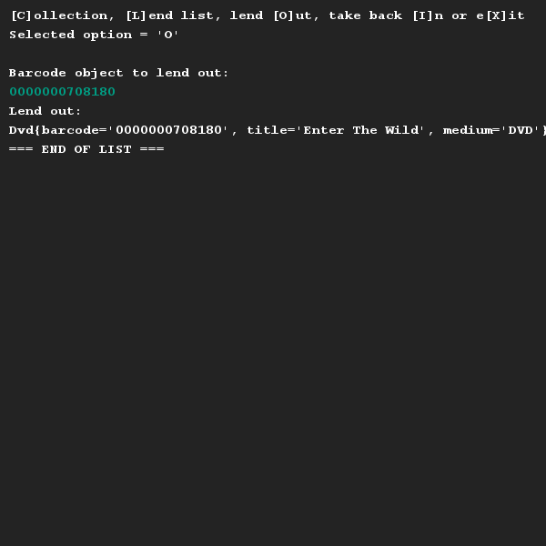
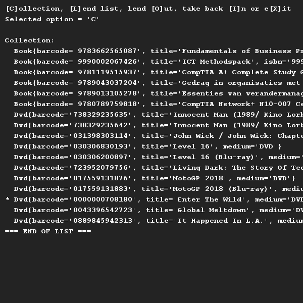

# Opdracht
## Moeilijkheid:    () 

We gaan een bibliotheek-applicatie maken. Je kunt er boeken en/of dvd's lenen. De uit
te lenen objecten hebben allemaal een barcode (een string van cijfers) en een titel.
Verder hebben boeken nog een ISBN nummer (tekst) en een auteur. Dvd's hebben, naast 
barcode en titel dus, ook een medium type.

De library bevat een lijst van boeken en een lijst van dvd's, waarbij ieder uit te
lenen object (dus boek of dvd) een status wel/niet uitgeleend heeft. Deze lijsten
(de boeken en dvd's) dienen ingelezen te worden uit de meegeleverde bestanden
"books.csv" resp. "dvds.csv".

Let erop dat het inlezen bij het juiste object wordt uitgevoerd. Zo is het openen
van een bestand functionaliteit bij een library klasse, maar het inlezen van de
elementen van een enkel boek is juist specifiek voor een boek. Let op: het inlezen
van barcode en titel is weer iets is dat boek en dvd gemeenschappelijk hebben, dus...

Bij de start van de applicatie worden alle objecten automatisch ingelezen. Daarna
heeft de bibliothecaris (de gebruiker) de mogelijkheid om:
* de lijst van boeken af te drukken, 
* de lijst van dvd's af te drukken,
* een boek of dvd (op barcode) uit te lenen of
* een boek of dvd (op barcode) weer in te nemen.

Signaleer bij het afdrukken van boeken of dvd's de uitgeleende exemplaren met een '*'.

In praktijk heeft ieder boek en iedere dvd een barcode en zal de bibliothecaris deze
barcode inlezen met een barcode scanner. Dit nummer is dan ook uniek over de hele
collectie van boeken en dvd's heen. Het is dus niet nodig om aan te geven of een 
barcode bij een boek of een dvd hoort.

Een barcode is altijd 10 cijfers lang. De invoer van een ongeldige of niet-bestaande
barcode moet worden afgevangen door de code.

Het uitlenen van een object dat al is uitgeleend dan wel een het inleveren van een 
object dat niet is uitgeleend is een fout in het proces en dient een Exception te 
genereren. Ook deze moet vervolgens netjes worden afgevangen in de code.

## Voorbeelden

## Relevant links
* [Java documentation SaxionApp](https://saxionapp.hboictlab.nl/nl/saxion/app/SaxionApp.html)

