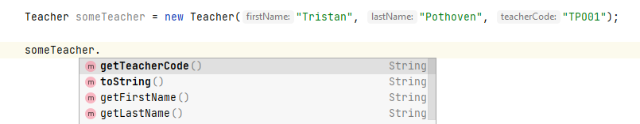
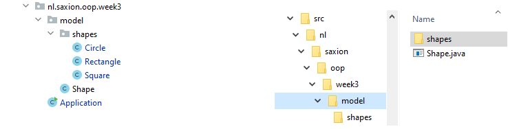

# Inheritance
Competence: _I understand the concept of inheritance and can apply its principles to avoid code duplication._

The assignments can be found in the individual modules. 

# Introduction
The past few weeks (and in the earlier module Introduction to Programming) we have been modelling all kinds of "things" 
in classes, such as artists, persons, trains, dice, cars, planes, etc. These classes have all been given their own 
functionality, and you might have noticed that a lot of this functionality was repeated on a regular basis.

Imagine, for example, that you are writing a personnel administration system for a university of applied sciences 
(e.g. Saxion). In this system, you will probably use "Student" instances to represent students and "Teacher" instances 
to capture the data of teachers. Much of this information will probably be stored in a similar way: both a teacher, 
and a student are likely to have a name. The associated functionality (setting this name, getters / setters to do 
something with this name, checks for invalid ages, etc.) will therefore probably be largely identical.

This week we're going to look at how to capture this kind of similar functionality in so-called _superclasses_ that 
contain this shared functionality. In the example of the student and teacher, you could think of introducing a new 
superclass "Person", where this class contains the shared functionality (name, age, etc.) so that you don't have to 
repeat this code in your own classes for a student and teacher.

Thinking about your code in this way, with the focus on storing functionality centralized so that you can easily use 
it in other classes, without having to duplicate the code is called _inheritance_ in object-oriented programming. And 
that is this week's topic!

## Inheritance
The idea of inheritance is relatively simple: Code with certain functionality that you want to use in multiple classes 
is moved into a class that will serve as the to a class which will serve as a _base_ for writing your own classes. Consider, 
for example, the example from earlier where you write a system with teachers and students.

```Java
public class Teacher {
    private String firstName; // This line can also be found in the Student class
    private String lastName; // This line can also be found in the Student class

    private String teacherCode;

    public Teacher(String firstName, String lastName, String teacherCode) {
        this.firstName = firstName; // This line can also be found in the Student constructor
        this.lastName = lastName; // This line can also be found in the Student constructor

        this.teacherCode = teacherCode;
    }

    // These 2 getters are duplicates from the Student class
    public String getFirstName() {
        return firstName;
    }

    public String getLastName() {
        return lastName;
    }

    // This getter is unique to Teacher
    public String getTeacherCode() {
        return teacherCode;
    }

    // Omitted the rest...
}
```

```java
public class Student {
    private String firstName; // This line can also be found in the Teacher class
    private String lastName; // This line can also be found in the Teacher class

    private int studentNumber;

    public Student(String firstName, String lastName, int studentNumber) {
        this.firstName = firstName; // This line can also be found in the Teacher constructor
        this.lastName = lastName; // This line can also be found in the Teacher constructor

        this.studentNumber = studentNumber;
    }

    // These 2 getters are duplicates from the Teacher class
    public String getFirstName() {
        return firstName;
    }

    public String getLastName() {
        return lastName;
    }

    // This getter is unique to Student
    public int getStudentNumber() {
        return studentNumber;
    }

    // Omitted the rest...
}
```
Note that the attributes `firstName` and `lastName` appear in both `Teacher` and `Student`. The corresponding code to 
(constructors, getters / setters, etc.) is therefore very similar.

However, suppose there is a small bug in the constructor of the `Student` class regarding the firstName attribute 
(e.g. we require the first name to be capitalised). Then there is a plausible chance that 
this will also go wrong in `Teacher`, since the code is duplicated.

The idea of inheritance is now to define a class `Person` (after all, both teachers and students are also people) 
and store this common code in it. The class `Person` could then look like this:

```java
public class Person {
    private String firstName;
    private String lastName;

    public Person(String firstName, String lastName) {
        this.firstName = firstName;
        this.lastName = lastName;
    }

    public String getFirstName() {
        return firstName;
    }

    public String getLastName() {
        return lastName;
    }

    @Override
    public String toString() {
        return firstName + " " + lastName;
    }
}
```
By storing the common code in the `Person` class we can now modify the `Teacher` and `Student` classes by stating that 
they are actually _extensions_ of the `Person` class. The functionality of `Person` remains, but we can add elements to 
it, e.g. the student number or the teacher code.

For this we will have to use _inheritance_. The classes `Teacher` and `Student` will inherit functionality from the 
class `Person`.

## Applying inheritance: extends and super
You can let a class inherit functionality by using the keyword `extends`. Let us use the class `Teacher` as an example. 
The new class `Teacher`, which inherits functionality from the class `Person`, looks like this as follows:

```java
public class Teacher extends Person { // Note the "extends Person" part!

    private String teacherCode;

    public Teacher(String firstName, String lastName, String teacherCode) {
        super(firstName, lastName); // Note this "super(...)" call!

        this.teacherCode = teacherCode;
    }

    public String getTeacherCode() {
        returns teacherCode;
    }

    @Override
    public String toString() {
        return super.toString() + " (" + teacherCode + ")";
    }

    // Omitted any other Teacher specific methods
}
```
The first thing you will notice is that the first line (class definition) now includes the word `extends`.
This word is used in Java to indicate that this class is an extension of the class mentioned after the word "extends".
So in this case you can read it as "the class Teacher is an extension of the class Person".

With this addition, the functionality from the class Person is automatically made available to the class Teacher.
You can now call the `firstName()` and `lastName()` methods directly from your code, even though they are not defined in 
the Teacher class.



Note that some methods are not **thickly printed** and may look familiar to you. 
This is because the methods are not directly in the class Teacher, but in the class `Person`. 

You will also notice that the constructor now suddenly uses the word `super(..)`. Because the `Teacher` class is an 
extension of the `Person` class, the `Teacher` class has to make sure that the `Person` class can be created properly. 
In our example, a `Person` can only be instantiated if it is provided with a _firstName_ and _lastName_ (see the 
constructor of `Person`). The `Teacher` class therefore also has to meet this condition. In this case we choose to give 
the class `Teacher` itself also a constructor which has a _firstName_ and _lastName_ and pass it to the constructor 
of `Person` by making the `super(..)` call.

The `Person` class is in this case also called the _superclass_ of the `Teacher` class. So a `Teacher` is nothing 
but a `Person` instance, with some extra information (in this case the `teacherCode`). Since the class `Teacher` will 
not store the firstName and lastName by itself (this functionality is in `Person`), this information still has to be 
passed on the constructor of the _superclass_. Conversely, we say that the class `Teacher` is a _subclass_ of `Person`. 

Finally, it is important to know that the `super(..)` call must always be the first instruction in a constructor: Before 
you can further develop an instance, you must have set up the basis (read: superclass) properly. So you always must call
the constructor of the superclass via `super(..)` first.

Besides the `super(..)` method, every class has a `super` attribute. This attribute is used in the
`ToString()` method. In this case we will use `super` to call a method from the class we are inheriting from. So the 
best way to read the toString is to use the result of the toString method from the class Person and add a piece 
(the teacher code) to it.

Let's do the same thing again for the class `Student`:

```java
public class Student extends Person {
    
    private int studentNumber;

    public Student(String firstName, String lastName, int studentNumber) {
        super(firstName, lastName);

        this.studentNumber = studentNumber;
    }


    public int getStudentNumber() {
        return studentNumber;
    }
}
```
Note that we are actually using the same pattern: With `extends` we indicate that the class `Student` is an extension 
of the class `Person` and so the first line of the constructor must call the constructor of the superclass by 
means of the `super(..)` method. Since the constructor of `Person` expects a _firstName_ and _lastName_ we choose in 
this case to use these arguments as parameters for the constructor of `Student` as well. In this case, we leave the 
`toString()` method for now, we will come back to it later!

Of course, you can do this differently! With the super(..)-call you may also give your own value:
```java
super("Bob", "TheBuilder");
```
(This is a bad example. In this case, all students would be called "Bob TheBuilder").

However, there are examples where this solution is very useful. We'll cover these in the assignments.

## Inheritance and encapsulation: public, private and protected
At the beginning of the module, we introduced the word `private` which you can use with both instance variables and
methods to indicate that "outside access" is not desirable. A `private` attribute therefore often had to be provided 
with getters and setters.

But what about inheritance? Since the class `Student` is an extension of the class `Person` you can say that a student 
is "also" a person and therefore you need to be able to access the attributes of `Person` (i.e. _firstName_ and _lastName_).

If you want to achieve this in your code, Java knows the keyword `protected`. Next to `private` and `public` which you 
have you have seen before, this is a term you can use in combination with your own attributes and methods.

By adding the word `protected` to an attribute you can indicate that for _subclasses_ (i.e. classes that inherit from 
this class) the attribute must be approachable (without getters / setters), but for other classes it is not.

Now suppose we adapt the class `Person` a bit and make the attributes _firstName_ and _lastName_ protected, then this 
looks like this:
```java
public class Person {
    protected String firstName;
    protected String lastName;

    // Omitted the rest
}
```

In this case, in the classes `Teacher` or `Student`, you do not need to retrieve the name via `getFirstName()` or `getLastName()`.

To demonstrate this, let us implement the toString() method for student:

```java
public class Student extends Person {

    private int studentNumber;

    public Student(String firstName, String lastName, int studentNumber) {
        super(firstName, lastName);

        this.studentNumber = studentNumber;
    }


    public int getStudentNumber() {
        return studentNumber;
    }

    @Override
    public String toString() {
        return lastName + ", " + firstName + " (" + studentNumber + ")";
    }
}
```

**Caution**: The use of protected variables opens up your code again to possible errors which you try to avoid with 
encapsulation. Be careful which attributes you want to make `protected` and which ones are better to keep 
private. As a rule of thumb: you want to keep as many attributes `private` "as you can". If you cannot do this, consider 
`protected` before considering `public`. If you cannot think of any reasons to use `protected`, please use `private`.

## Override methods
In addition to being able to add specific attributes and methods through inheritance, it is now possible to override 
existing behaviour. If add a method to a _subclass_ that is also defined in a _superclass_, the implementation of the
method will be overridden by the subclass. An example:

```java
public class Shape {
    // No more details are shown as this is one of the exercises.

    public double getArea() {
        return -1; // We don't know how to calculate this of a generic shape, so we'll just return -1!
    }
    
}
```

```java
public class Rectangle extends Rectangle {
    private int width;
    private int height;

    // No more details are shown as this is one of the exercises...
    
    @Override
    public double getArea() {
        return width * height;
    }
    
}
```

In the above example, we are talking about the fact that the method `getArea()` from the class `Shape` is "overwritten" 
by the implementation of `getArea()` from the class `Rectangle`. This offers you the possibility to provide a more detailed 
implementation of a method, without having to create a separate method for this!

However, it is important that you use the same _method signature_ when overriding methods, i.e.
the method _must_ have the same name, expect the same arguments and have the same return type. Only if these conditions 
are met we speak of a _method override_.

It is rather easy to make mistakes here. That's why Java has come up with the addition `@Override` (maybe you've 
seen it before, e.g. with the toString() method) to help you with this. The `@Override` tag ensures that the compiler knows 
that you are trying to override a method and will check which method you are actually overriding. If that method cannot 
be found (e.g. because you entered the return type incorrectly), an error message will be returned. In short: `@Override` 
is really just a tool for you as a programmer! 

What you should be aware of when overriding methods is that it is not possible to _disable_ functionality. So you can't 
create a _subclass_ with fewer (public) methods than the _superclass_. (This is also where the word "extends" comes from.) 
If you want a _subclass_ to not have a certain method, then you have to make sure that the superclass doesn't offer it 
or choose not to inherit from that particular class.

## Organising your own classes: Packages
The number of classes you've started using over the past few weeks is getting bigger and bigger. It is therefore a good 
idea to take a look at how you can structure classes in a logical way. In Java, we often make extensive use of _packages_ 
to arrange classes in a certain way. Most programming languages have such a construction, sometimes under a different 
name (C# calls it _namespaces_).

A _package_ is in fact nothing else than a certain folder structure, see also the picture below.



(Packages are easily created in IntelliJ by right-clicking on a folder and instead of 
"New --> Java class", click on "New --> Package". IntelliJ takes care of creating a folder on your hard drive.) 

In recent weeks, you've almost always included your code in packages. This week's package is `nl.saxion.oop.week3`. This 
has a number of reasons, the most important of which is that you need to be able to "distinguish" classes with the same name.

Whenever you use a class (e.g. by importing or initialising it) Java uses the so-called _fully-qualified class name_ of a 
given class. In the case of the `Shape` class and subclasses shown in the image above, the _fully-qualified class name_ 
is `nl.saxion.oop.week3.model.Shape` and the corresponding subclasses are `Circle`, `nl.saxion.oop.week3.model.shapes.Rectangle` 
and `nl.saxion.oop.week3.model.shapes.Square`.

By adding the package part of the name, it is possible to give certain classes the same names. Java also has its own class 
`Rectangle` in the package `java.awt`. So the full name of this class is `java.awt.Rectangle`, which is different from the 
Rectangle class you created this week as an assignment. So by adding the package to the full name of a class, it is thus 
possible for Java to distinguish between these classes.

It is very common to include in your package name something that identifies you as the developer. Often
a _reverse domain name_ is used for this. By prefixing our packages with `nl.saxion.oop` we can
indicate that these classes belong to this module. In companies, we often see things like `com.company.MyClass`.

From now on, we recommend that you also use packages to store your code in a structured way. There are not many guidelines, 
except that it should be easy for you (as programmer) to find your classes. Therefore, choose clear names for your packages 
and any subpackages.

### Packages and encapsulation: package private
The use of packages also affects (to a limited extent) the encapsulation of a class. And this is very confusing:

Java behaves somewhat differently from other programming languages in this respect. In the table below, we have indicated 
when attributes can be seen by other classes.

| Modifier       | Inside the same class           | Inside the package  | From a subclass  | Outside class |
| ------------- |:-------------:| -----:|-----:|-----:|
|public      | Yes   |  Yes    |    Yes       |      Yes |    
|protected   | Yes   |  Yes    |    Yes       |      No  |    
|default     | Yes   |  Yes    |    No       |      No  |
|private     | Yes   |  No     |    No        |      No  |


(Note: An _Outside class_ is a class that is not in the same package as your class and does not inherit from the class 
you refer to.)

You already know some of these access modifiers (`public` and `private`) and this week we introduced `protected` as well.
Public attributes are always editable by all classes, regardless of whether they are subclasses of these classes or are 
in the same or different packages. Private attributes are never editable. Not even by subclasses.

Protected attributes are attributes that can only be used within subclasses.

However, this is **not** entirely true. All classes in the same packages as the class with the protected attributes can 
modify them at all times. (This is often not the case with other programming languages. We can't explain to you why this 
choice was made.)

The last option (_default_) is the one you used a lot in Introduction to Programming. Here, you just leave out the word, 
as in the case of:

```java
public class Student {
    String firstName;
    String lastName;
}
```

# Videos

[](http://www.youtube.com/watch?v=hPP0jaTqY20)
[](http://www.youtube.com/watch?v=4i9dn5HFewM)
[](http://www.youtube.com/watch?v=FUX3OmeFlYQ)