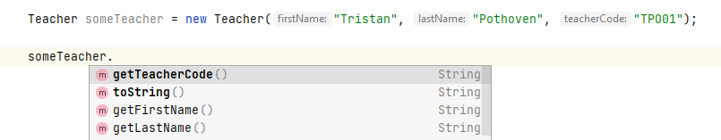
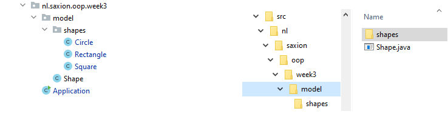

# Overerving
Competentie: _Ik begrijp het concept overerving en kan de principes hiervan toepassen om code duplicatie te voorkomen._

De opdrachten kunnen gevonden worden in de losse modulen. 

# Introductie
De afgelopen weken (en in de eerdere module Introductie Programmeren) hebben we allerlei verschillende "dingen" gemodelleerd 
in klassen, zoals artiesten, personen, treinen, dobbelstenen, auto's, vliegtuigen, etc. Deze klassen hebben vervolgens allemaal 
hun eigen functionaliteit gekregen waarbij het je misschien al eens is opgevallen dat een groot deel van deze functionaliteit
regelmatig herhaald werd.

Stel je bijvoorbeeld eens voor dat je een personeelsadministratiesysteem schrijft voor een hogeschool (bijv. Saxion). Dan zal je in dit
systeem waarschijnlijk gebruik gaan maken van "Student"-instanties om studenten te representeren respectievelijk "Docent"-instanties om
docenten te representeren. Van studenten en docenten leg je waarschijnlijk veel dezelfde informatie (variabelen!) vast, zoals naam en adresgegevens.
Daarnaast vertonen ze daarom ook veel hetzelfde gedrag (methoden) en nee, dan hebben we het niet over naar de kroeg gaan, maar 
bijv. het instellen van deze naam, getters / setters om iets met deze naam te doen, controles op ongeldige leeftijden, etc.).

Deze week gaan we kijken hoe we dit soort vergelijkbare functionaliteit kunnen gaan vastleggen in klassen die _gemeenschappelijke_
functionaliteit bevatten, ook wel _superklassen_ genoemd. In het voorbeeld van de student en docent bijv. kun je denken aan het introduceren 
van een nieuwe superklasse "Person", waarbij deze klasse de gemeenschappelijke kenmerken en/of gedragingen (naam, leeftijd, etc.) bevat zodat je deze code 
niet hoeft te herhalen in de klassen voor student en docent.

Op deze manier nadenken over je code, waarbij de focus ligt op het centraal opslaan van functionaliteit waardoor je er in andere klassen eenvoudig gebruik van kan maken, zonder de code te hoeven dupliceren heet binnen het objectgeorienteerd programmeren _overerven_. En dat is het onderwerp van deze week!

## Overerving
Het idee van overerving is relatief eenvoudig: Code met bepaalde functionaliteit die je in meerdere klassen wil gaan gebruiken verplaats
je naar een klasse die gaat dienen als _basis_ om je eigen klassen te gaan schrijven. Denk bijvoorbeeld maar eens aan het voorbeeld van eerder
waarbij je een systeem schrijft met docenten en studenten.

```java
public class Teacher {
    private String firstName; // This line can also be found in the Student class
    private String lastName; // This line can also be found in the Student class

    private String teacherCode;

    public Teacher(String firstName, String lastName, String teacherCode) {
        this.firstName = firstName; // This line can also be found in the Student constructor
        this.lastName = lastName; // This line can also be found in the Student constructor

        this.teacherCode = teacherCode;
    }

    // These 2 getters are duplicates from the Student class
    public String getFirstName() {
        return firstName;
    }

    public String getLastName() {
        return lastName;
    }

    // This getter is unique to Teacher
    public String getTeacherCode() {
        return teacherCode;
    }

    // Omitted the rest..
}
```

```java
public class Student {
    private String firstName; // This line can also be found in the Teacher class
    private String lastName; // This line can also be found in the Teacher class

    private int studentNumber;

    public Student(String firstName, String lastName, int studentNumber) {
        this.firstName = firstName; // This line can also be found in the Teacher constructor
        this.lastName = lastName; // This line can also be found in the Teacher constructor

        this.studentNumber = studentNumber;
    }

    // These 2 getters are duplicates from the Teacher class
    public String getFirstName() {
        return firstName;
    }

    public String getLastName() {
        return lastName;
    }

    // This getter is unique to Student
    public int getStudentNumber() {
        return studentNumber;
    }

    // Omitted the rest..
}
```
Merk op dat de attributen `firstName` en `lastName` zowel in `Teacher` als `Student` voorkomen. De bijbehorende code om 
dit netjes te gebruiken (constructors, getters / setters, etc.) lijkt daarom ook erg veel op elkaar.

Stel nu echter dat er een klein foutje in de constructor zit van de klasse `Student` m.b.t. het firstName attribuut 
(bijv. we verplichten dat je een voornaam altijd met hoofdletter moet schrijven). Dan is er een aannemelijke kans dat 
dit ook in `Teacher` fout gaat, aangezien de code gedupliceerd is.

Het idee van overerving is nu om een klasse `Person` te definieren (immers zijn zowel docenten als studenten ook mensen)
en deze gemeenschappelijke code hierin op te slaan. De klasse `Person` zou er dan als volgt uit kunnen zien:

```java
public class Person {
    private String firstName;
    private String lastName;

    public Person(String firstName, String lastName) {
        this.firstName = firstName;
        this.lastName = lastName;
    }

    public String getFirstName() {
        return firstName;
    }

    public String getLastName() {
        return lastName;
    }

    @Override
    public String toString() {
        return firstName + " " + lastName;
    }
}
```
Door de gemeenschappelijke code nu in de klasse `Person` op te slaan, kunnen we de klassen `Teacher` en `Student` aanpassen 
door te stellen dat dit eigenlijk _uitbreidingen_ zijn op de klasse `Person`. De functionaliteit van `Person`
blijft daardoor behouden, maar we kunnen er elementen aan toevoegen, bijv. het studentnummer of de docentcode.

We noemen dit hergebruik _overerving_; de klassen `Teacher` en `Student` _erven_ de functionaliteit van de klasse `Person`.

## Overerving toepassen: extends en super
Een klasse kun je functionaliteit laten overerven door middel van het keyword `extends`. Laten we de klasse `Teacher`
als voorbeeld gebruiken. De nieuwe klasse `Teacher`, die dus functionaliteit overneemt van de klasse `Person`, ziet er als volgt uit:

```java
public class Teacher extends Person { // Note the "extends Person" part!

    private String teacherCode;

    public Teacher(String firstName, String lastName, String teacherCode) {
        super(firstName, lastName); // Note this "super(...)" call!

        this.teacherCode = teacherCode;
    }

    public String getTeacherCode() {
        return teacherCode;
    }

    @Override
    public String toString() {
        return super.toString() + " (" + teacherCode + ")";
    }

    // Omitted any other Teacher specific methods
}
```
Het eerste wat direct opvalt is dat bij de eerste regel (klasse definitie) nu het woordje `extends` is opgenomen.
Dit woord wordt in Java gebruikt om aan te geven dat deze klasse een uitbreiding is op de klasse die daarna genoemd wordt.
In dit geval mag je het dus lezen als "de klasse Teacher is een uitbreiding op de klasse Person".

Door deze toevoeging wordt automatisch de functionaliteit uit de klasse `Person` beschikbaar gesteld aan de klasse `Teacher`.
Je kan dus nu al direct vanuit je code de methoden `getFirstName()` en  `getLastName()` aanroepen ondanks dat deze niet
in de klasse `Teacher` zijn gedefinieerd.



Merk op dat er ook methoden niet **dikgedrukt** zijn die je wel bekend voorkomen, dit komt omdat de methoden dus niet 
direct in de klasse `Teacher` staan, maar in de klasse `Person`. 

Verder zal je opvallen dat de constructor nu opeens gebruikt maakt van de "methode" `super(..)`, waarmee je aangeeft dat 
de constructor van de klasse waar `Teacher` op gebaseerd is (`Person` in dit geval) wordt aangeroepen. Dit doen we omdat 
de klasse `Teacher` ervoor moet zorgen dat de `Person` klasse goed aangemaakt kan worden.  In ons voorbeeld kan een `Person` 
alleen maar geïnstantieerd worden als deze voorzien wordt van een _firstName_ en _lastName_ (zie de constructor van `Person`). 
De klasse `Teacher` moet dus ook aan deze voorwaarde voldoen. In dit geval kiezen we er voor om de klasse `Teacher` zelf ook een constructor te geven die een 
_firstName_ en _lastName_ vraagt en sturen deze door naar de constructor van `Person` door de `super(..)` aanroep te doen.

De klasse `Person` wordt in dit geval ook wel de _superklasse_ (of "ouder" / "parent") van de klasse `Teacher` genoemd. 
Een `Teacher` is dus niets anders dan een `Person` instantie, met wat extra informatie (in dit geval de `teacherCode`). 
Aangezien de klasse `Teacher` nu zelf niet de firstName en lastName opslaat (deze functionaliteit zit nu immers in `Person`), moet 
deze informatie dus nog wel doorgegeven worden. Omgekeerd zeggen we trouwens dat de klasse `Teacher` een _subklasse_ (of "kind" / "child") is van `Person`. 

Tenslotte is het belangrijk om te weten dat wanneer je `super(..)` wil gebruiken dit de eerste instructie moet zijn in een constructor: 
Voordat je een instantie kunt construeren moet je de basis (lees: superklasse) goed hebben opgezet. Je voert dus 
altijd de `super(..)` aanroep eerst uit, waarmee je de constructor van de superklasse aanroept.

Naast de `super(..)` methode kent elke klasse ook nog een `super` attribuut, die in het gebruik een beetje lijkt op 
`this`. Dit attribuut zie je gebruikt worden in de `toString()` methode. In dit geval gebruiken we `super` om een methode 
aan te kunnen roepen vanuit de klasse waarvan we overerven. Je kan de toString dus het beste lezen als: "Gebruik het 
resultaat van de toString methode uit de klasse Person en voeg hier een stukje (de docentcode) aan toe." Let hier ook
op het gebruik van `@Override`, waarmee we aangeven dat een superklasse van `Teacher` deze methode ook heeft en
dat we het bedrag van deze methode hier (bewust) vervangen (_overriden_).

Laten we hetzelfde nog een keer doen voor de klasse `Student`:

```java
public class Student extends Person {
    
    private int studentNumber;

    public Student(String firstName, String lastName, int studentNumber) {
        super(firstName, lastName);

        this.studentNumber = studentNumber;
    }


    public int getStudentNumber() {
        return studentNumber;
    }
}
```
Merk op dat we eigenlijk hetzelfde patroon gebruiken: Met `extends` geven we aan dat de klasse `Student` een uitbreiding
is op de klasse `Person` en dus moet de eerste regel van de constructor van de superklasse aanroepen m.b.v. de methode `super(..)`. 
Aangezien de constructor van `Person` een _firstName_ en _lastName_ verwacht kiezen we er in dit geval ook voor om deze argumenten 
ook als parameters voor de constructor van `Student` op te nemen. Verder laten we nu de `toString()` methode even achterwegen, hier
komen we later nog wel op terug!

Dit kan je natuurlijk ook anders doen! Bij de super(..)-aanroep mag je ook zelf je eigen waarde geven, bijvoorbeeld:
```java
super("Bob", "TheBuilder");
```
(Dit is natuurlijk een slecht voorbeeld; zo zouden alle studenten namelijk "Bob TheBuilder" heten..)

Er zijn echter wel voorbeelden te bedenken waar deze oplossing zeer nuttig is. Deze gaan we behandelen in de opdrachten.

## Overerving en encapsulatie: public, private en protected
In het begin van de module hebben we het woord `private` geintroduceerd dat je kan gebruiken bij zowel instantievariabelen als
methoden om aan te geven dat "toegang van buitenaf" niet wenselijk is. Een `private` attribuut moesten we daarom vaak voorzien
van getters en setters.

Maar hoe zit dit nu met overerving? Aangezien de klasse `Student` een uitbreiding is op de klasse `Person` kan je stellen dat
een student "ook" een persoon is en dus dat je bij de attributen van `Person` moet kunnen (dus bij _firstName_ en _lastName_).

Als je dit wil bereiken in je code kennen we daar het keyword `protected` voor. Naast `private` en `public`, die jullie eerder
hebben gezien, is dit een nieuwe term die je kan gebruiken in combinatie met je eigen attributen en methoden.

Door het woord `protected` toe te voegen aan een attribuut geef je aan dat voor _subklassen_ (en de klassen die daar eventueel weer 
van erven, etc.) het attribuut benaderbaar moet zijn (zonder getters / setters), maar voor andere klassen niet.

Stel nu dat we de klasse `Person` een beetje aanpassen en de attributen _firstName_ en _lastName_ protected maken, dan ziet dit er als volgt uit:
```java
public class Person {
    protected String firstName;
    protected String lastName;

    // Omitted the rest
}
```

In dit geval hoef je in de klassen `Teacher` of `Student` niet meer de naam op te halen via `getFirstName()` of `getLastName()`. 
Laten we om dit aan te tonen gelijk maar eens de `toString()` methode voor `Student` implementeren:

```java
public class Student extends Person {

    private int studentNumber;

    public Student(String firstName, String lastName, int studentNumber) {
        super(firstName, lastName);

        this.studentNumber = studentNumber;
    }


    public int getStudentNumber() {
        return studentNumber;
    }

    @Override
    public String toString() {
        return lastName + ", " + firstName + " (" + studentNumber + ")";
    }
}
```

**Let op**: Het gebruik van protected variabelen opent je programmatuur weer voor mogelijke fouten die je juist
met encapsulatie probeert te voorkomen. Wees daarom bedachtzaam welke attributen je `protected` wilt maken en
welke je beter `private` kan houden. Een vuistregel bij het ontwerp van je klassen is dat je alles “zo private mogelijk” maakt. Kies in eerste instantie voor `private`, als het moet voor `protected` en pas als laatste optie voor `public`. Dus als je geen goede reden kan verzinnen om protected te gebruiken raden we je aan om je attributen private te houden.

## Methoden overriden
Naast dat je nu specifieke attributen en methoden kan toevoegen door middel van overerving, is het ook mogelijk om
bestaand gedrag te overschrijven, zoals we met `toString()` al gezien hebben. Als je in een _subklasse_ een methode 
toevoegt die ook in een _superklasse_ gedefinieerd is, zal deze overschreven worden. Een voorbeeld:

```java
public class Shape() {
    // No more details are shown as this is one of the exercises..

    public double getArea() {
        return -1; // We don't know how to calculate this of a generic shape, so we'll just return -1!
    }
    
}
```

```java
public class Rectangle() extends Rectangle {
    private int width;
    private int height;

    // No more details are shown as this is one of the exercises..
    
    @Override
    public double getArea() {
        return width * height;
    }
    
}
```

In het bovenstaande voorbeeld spreken we van het feit dat de methode `getArea()` uit de klasse `Shape` wordt "overriden"
(overschreven in het Nederlands) door de implementatie van `getArea()` uit de klasse `Rectangle`. Dit biedt je de mogelijkheid
om een meer gedetaileerde implemenatie van een methode te geven, zonder dat je hiervoor een aparte methode hoeft aan te maken!

Het is echter wel belangrijk dat je bij het overriden van methoden je wel dezelfde _method signature_ blijft hanteren, oftewel
de methode _moet_ dezelfde naam hebben, dezelfde argumenten verwachten en hetzelfde return type hebben. Alleen als aan deze voorwaarden
voldaan is spreken we over een _method override_.

Het is soms erg eenvoudig om hier fouten in te maken. Daarom heeft Java de toevoeging `@Override` bedacht (misschien heb je
die al vaker gezien, bijv. bij de toString() methode) om je hierbij te helpen. De toevoeging `@Override` zorgt er voor dat de
compiler weet dat je een methode wilt gaan overschrijven en controleert welke methode je daadwerkelijk probeert te overschrijven.
Als deze niet gevonden wordt (omdat je bijv. het return type verkeerd hebt ingevuld) zal hier een foutmelding op gegeven worden.
Kortom: `@Override` is eigenlijk niet meer dan een hulpmiddel voor jou als programmeur! 

Waar je je bewust van moet zijn bij het overriden van methoden is dat het niet mogelijk is om functionaliteit _uit te schakelen_. Je kan
dus niet een _subklasse_ creeren met minder (public) methoden dan de _superklasse_. (Hier komt het woord "extends" ook vandaan.) Als
je wil dat een _subklasse_ een bepaalde methode niet heeft, dan moet je er voor zorgen dat de superklasse deze niet aanbiedt of ervoor
kiezen om niet over te erven van die specifieke klasse.

## Het organiseren van je eigen klassen: Packages
Het aantal klassen dat je bent gaan gebruiken de afgelopen weken wordt maar groter en groter. Het is daarom verstandig om 
eens te gaan kijken naar de manier waarop je klassen op een logische manier kan structureren. In Java maakt men veelvuldig
gebruik van _packages_ om klassen te ordenen (of beter: te groeperen). De meeste programmeertalen kennen een dergelijke 
constructie, soms onder een andere naam (C# noemt het bijv. _namespaces_).

Een _package_ is feitelijk niets anders dan een bepaalde folderstructuur, zie ook onderstaande afbeelding.



(Packages zijn in IntelliJ eenvoudig te maken door met je rechtermuisknop te klikken op een folder en in plaats van 
"New --> Java class", "New --> Package" aan te klikken. IntelliJ zorgt er zelf voor dat de folder op je hardeschijf wordt aangemaakt.) 

De afgelopen weken hebben jullie vrijwel altijd je code in packages opgenomen. Deze week is dit `nl.saxion.oop.week3`. Dit 
heeft een aantal redenen, waarbij de belangrijkste is dat je klassen met dezelfde naam "uit elkaar" moet kunnen halen. 

Als je een klasse gebruikt (bijv. door deze te importeren of te initialiseren) gebruikt Java de zogehete
_fully-qualified class name_ van een bepaalde klasse. In het geval van de `Shape` klasse en subklassen die je in de afbeelding
hierboven ziet is de _fully-qualified class name_ `nl.saxion.oop.week3.model.Shape` en de bijbehorende subklassen zijn
`nl.saxion.oop.week3.model.shapes.Circle`, `nl.saxion.oop.week3.model.shapes.Rectangle` en `nl.saxion.oop.week3.model.shapes.Square`.

Door de toevoeging van het package-gedeelte van de naam is het mogelijk bepaalde klassen dezelfde namen te geven. Java heeft
bijv. ook een eigen klasse `Rectangle` in de package `java.awt` zitten. De volledige naam van deze klasse is dus `java.awt.Rectangle`,
wat anders is dan de Rectangle die je deze week gemaakt hebt als opdracht. Door het toevoegen van de package aan de volledige naam
van een klasse is het dus mogelijk voor Java om onderscheid tussen deze klassen te maken.

Het is zeer gebruikelijk om in je package name iets te verwerken wat jou als ontwikkelaar identificeert. Vaak wordt
hier tegenwoordig een _reverse domain name_ voor gebruikt. Door onze packages te prefixen met `nl.saxion.oop` kunnen wij
aangeven dat deze klassen behoren tot deze module. In bedrijven zie vaker dingen als `com.company.MyClass`.

Vanaf nu raden wij jullie aan om ook packages te gaan gebruiken om je code gestructureerd op te slaan. Hier zijn verder
weinig richtlijnen voor, behalve dan dat het voor jou (als programmeur) eenvoudig moet zijn om je klassen terug te kunnen
vinden. Kies daarom duidelijke namen voor je packages en eventuele subpackages.

### Packages en encapsulatie: package private
Het gebruik van packages heeft ook (in beperkte mate) invloed op de encapsulatie van een klasse. En dit is ronduit verwarrend:
Java gedraagt zich in dit opzicht iets anders dan andere programmeertalen. In onderstaande tabel hebben wij aangegeven
wanneer attributen door andere klassen gezien kunnen worden.

| Modifier       | Inside the same class           | Inside the package  | From a subclass  | Outside class |
| ------------- |:-------------:| -----:|-----:|-----:|
|public      | Yes   |  Yes    |    Yes       |      Yes |    
|protected   | Yes   |  Yes    |    Yes       |      No  |    
|default     | Yes   |  Yes    |    No       |      No  |
|private     | Yes   |  No     |    No        |      No  |

(Let op: Een _Outside class_ is een klasse die dus niet in dezelfde package staat als jouw klasse en ook niet erft van
de klasse waarin de attributen zijn opgenomen.)

Een aantal van deze access modifiers ken je al (`public` en `private`) en deze week introduceerden we ook nog `protected`.
Public attributen zijn altijd door alle klassen, ongeacht of het subklassen zijn van deze klassen of ze in dezelfde of andere
packages zitten, aan te passen. Private attributen zijn nooit aan te passen. Dus ook niet door subklassen.

Protected attributen hebben wij vandaag geintroduceerd als attributen die alleen maar te gebruiken zijn binnen subklassen.

Dit is echter **niet** geheel waar. Alle klassen in dezelfde packages als de klasse met de protected attributen kunnen
deze ten alle tijden aanpassen. (Dit is bij andere programmeertalen vaak niet het geval. Wij kunnen jullie ook niet uitleggen
waarom deze keuze is gemaakt.)

De laatste optie (_default_) is de variant die je in Introductie Programmeren veelvuldig hebt gebruikt. Hier laat
je het woord namelijk gewoon weg, zoals bijvoorbeeld bij:

```java
public class Student {
    String firstName;
    String lastName;
}
```

# Videos

[](http://www.youtube.com/watch?v=jlllbZr1AIc)
[](http://www.youtube.com/watch?v=ISpbBzFC1Yo)
[](http://www.youtube.com/watch?v=h7QUPHEw2AE)


