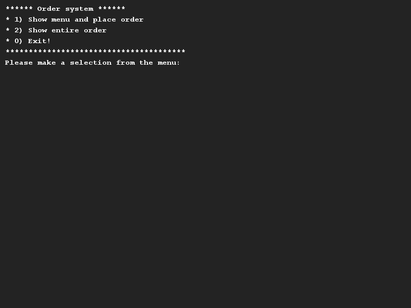

# Hospitality
## Difficulty:    

The application that we have included contains an ordering system for the catering industry. You can use it to order drinks 
and food. Each item on the menu has a name and a price. In addition, drinks need to be stored to determine whether they 
are alcoholic and how much volume there is in each flask (in millilitres). For the food, we store whether it is a hot 
or cold dish and how many people can be fed from one portion.

You should also be able to request the total price.

To help you out with some menu items, we have provided a menuitems.csv for you with some dummy data from a typical
Dutch "pannenkoekenhuis". (So the menu items might be unfamiliar to you! Please Google them if you want to.)

##Examples

## Relevant links
* [Java documentation for the SaxionApp](https://saxionapp.hboictlab.nl/nl/saxion/app/SaxionApp.html)
