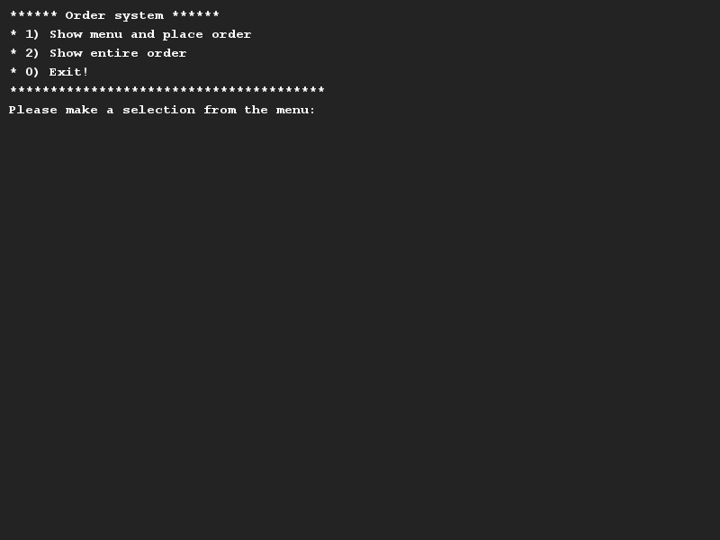
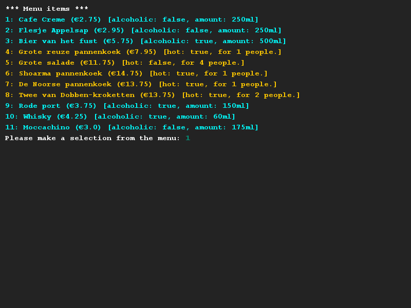
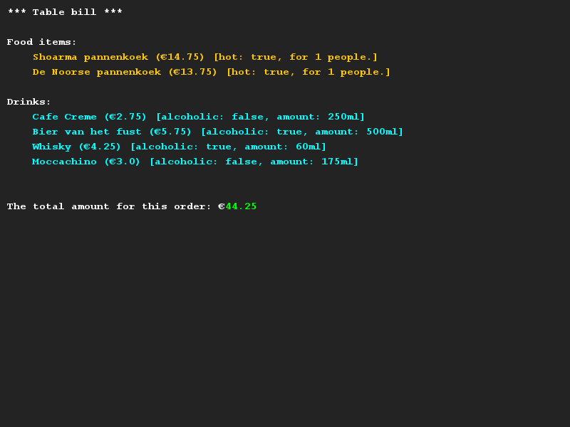

# Horeca
## Moeilijkheid:    

De applicatie die we hebben meegeleverd hebben bevat een bestelsysteem voor in de horeca. Je kunt drankjes en 
etenswaren mee bestellen. Ieder te bestellen item op de menukaart heeft een naam en een prijs. Daarnaast moet er van 
drankjes worden opgeslagen of het alcoholisch is en hoeveel milliliter er in een flesje zit. Van etenswaren slaan we op 
voor hoeveel personen een portie is en of het een warm of koud gerecht is.

U zou ook de totale prijs moeten kunnen opvragen.

Om je programma te voorzien van wat data hebben wij menuitems.csv meegeleverd met daarin enkele menuitems. Merk goed op
dat er in dit csv bestand een onderscheid wordt gemaakt tussen dranken en gerechten.

## Voorbeelden

## Relevant links
* [Java documentation SaxionApp](https://saxionapp.hboictlab.nl/nl/saxion/app/SaxionApp.html)