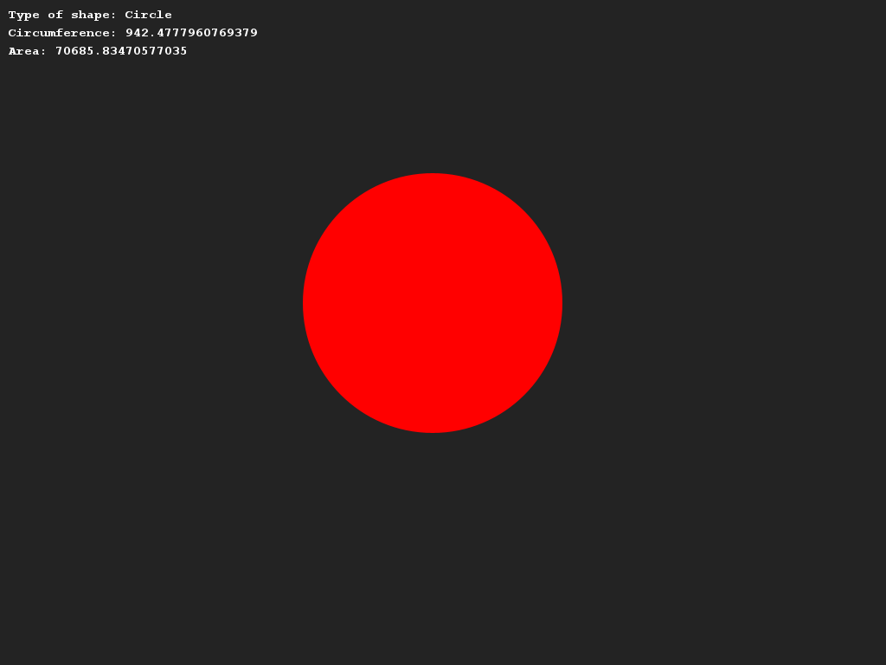
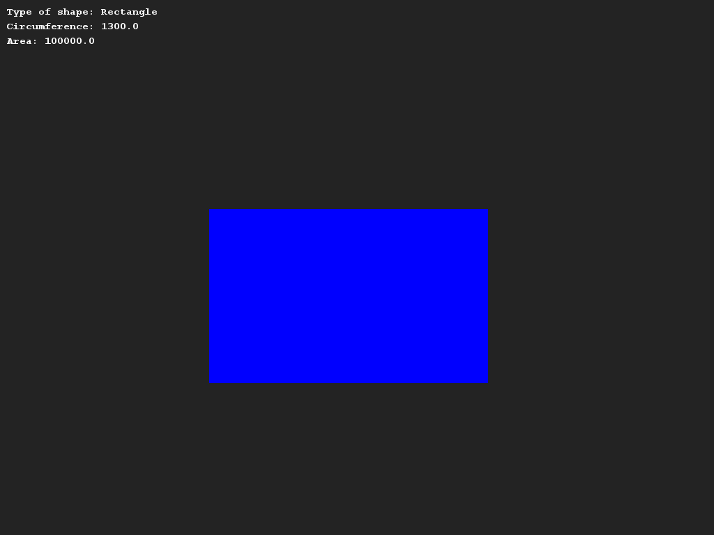
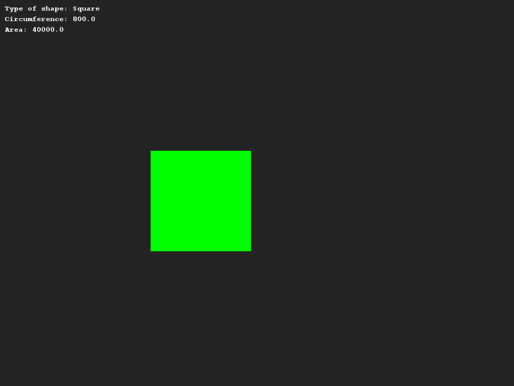

# Introducing the Shape superclass
## Difficulty:    
We are going to reuse the created shape classes from last week.

Create one list of shapes in the Application class and run a for loop through the shapes.
Print per object the type, print the outline, the content and draw the shape.

##Examples

## Relevant links
* [Java documentation for the SaxionApp](https://saxionapp.hboictlab.nl/nl/saxion/app/SaxionApp.html)
