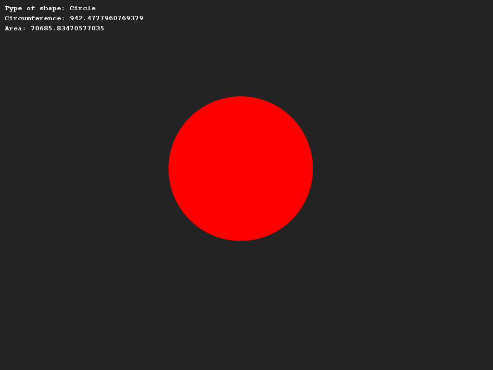
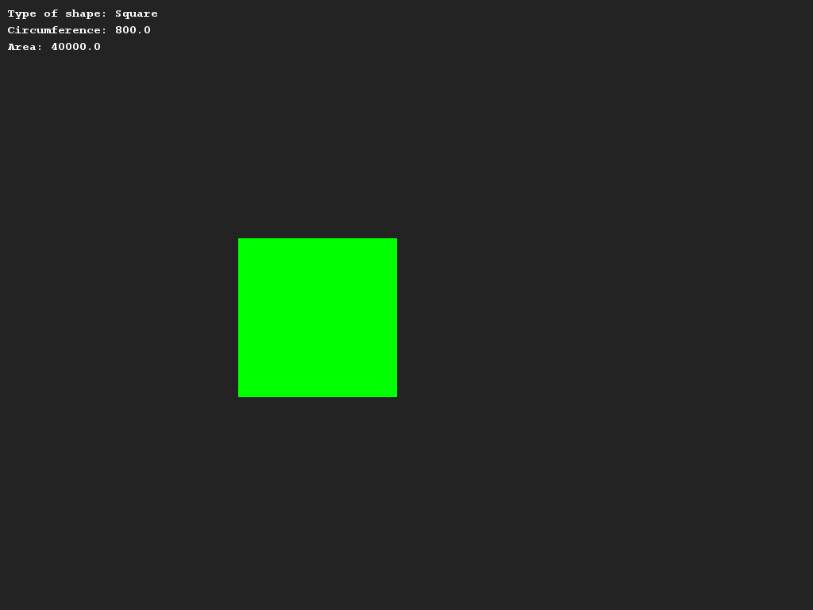

# Vormen opdracht
## Moeilijkheid:    
We gaan de gemaakte vorm klassen van vorige week hergebruiken deze week.

Maak één lijst met vormen in deApplication klasse en loop met een for-lus door de vormen.
Print per object het type, print de omtrek, de inhoud en teken de vorm.

## Voorbeelden
    

   

## Relevant links
* [Java documentation SaxionApp](https://saxionapp.hboictlab.nl/nl/saxion/app/SaxionApp.html)
