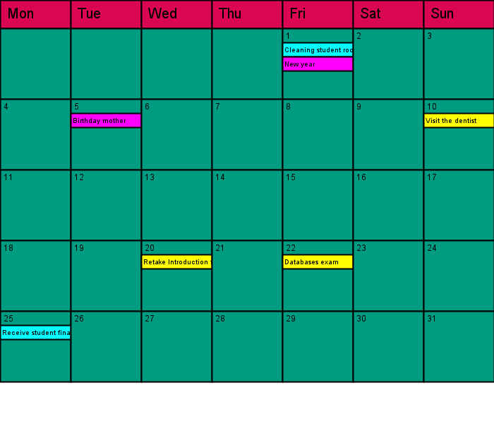

# Calendar
## Difficulty:    

In this assignment we are going to build a calendar. The schedule can store appointments. Each appointment consists of a title and a date on which it takes place. 
There are three different types of appointments:
- Single appointments. These take place on one specific date.
- Monthly appointments. These take place every month on the same day (e.g. 5) and at the same time.
- Annual appointments. These take place every year on exactly the same month and day (e.g. 6 June) and the same time.

Create classes to model the above problem. 
Also build a method `occursOn(int year, int month, int day)` that indicates of a given date whether the appointment will take place on that day.
For each class, create a `toString()` method that transparently displays the details of the appointment.

Then implement the given `Calendar` class and test if your code works correctly.

*Hint:* use the `YearMonth` and the `LocalDate` classes from Java to determine the first day of the week and the length of the month.

**Note:** that you should start off simple and just print out the appointments for each date. The graphical interface shown below is our
challenge for you for this week.

## Bonus    () ()
It is also possible to draw a monthly calendar in the SaxionApp. The image below shows such a monthly overview.
The one-time appointments are shown in yellow, the monthly appointments in cyan and the yearly appointments in magenta.

## Relevant links
* [Java documentation for the SaxionApp](https://saxionapp.hboictlab.nl/nl/saxion/app/SaxionApp.html)
