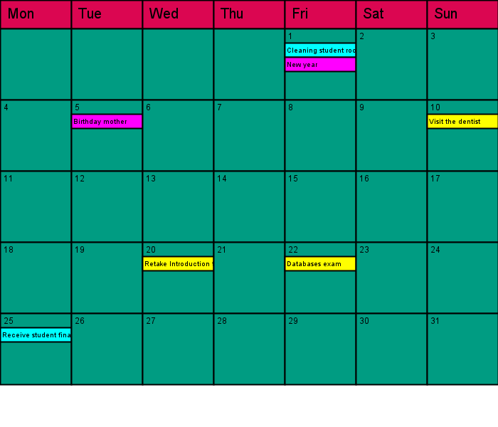

# Calendar
## Moeilijkheid:    

Bij deze opdracht gaan we een agenda bouwen. De agenda kan afspraken opslaan. Ieder afspraak bestaat uit een titel en een datum waarop deze plaats vindt. 
Er zijn 3 verschillende typen afspraken:
- Losse afspraken. Deze vinden plaats op één specifieke datum.
- Maandelijkse afspraken. Deze vinden plaats iedere maand op dezelfde dag (bijvoorbeeld 5) en hetzelfde tijdstip.
- Jaarlijkse afspraken. Deze vinden ieder jaar plaats op exact dezelfde maand en dag (bijvoorbeeld 6 juni) en hetzelfde tijdstip.

Maak klassen om het bovenstaande probleem te modelleren. 
Bouw ook een methode `occursOn(int year, int month, int day)` die van een gegeven datum aangeeft of de afspraak op die dag plaats vindt.
Maak per klasse een `toString()` methode die overzichtlijk de details van de afspraak weergeeft.

Implementeer vervolgens de gegeven `Calendar` klasse en test of je code correct werkt.

*Hint:* Gebruik de `YearMonth` en de `LocalDate` klassen uit Java om de eerste dag van de week te bepalen en de lengte van de maand.

Het is prima als je de output van het programma zo simpel mogelijk houdt. Probeer vooral in de code de juiste aanroepen te doen
en print het resultaat van de `occursOn(..)` methode. 

Wij gaan echter een klein stapje verder:

## Bonus    () ()
Het is ook mogelijk om een maandkalender te tekenen in de SaxionApp. Onderstaande afbeelding toont zo'n maandoverzicht.
De eenmalige afspraken zijn weergeven in het geel, de maandelijkse afspraken in cyaan en de jaarlijkse afspraken in het magenta.

## Relevant links
* [Java documentation SaxionApp](https://saxionapp.hboictlab.nl/nl/saxion/app/SaxionApp.html)
