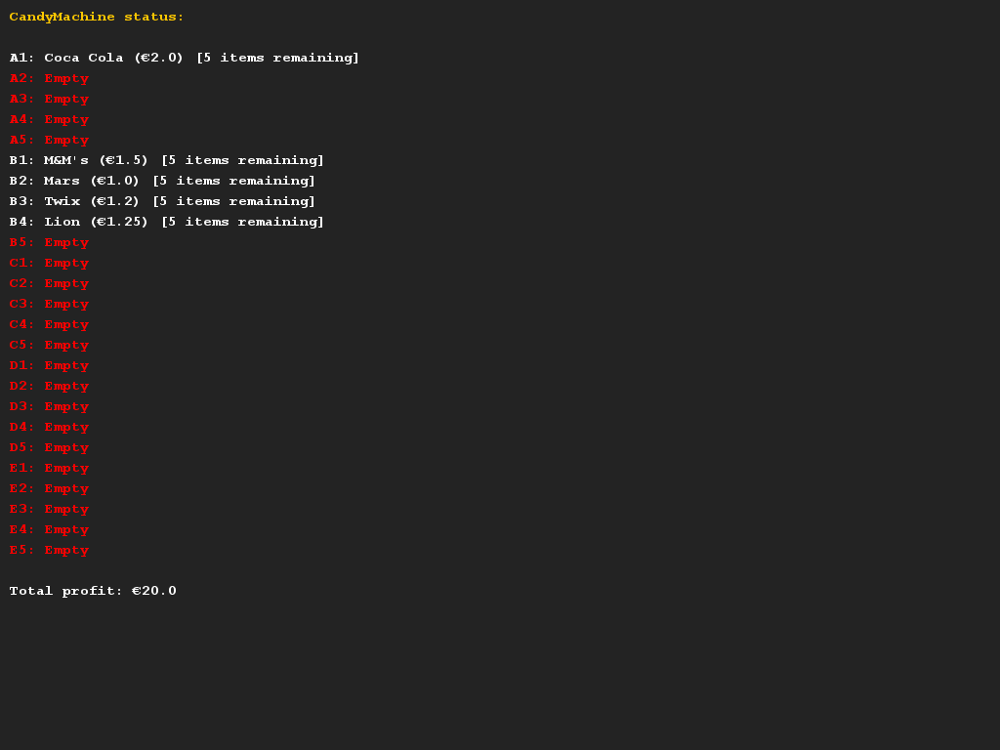

# Candy dispenser
## Difficulty:    

In this assignment we model a candy machine. The candy machine contains two types of products: soda cans and candy.
The name and price of each product must be stored.
In addition, we need to store the contents of the soda cans in millilitres, the amount of sugar in grams and whether it contains caffeine.
For sweets, we also need to store the weight in grams.

The candy machine has an index system with letters and numbers. The letters indicate the row in the machine, the number indicates the column.
The machine has 5 rows (A to E) and 5 columns (1 to 5). Each compartment can contain several copies of a product (e.g. 8 x a Mars bar).

The machine has the following functionality:
- Someone can fill a compartment in the machine with a certain product. This whole compartment will then be filled with these products.
- Someone can empty a compartment, so that a new product can be placed in the machine.
- Someone can take a product out of the machine. The money that is generated by this is also stored in the machine.
- Someone can check with the machine to see how much money has been earned from the machine.

In addition, the machine must have good error handling and a clear `printReport()` method (see example), which prints the contents of the machine.
Implement the class candy dispenser and write the necessary classes to store the products and the subject content.

Note that you do not have to implement any interactions with the machine. We have provided you with the code that generated the output below.

##Examples

## Relevant links
* [Java documentation for the SaxionApp](https://saxionapp.hboictlab.nl/nl/saxion/app/SaxionApp.html)
