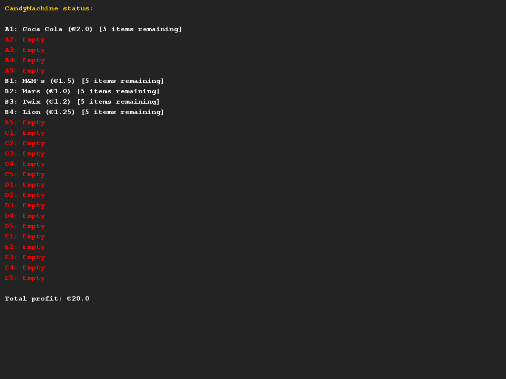

# Snoepautomaat
## Moeilijkheid:    

Bij deze opdracht modelleren we een snoepautomaat. De snoepautomaat bevat twee typen producten: frisdrank blikjes en snoep.
Van ieder product moet er opgeslagen worden: de naam en de prijs.
Daarnaast moeten we bij de frisdrank blikjes opslaan: de inhoud in milliliters, hoeveelheid suiker in gram en of er cafeine in zit.
Bij snoep moet er nog opgeslagen worden wat het gewicht is in gram.

De snoepautomaat heeft een index systeem met letters en cijfers. De letters geven de rij in de automaat aan, het cijfer geeft de kolom aan.
De automaat heeft 5 rijen (A t/m E) en 5 kolommen (1 t/m 5). Ieder vakje kan meerdere exemplaren van een product bevatten (bijvoorbeeld 8x een mars).

De machine heeft volgende functionaliteit:
- Iemand kan een vakje in de automaat vullen met een bepaald product. Dit hele vak wordt dan gevuld met deze producten.
- Iemand kan een vak leeg maken, zodat er een nieuw product in de machine geplaatst kan worden.
- Iemand kan een product uit de automaat halen. Het geld dat dit oplevert wordt ook opgeslagen in de automaat.
- Iemand kan bij de automaat opvragen hoeveel geld er verdiend is met de automaat.

Daarnaast moet de automaat goede foutafhandeling hebben een duidelijke `printReport()` methode, waarmee de inhoud van de automaat geprint wordt (zie voorbeeld).
Implementeer de klasse snoepautomaat en schrijf de benodigde klassen om de producten en de vakinhoud op te kunnen slaan.

Je hoeft je verder geen zorgen te maken over de interactie met het systeem. Voor deze opdrachten houden we het gewoon bij de
code en een report-methode.

## Voorbeelden

## Relevant links
* [Java documentation SaxionApp](https://saxionapp.hboictlab.nl/nl/saxion/app/SaxionApp.html)
