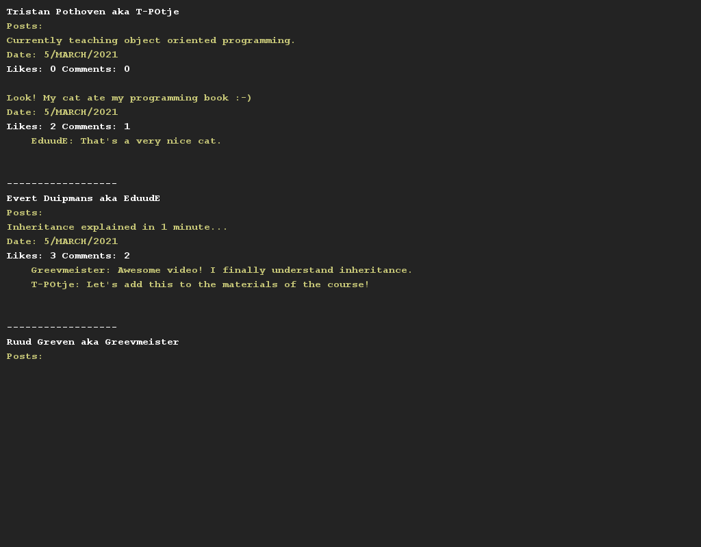

# Facebook-ish..
## Difficulty:    
In this assignment you are going to recreate Facebook's wall system.

Facebook consists of users. Each user has a user name and a real (full) name. In addition, a list of posts is kept of each user.

Each post can be of one of the following types:
- A normal post (a post with a piece of text and a date/time).
- An image (this is a normal post completed with a filename of the image and a filter that is applied).
- A video (this is a normal post completed with a file name of the video and the length of the video in seconds).

There are two lists for each post. One list with comments (one consists of the user who posts the comment, the comment itself and a date/time of posting).
In addition, there is one list containing the likes. This list contains the users who have liked this post.

The `User` class will have to contain the following methods:
- `void addPost(Post post)` to add a new post.
- To delete a post: `void removePost(Post post)`.

The `Post` class will need to contain the following methods:
- `void addComment(Comment comment)` to add a comment.
- `void removeComment(Comment comment)` to delete a comment.
- `void like(User user)` to let a user like a post.
- `void unlike(User user)` to remove a like posted by a user.
- `int getNumberOfLikes()` to get the number of likes of a post.

In the Application class, a setup is already given with a number of users and posts. Create print methods in User and post.

##Examples

## Relevant links
* [Java documentation for the SaxionApp](https://saxionapp.hboictlab.nl/nl/saxion/app/SaxionApp.html)
