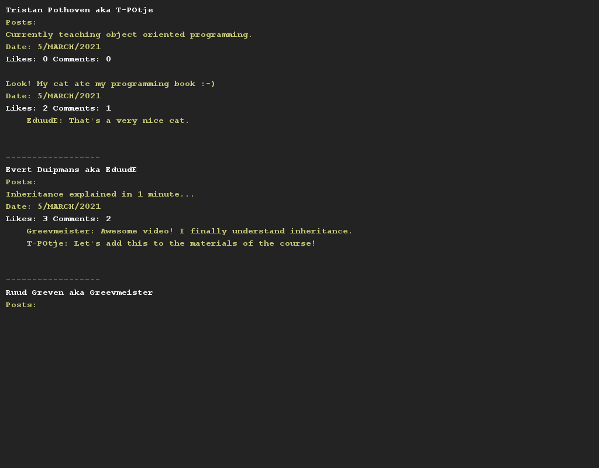

# Facebookachtig..

## Moeilijkheid:    
Bij deze opdracht ga je het wall-systeem van Facebook nabouwen.

Facebook bestaat uit gebruikers. Iedere gebruiker heeft een gebruikersnaam en een echte (volledige) naam. Daarnaast wordt er van iedere gebruiker een lijst met zijn/haar posts bijgehouden.

Iedere post kan van één van de volgende typen zijn:
- Een normale post (een post met een stuk tekst en een datum/tijd).
- Een afbeelding (dit is een normale post aangevuld met een bestandsnaam van de afbeelding en een filter dat wordt toegepast).
- Een video (dit is een normale post aangevuld met een bestandsnaam van de video en de lengte van de video in seconden).

Voor iedere post geldt dat er twee lijsten moeten worden bijgehouden. Eén lijst met comments (een bestaat uit de gebruiker die de comment plaatst, de comment zelf en een datum/tijd van plaatsing).
Daarnaast is er één lijst met daarin de likes. Deze lijst bevat de gebruikers die deze post geliked hebben.

De `User` klasse zal de volgende methodes moeten bevatten:
- `void addPost(Post post)` om een nieuwe post toe te voegen.
- `void removePost(Post post)` om een post te verwijderen.

De `Post` klasse zal de volgende methodes moeten bevatten:
- `void addComment(Comment comment)` om een comment toe te voegen.
- `void removeComment(Comment comment)` om een comment te verwijderen.
- `void like(User user)` om een gebruiker een post te laten liken.
- `void unlike(User user)` om een like die een gebruiker heeft geplaatst weg te halen.
- `int getNumberOfLikes()` om het aantal likes op te vragen van een post.

In de Application class wordt al een setup gegeven met een aantal gebruikers en posts. Maak afdrukmethoden in Gebruiker en post.

## Voorbeelden
 

## Relevant links
* [Java documentation SaxionApp](https://saxionapp.hboictlab.nl/nl/saxion/app/SaxionApp.html)
