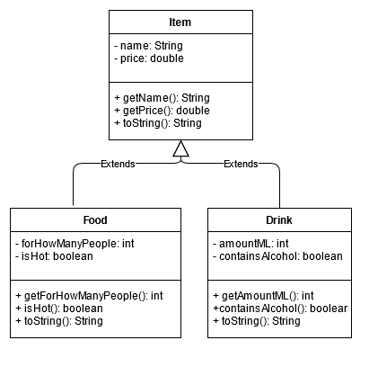

# Putting your class designs to paper
## Difficulty:    

Study the video that deals with class design and our given example of a class diagram for exercise 0 (see below). Try
to understand that a class diagram can help you keep track of exactly where to find what functionality (e.g. methods).
However, drawing up a class diagram is sometimes quite difficult, but with the right tooling generally doable! (In fact: you can
sometimes have a class diagram generated on the basis of existing code. For now, though, we're going to draw class diagrams ourselves).

Using these examples, try to draw a class diagram for assignments 1, 2 and 3 (assignment 4 is bonus!). For this assignment, you don't need to write any code.

There are several tools in circulation with which you can draw class diagrams, as far as we are concerned you pick one yourself. We use _draw.io_ quite often and
have included the drawio file of the class diagram in this project for inspiration.

**Note:** The reason this is assignment 5 (even tho it's just 1 star) for this week is because we don't want to cover the concept of "class diagram" until the second lesson of week 4.

# Videos
We borrowed this video from the Lucidchart company (Lucidchart can be used to draw class diagrams):

# Example

## Relevant links
* [Java documentation for the SaxionApp](https://saxionapp.hboictlab.nl/nl/saxion/app/SaxionApp.html)
