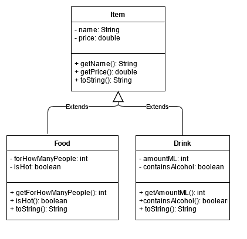

# Je programma's vastleggen in klassendiagrammen
## Moeilijkheid:    

Bestudeer de video dat gaat over het ontwerp van klassen en ons gegeven voorbeeld van een klassendiagram voor opdracht 0 (zie hieronder). Probeer
met name in te zien dat een klassendiagram je kan helpen het overzicht te bewaren waar precies welke functionaliteit te vinden is. Het opstellen
van een klassendiagram is echter soms best lastig, maar met de juiste tooling over het algemeen goed te doen! (Sterker nog: Je kan 
soms een klassendiagram laten genereren op basis van bestaande code. Voor nu gaan we echter zelf klassendiagrammen tekenen.)

Probeer nu aan de hand van deze voorbeelden een klassendiagram te tekenen voor de opdrachten 1, 2 en 3 (opdracht 4 is bonus!). Voor deze opdracht hoef je verder geen code te schrijven.

Er zijn verschillende tools in omloop waarmee je klassendiagrammen kan tekenen, wat ons betreft kies je er zelf 1 uit. Wij gebruiken redelijk vaak _draw.io_ en 
hebben ter inspiratie het drawio bestand van het klassendiagram meegeleverd in dit project.

**Let op:** De reden dat dit opdracht 5 is voor deze week is omdat we het concept "klassendiagram" pas in de tweede les van week 4 willen behandelen.

# Videos
Met dank aan de ontwikkelaars van Lucidchart (een applicatie waarmee je class diagrams kan tekenen):

# Voorbeeld

(Note that the "Application" class was left out intentionally as it doesn't have any real functions on it's own.)

## Relevant links
* [Java documentation SaxionApp](https://saxionapp.hboictlab.nl/nl/saxion/app/SaxionApp.html)
