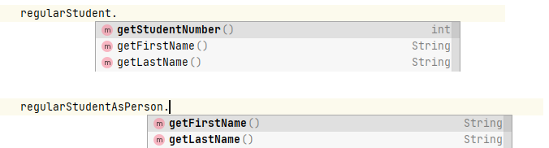
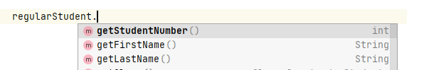
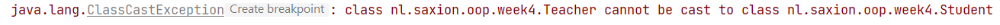
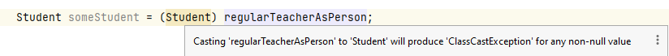

# Polymorfisme
Competentie: _Ik begrijp het concept polymorfisme en kan gebruik maken van superklassen om verschillende datatypen op 
eenzelfde manier te gebruiken._

De opdrachten staan in de losse modulen.

## Introductie
Deze week bekijken we de volgende pijler van het objectgeoriënteerd programmeren: _polymorfisme_.

Polymorfisme betekent letterlijk _"veelvormigheid"_, of ook: iets kan meerdere vormen hebben. Binnen het programmeren
heb je dit de afgelopen weken vaak gezien en gebruikt: je hebt een klasse `Person` geschreven, die vervolgens als
basis werd gebruikt voor de klassen `Student` en `Teacher`. Als je vervolgens een `Teacher` aanmaakt en opslaat heb je
een object dat eigenlijk een `Person` is, met een kleine toevoeging om er een `Teacher` van te maken. 

In dit geval spreken we van een object dat eigenlijk meerdere gezichten (vormen) heeft: het is zowel een `Teacher` als ook een 
`Person`. 
Hetzelfde gaat natuurlijk ook op voor ons andere voorbeeld: `Student`. Een `Student` is ook een `Person`. Aangezien studenten en
docenten beiden dus ook personen zijn is het mogelijk om code te schrijven die voor beide typen opgaat (of beter: voor het type
`Person`). De mogelijkheid dat je een klasse (bijv. `Student`) ook als een andere klasse kan behandelen (bijv. `Person`) 
wordt daarom ook polymorfisme genoemd.

Deze techniek is bijzonder krachtig, omdat het je in staat stelt bepaalde typen (op basis van een superklasse) op eenzelfde
gemeenschappelijke manier te behandelen. Hiermee voorkom je codeduplicatie en verhoog je de herbruikbaarheid van je code. 

Je zal hier echter wel iets voor moeten doen; Java kan bijv. niet zelf eenvoudig zien wat voor type je precies 
wilt gebruiken en tijdens je programmeren zal je hier aandacht voor moeten hebben. En dat is precies het onderwerp van deze 
week!

## Polymorfisme
Alles in Java heeft een type. Dit heb je geleerd vanaf het moment dat je begon met programmeren in Java. Je hebt variabelen
gemaakt van het type `int`, `double`, etc. (wat we de primitieve types noemen), maar al snel zijn we onze eigen datatypen gaan 
bouwen in de vorm van `Person`, `Artist`, `Album`, etc. Tot nu toe echter hebben we altijd gedaan alsof een variabele altijd 
maar 1 type kon hebben en eigenlijk is dat gewoon niet waar. Alle _referentietypen_ in Java zijn polymorf, wat betekent dat 
ze meerdere vormen kunnen aannemen. Alle klassen binnen Java erven bijv. al standaard van de klasse `Object`, met als gevolg
dat elke klasse die je zelf bouwt, eigenlijk al 2 typen (vormen) heeft.

Bij overerving introduceerden we daar nog wat extra diepgang. Naast de klassen `Teacher` en `Student` introduceerden we
ook nog een klasse `Person` waar gemeenschappelijke functionaliteit in kon worden opgenomen. Door deze toevoeging werd
een instantie van `Student` dus ook _ook_ een `Person` (en indirect nog steeds _ook_ een `Object`). Als je dus een `Teacher`
instantie gebruikt in je applicatie kun je deze dus op verschillende manieren behandelen: als `Teacher`, maar ook als `Person`.

(Merk op dat omgekeerd dit trouwens meestal niet opgaat: een docent is altijd een persoon, maar niet alle personen zijn 
docenten!)

Gegeven is de volgende code voor de klassen `Person`, `Student` en `Teacher`:

```java
public class Person {
    private String firstName;
    private String lastName;

    public Person(String firstName, String lastName) {
        this.firstName = firstName;
        this.lastName = lastName;
    }

    // Omitted getters / setters
}
``` 

```java
public class Student extends Person {

    private int studentNumber;

    public Student(String firstName, String lastName, int studentNumber) {
        super(firstName, lastName);

        // Omitted checks on student number
        this.studentNumber = studentNumber;
    }

    // Omitted getters / setters
}
```

```java
public class Teacher extends Person {

    private String code;

    public Teacher(String firstName, String lastName) {
        super(firstName, lastName);

        code = generateCode(firstName, lastName); // Converts "Tristan Pothoven" into "TPO" -- Omitted as this is an exercise.
    }

    // Omitted getters / setters
}
```

Tot nu toe hebben wij deze klassen altijd geïnstantieerd door middel van:
```java
Student regularStudent = new Student("Some", "Student", 1234567);

Teacher regularTeacher = new Teacher("Tristan", "Pothoven");
```
En dat is uiteraard prima. We definiëren een nieuwe variabele van het type `Student` of `Teacher` en instantiëren een object
van hetzelfde type (en verbinden deze aan een variabele). Maar het kan ook anders. We kunnen namelijk ook voorgaande code
herschrijven en beide soorten personen opslaan in variabelen van hetzelfde type:

```java
Person regularStudentAsPerson = new Student("Some", "Student", 1234567);

Person regularTeacherAsPerson = new Teacher("Tristan", "Pothoven");
```

We maken in dit geval gebruik van het feit dat een `Student` ook een `Person` is. Ga maar na dat het ook logisch klinkt:
_"Een student is ook een persoon."_

Het opslaan van een `Student` instantie in een `Person` variabele heeft echter wel gevolgen: in je programma worden
studenten (en ook docenten) nu echt beschouwd als instanties van de klasse `Person`, met als gevolg dat alle uitbreidingen 
die je hebt toegevoegd aan de subklassen (bijv. het opvragen van het studentnummer aan een student of de docentcode aan 
een docent) nu **niet** mogelijk is. De variabelen zijn namelijk **niet** van het juiste type om die methoden aan te roepen.
(De inhoudelijke data van een `Teacher` of `Student` wordt echter wel goed opgeslagen. Je hoeft dus niet bang te zijn dat
informatie verloren gaat.)

Dit is ook heel snel te zien als je dit probeert in te typen in de IntelliJ IDEA editor. Bestudeer de volgende screenshots:



Let op dat in de afbeelding hierboven dus **geen** `getStudentNumber()` te zien is bij `regularStudentAsPerson`, omdat 
de "studentStoredInPerson" variabele verwijst naar een `Person` instantie. En een `Person` instantie heeft geen 
studentnummer!

Dit probleem is echter gelukkig eenvoudig op te lossen: het is mogelijk om een variabele van het type `Person` die 
eigenlijk verwijst naar een `Student` instantie weer om te zetten naar zijn student vorm. Hier komen we later op terug.

Doordat we nu zowel docenten als studenten als `Person` instanties kunnen opslaan in variabelen, heeft dit ook grote
voordelen voor onze verdere code. Je kunt deze techniek namelijk op allerlei plekken inzetten, zoals bijv. bij methoden 
(als argument en als return type), maar misschien is het beste voorbeeld wel in lijsten te vinden.

Bekijk onderstaande voorbeeld waarin we een ArrayList gebruiken om personen op te slaan:

```java
Person regularStudentAsPerson = new Student("Some", `Student`, 1234567);
Person regularTeacherAsPerson = new Teacher("Tristan", "Pothoven");

ArrayList<Person> listOfPersons = new ArrayList<>(); // Note the Person type!

listOfPersons.add(regularStudentAsPerson); // A student is also a person!
listOfPersons.add(regularTeacherAsPerson); // A teacher is also a person!
```

Door de ArrayList nu het type `Person` te laten opslaan krijgen we de mogelijkheid om *alle* personen, ongeacht of dit nu
studenten of docenten zijn, in dezelfde lijst op te staan. Uiteraard hangt het nog wel af van het doel van het programma
of je dat moet willen (soms is het gebruik van 2 lijsten handiger), maar de mogelijkheid bestaat.

Voor de volledigheid: het is niet per se nodig om de variabelen van het type `Person` te maken. De compiler is in staat
om te achterhalen dat de klasse `Student` ook een subklasse is van `Person`. Onderstaande code is dus gelijk aan
voorgaande code (maar voor de duidelijkheid benoemen we het beiden).

```java
Student regularStudent = new Student("Some", `Student`, 1234567); // Note that we do not store this as Person!
Teacher regularTeacher = new Teacher("Tristan", "Pothoven"); // Note that we do not store this as Person!

ArrayList<Person> listOfPersons = new ArrayList<>(); // Note the Person type!

listOfPersons.add(regularStudent); // A student is also a person!
listOfPersons.add(regularTeacher); // A teacher is also a person!
```

Doordat we nu docenten en personen in dezelfde lijst kunnen opslaan, betekent dit dat we code die uitgevoerd moet worden
op _alle_ bekende personen in het systeem eenvoudig kunnen toepassen (bijv. door een lusje te bouwen). Maar de echte winst 
is te vinden in de uitbreidbaarheid van ons systeem. 

We beschouwen even een (extreem) voorbeeld: naast de klassen `Teacher` en `Student` bouwen we het administratiesysteem uit 
en introduceren ook nog de klassen `Employee`, `PartTimeStudent`, `FullTimeStudent`, `Manager` en `ProjectLeader`, die elk 
erven van de klasse `Person`. (We laten de implementatie van deze klassen even achterwege.)

Doordat we in ons programma gebruik maken van een lijst met `Person` instanties zijn deze nieuwe subtypen van `Person` hier 
ook onmiddellijk te gebruiken: het is niet nodig om enige aanpassing te doen in onze code om de _listOfPersons_ ook al deze 
nieuwe typen te laten accepteren. Het is dus nog steeds mogelijk om _alle personen_ op te slaan in deze lijst! Zolang de 
klassen erven van `Person` blijft deze oplossing werken. En dit principe, dat je dus geen aanpassingen in je programmatuur 
hoeft te maken als je deze verder uitbreidt, is een van de sterkste punten uit het objectgeoriënteerd programmeren: Het maakt
verdere ontwikkeling van het systeem een stuk makkelijker!

## Casting
Zoals eerder gemeld heeft het gebruik maken van superklassen om een bepaalde typen samen te nemen ook wat nadelen. De voornaamste
is dat je toegang verliest tot alle uitbreidingen die je hebt toegevoegd aan de klasse (zoals bijv. het studentnummer of 
de docentcode). Omgekeerd is geen probleem, omdat een superklasse nooit meer functionaliteit heeft dan een subklasse.

Je kunt echter altijd een klasse met een bepaald supertype weer "terugstoppen" in een variabele van een bepaald subtype door 
deze te _casten_. Je hebt eerder gezien om bijv. van een `double` waarde een `int` te maken:
```java
double someDouble = 2.5;
int valueFromDouble = (int) someDouble; // this will result in "2" as everything after the comma is dropped.
```
De constructie `(<type>)` wordt _casting_ genoemd en daarmee dwing je de compiler om een variabele van een
bepaald type te beschouwen als iets anders; je zegt eigenlijk tegen de compiler "vertrouw mij maar, ik weet wat ik doe". 
Merk op dat het casten van een subklasse naar een superklasse niet nodig is, want de subklasse **is** immers altijd ook de 
superklasse m.a.w. een `Student` instantie heeft alle variabelen / methoden die een `Person` heeft (en meer). Je hoeft dus
nooit een `Student` variabele te casten naar een `Person` variabele.

Casting kun je dus als volgt gebruiken in ons eerdere voorbeeld van personen, studenten en docenten:
```java
Person regularStudentAsPerson = new Student("Some", `Student`, 1234567);

Student regularStudent = (Student) regularStudentAsPerson; // Convert the type from Person back to Student.
```

De variabele `regularStudent` is nu weer als het ware "hersteld" en alle functionaliteit van de klasse `Student` is nu weer
te gebruiken. Je mag het voorgaande voorbeeld ook wel lezen als _probeer het object regularStudentAsPerson om te zetten
naar een normale Student instantie_.



Echter! Casten is niet veilig. Je las misschien al het woord "probeer" in de vorige zin; dit was met een reden. Casten
stelt je als ontwikkelaar in staat om slimme trucs toe te passen, maar de compiler gaat er vanuit dat jij weet wat je doet.
Er zijn dus geen echte goede controles op het omzetten van typen en dit kan dus ook wel echt fout gaan. Neem bijv. het volgende
voorbeeld:

```java
Person regularTeacherAsPerson = new Teacher("Tristan", "Pothoven"); // Note that we initialize a Teacher instance, but store it as `Person`.

Student someStudent = (Student) regularTeacherAsPerson; // Convert the type from Person to Student.
```
Qua syntax is dit volledig geldig en je krijgt hier ook geen compileer-fouten op. Dit komt omdat je de Java compiler de opdracht
geeft om van een type "iets anders" te maken en dat wil Java prima doen! Echter zal deze code tijdens de uitvoer ontdekken dat
dit niet kan en je programma laten crashen met een `ClassCastException`:



Je mag deze foutmelding beschouwing als een melding _dat het niet gelukt is om van dit Teacher object een Student object te maken_. En
dat is natuurlijk ook logisch! Een student heeft immers geen docentcode en een docent heeft geen studentnummer. 

IntelliJ als tool is gelukkig best slim en zal ons helpen om dit soort fouten te vinden, maar kan dit in een groot deel van 
de situaties ook niet kunnen aangeven. (Vooral niet als je methoden gaat gebruiken in verschillende klassen.) 



Het is dus aan jou als programmeur om ervoor te zorgen dat, als je een type om wil zetten, je zeker weet dat dit kan.

En gelukkig kunnen we dat eenvoudig controleren en daar gaat de volgende paragraaf over.

## Onderscheid maken tussen typen: instanceof
Om te kunnen controleren of een object van een bepaald type is kent Java het keyword `instanceof`. Je kunt dit
keyword bijv. gebruiken in een if-statement. De syntax is, voor wat je gewend bent, misschien wat 
apart: `<object> instanceof <type>`. Laten we dit gelijk maar eens bekijken in een voorbeeld:

```java
Person regularTeacherAsPerson = new Teacher("Tristan", "Pothoven"); // Note that we initialize a Teacher instance, but store it as `Person`.

if (regularTeacherAsPerson instanceof Teacher) {
        // It is safe to cast to a Teacher instance!
        Teacher regularTeacher = (Teacher) regularTeacherAsPerson;
} else {
    // Don't do it! ClassCastException is waiting!
}
```
Dit voorbeeld is natuurlijk wat suf, maar beschouw nu het volgende voorbeeld. Stel dat we een dierentuin runnen
met verschillende soorten dieren. In dit programma hebben wij klassen gedefinieerd als `Lion`, `Elephant`, `Giraffe`, ...

Omdat deze klassen natuurlijk best wel veel gemeenschappelijke functionaliteit hebben, bouwen we vervolgens een klasse
`Animal` om codeduplicatie te voorkomen. De data voor deze dieren komt echter allemaal uit dezelfde database en tijdens 
het inlezen worden al deze dieren vervolgens opgeslagen in 1 grote lijst: `ArrayList<Animal> listOfAllAnimals`.

Bekijk de volgende code:

```java
public void run() {
    ArrayList<Animal> listOfAllAnimals = readAnimalsFromDB(); // Don't worry how this is done..
        
    for(Animal a : listOfAllAnimals) {
        // Do something with this animal..    
    }
}
```

In de bovenstaande lus is het onmogelijk om methoden aan te roepen die specifiek zijn voor een bepaald diersoort. Alleen
methoden die gedefinieerd zijn in de klasse `Animal` zijn nu te gebruiken. Mochten we nu dier-specifieke methoden willen
gebruiken zullen we moeten casten. Dit komt echter met een risico, dus zullen we `instanceof` moeten gebruiken om zeker
te zijn dat we te maken hebben met een bepaald type. Dit kan er bijv. als volgt uit zien:

```java
public void run() {
        ArrayList<Animal> listOfAllAnimals = readAnimalsFromDB(); // Don't worry how this is done..

        for(Animal a : listOfAllAnimals) {
            if(a instanceof Lion) {
                // Give it some meat!
                Lion l = (Lion) a;
                a.giveMeat(..); // giveMeat(..) is a specific method for Lion's (or meat eating animals).
            } else if(a instanceof Giraffe) {
                // Give it some hay or bamboo!
                Giraffe g = (Giraffe) a;
                a.giveVeg(..); // giveVeg(..) is a specific method for Giraffe's (or vegetable eating animals).
                // Also, let's measure the length of its neck!
                a.getNeckLength(..); // This might also be a specific method for Giraffe's.
            } else if(...) { ... }
        }
}
```

## Method overriding: welke methode wordt aangeroepen?
Afgelopen week hebben we bij overerving ook geïntroduceerd dat je methoden kan _overriden_. Een subklasse kan dus
een methode uit een superklasse een andere invulling geven. 

In het geval van polymorfisme geeft dit een interessant probleem: stel dat je een methode hebt gedefinieerd in een
superklasse, maar deze hebt _overriden_ in een subklasse. Neem bijvoorbeeld de volgende toString constructie:

```java
public class Person {
    private String firstName;
    private String lastName;

    public Person(String firstName, String lastName) {
        this.firstName = firstName;
        this.lastName = lastName;
    }

    @Override
    public String toString() {
        return firstName + " " + lastName;
    }
}
```

```java
public class Teacher extends Person {

    private String code;

    public Teacher(String firstName, String lastName) {
        super(firstName, lastName);

        code = generateCode(firstName, lastName); // Converts "Tristan Pothoven" into "TPO" -- Omitted as this is an exercise.
    }

    @Override
    public String toString() {
        return super.toString() + " (" + code + ")";
    }
}
```

Wat gebeurt er dan als je nu de volgende aanroep doet:
```java
Person somePerson = new Teacher("Tristan","Pothoven");

SaxionApp.printLine(somePerson.toString()); // Added .toString() to make clear we're looking at that method, it's not required.
```

Je verwacht misschien dat je nu alleen "Tristan Pothoven" ziet staan, aangezien dit de `toString()` methode is die gekoppeld
is aan de klasse Person. Echter zie je het volgende resultaat:


Dit is de `toString()` die gedefinieerd is door de klasse `Teacher` en is het gevolg van iets dat in Java _"dynamic method 
lookup"_ wordt genoemd.

In het geval van polymorfisme, wordt bij een methode aanroep _de meeste specifieke implementatie_ van een methode gezocht. 
Daarbij is het belangrijk om te weten dat **niet** het type van de variabele (in dit geval `Person`) bepaalt welke methode
uitgevoerd wordt, maar het type van het daadwerkelijke object (in dit geval: `Teacher`). Je kan dus wel een `Teacher` behandelen
als een persoon, maar het blijft een docent (het is net de echte wereld!).

Het prettige van deze manier van werken is dat het idee van overerving behouden blijft: je kunt dus prima subklassen een eigen
implementatie geven die afwijkt van zijn superklasse(n) en **ook** ze op dezelfde manier behandelen. Java zorgt er zelf voor 
dat de juiste versie van een methode wordt aangeroepen, ongeacht het type van de variabele waaraan het object gekoppeld zit.

# Videos

De eerste video gaat over casting en het gebruik van `instanceof`. In de video wordt gesproken over een *abstracte* klasse. 
Abstracte klassen worden volgende week behandeld, dit mag je voor nu negeren.  

[](http://www.youtube.com/watch?v=BmtFpqAX7SY)

De video hieronder gaat over het tekenen van klassediagrammen en bijbehorende relaties. De video is ouder en praat over een opdracht die
wij niet langer meer aanbieden. De manier waarop klassediagrammen echter worden opgesteld is vrijwel onveranderd.

[](http://www.youtube.com/watch?v=9LGMKYLvfB0)