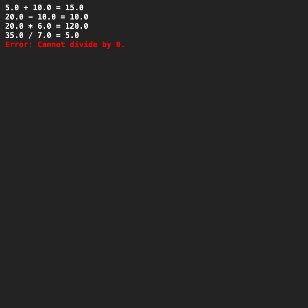

# Berekeningen
## Moeilijkheid:    
Bij deze opdracht gaan we oefenen met abstracte klassen en abstracte methoden. We gaan klassen schrijven voor het rekenen met twee getallen (doubles).
De superklasse die we nodig hebben heet `Calculation`. Deze klasse maak je aan met twee getallen (value1 en value2) waarvoor 
je natuurlijk de constructor gebruikt. Daarnaast heeft de klasse een abstracte methode `double calculate()` die 
geïmplementeerd dient te worden in de subklassen.

Er zijn vier klassen die erven van de `Calculation` klasse:
- `SumCalculation`: deze klasse telt de twee getallen bij elkaar op.
- `SubtractCalculation`: deze klasse bepaalt het verschil tussen de twee getallen.
- `MultiplyCalculation`: deze klasse vermenigvuldigd de twee getallen.
- `DivisionCalculation`: deze klasse deelt de twee getallen (let op: delen door 0 is niet toegestaan en moet afgevangen worden in je code).

## Voorbeeld
Implementeer de superklasse en de subklassen. Als je het voorbeeldprogramma draait zou het resultaat er als volgt uit moeten zien:

## Relevant links
* [Java documentation SaxionApp](https://saxionapp.hboictlab.nl/nl/saxion/app/SaxionApp.html)
