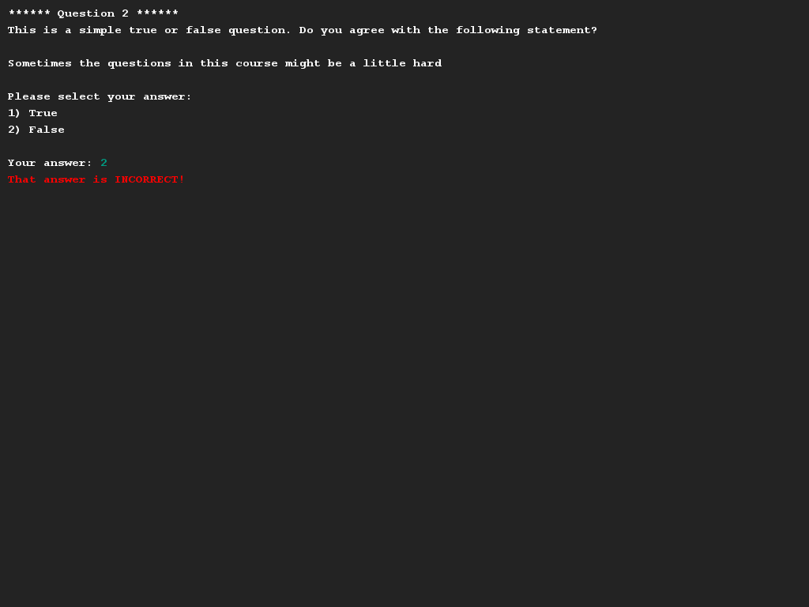
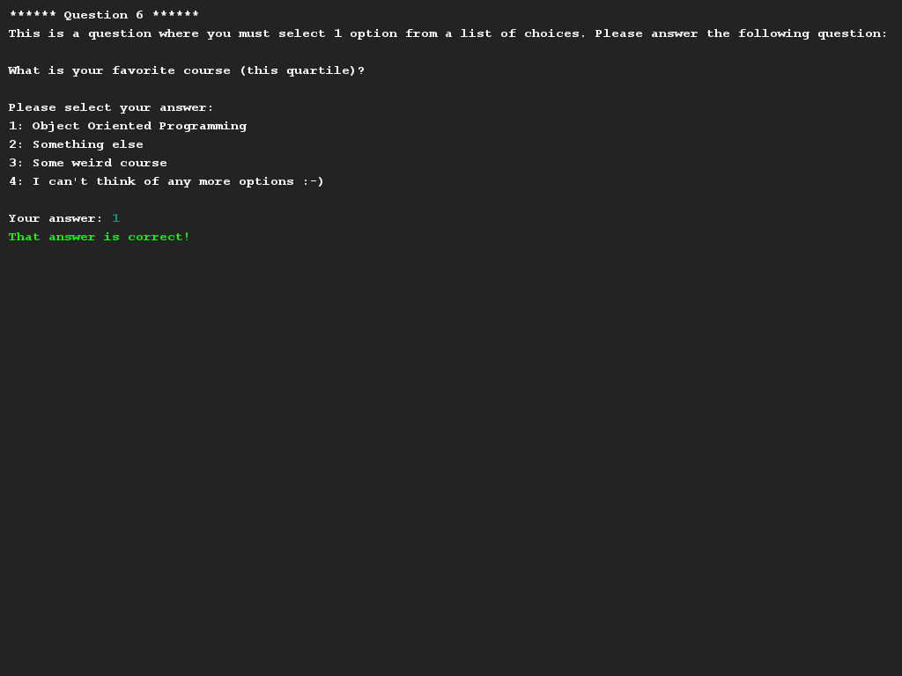
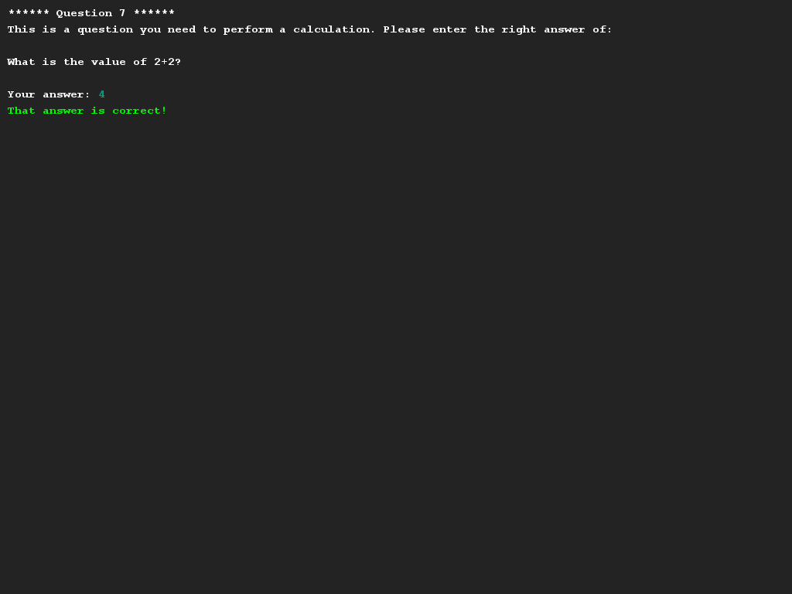

# Quiz questions
## Difficulty:    
Write a program that asks the user quiz questions. You can keep the interface simple, because it is (of course) all about 
the data model in this assignment. You will implement several types of quiz questions, each of which must be 
called in the same way.

To get you started, we provide the `Application` class so that you know how to use the program. (And what functionality 
you should implement). Please note that you should not have to alter the `Application` class.

The task is to create the (abstract) class `Question` and its subclasses. In the program the following types 
The following types of questions are possible in the program:
* `ChoiceQuestion` - A question with multiple answers of which only 1 is correct.
* `NumericalQuestion` - A mathematical question where you have to enter the correct answer (as int).
* `TrueFalseQuestion` - A question where the answer consists of 'true' or 'false'.

A few tips to get you started:
* Each `Question` naturally has a question (String), but the type of answer differs from question type to question type.
* Each `Question` takes care of printing the question on the screen (by means of the SaxionApp) and is able to check a given answer. (See also the code of Application).
* we choose "int" as a common type between all questions intentionally to make your life easier (see examples). Make use of this.

## Example

## Relevant links
* [Java documentation for the SaxionApp](https://saxionapp.hboictlab.nl/nl/saxion/app/SaxionApp.html)
