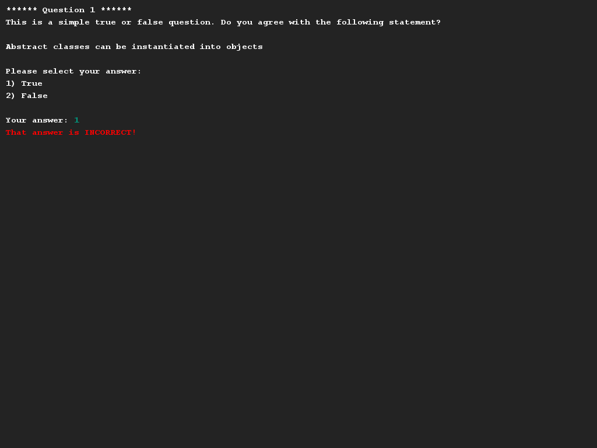
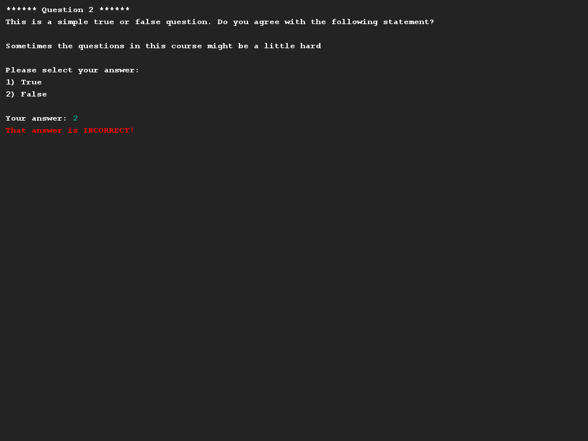
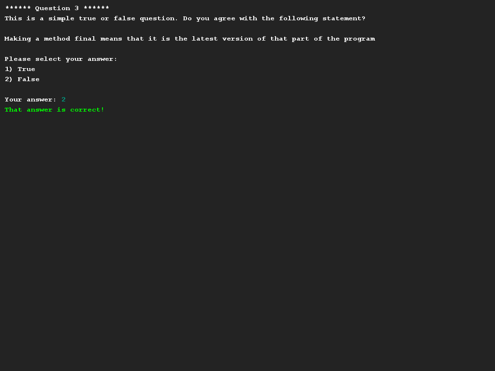
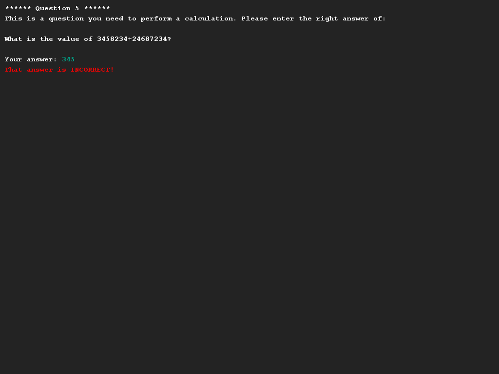
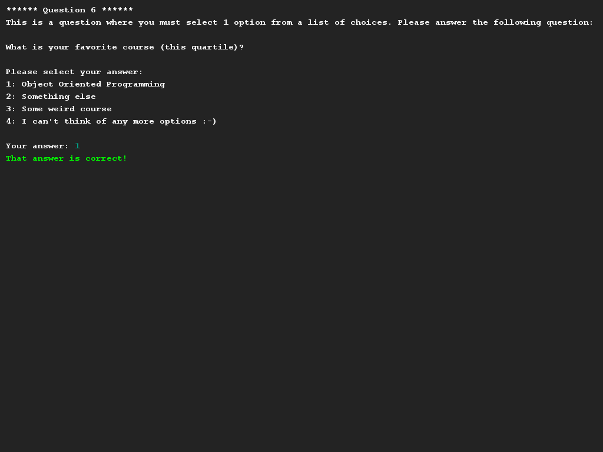
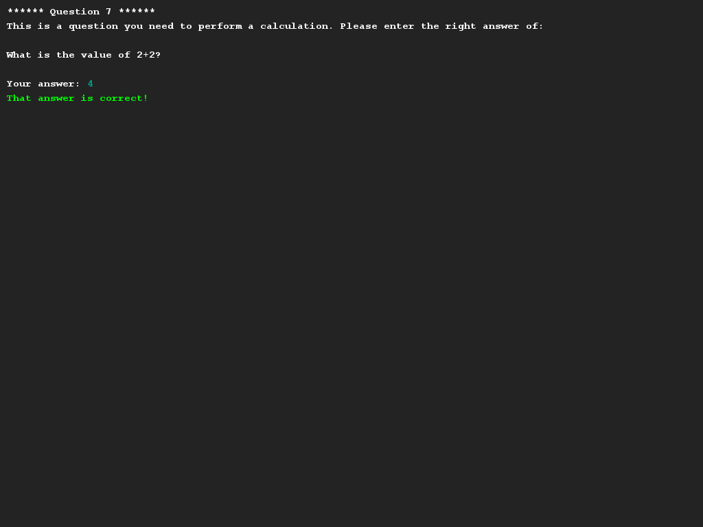
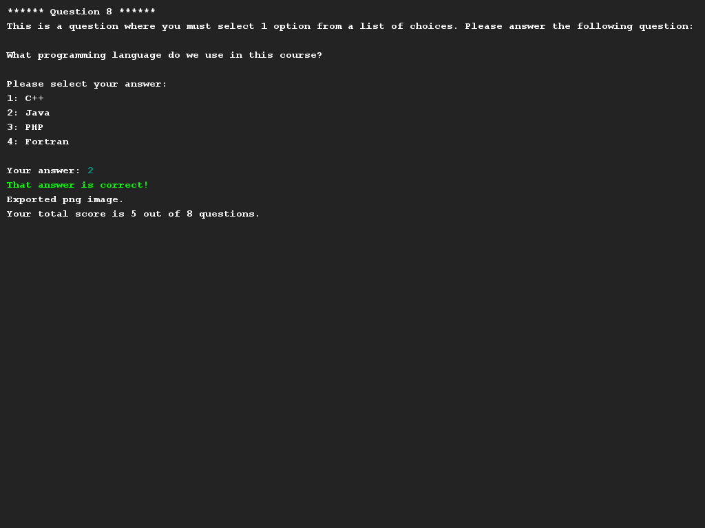

# Quizvragen
## Moeilijkheid:    
Schrijf een programma waarmee je quizvragen kan stellen aan de gebruiker. De interface mag je simpel houden, want het gaat 
natuurlijk om het datamodel in deze opdracht. Je gaat enkele soorten quizvragen implementeren die elk op eenzelfde manier 
aangeroepen dienen te worden.

Om je op weg te helpen geven wij de `Application` klasse zodat je weet hoe het programma gebruikt moet gaan worden. (En
welke functionaliteit je dus moet implementeren).

De opdracht bestaat uit het maken van de (abstracte) klasse `Question` en de bijbehorende subklassen. In het programma zijn 
de volgende soorten vragen mogelijk:
* `ChoiceQuestion` - Een vraag met meerdere antwoorden waarvan er slechts 1 goed is.
* `NumericalQuestion` - Een rekenvraag waarbij je het juiste antwoord (als int) moet ingeven.
* `TrueFalseQuestion` - Een vraag waarbij het antwoord bestaat uit "waar" of "niet waar".

Een paar tips om je op weg te helpen:
* Elke `Question` heeft natuurlijk een vraag (String), maar het soort antwoord verschilt van vraagsoort tot vraagsoort.
* Elke `Question` zorgt zelf voor het goed printen van de vraag op het scherm (d.m.v. de SaxionApp) en is in staat om een
  gegeven antwoord te controleren. (Zie ook de code van Application.)
* Wij kiezen niet voor niets "int" als gemeenschappelijk type tussen alle vragen (zie voorbeelden). Maak hier gebruik van.

## Voorbeeld

## Relevant links
* [Java documentation SaxionApp](https://saxionapp.hboictlab.nl/nl/saxion/app/SaxionApp.html)
