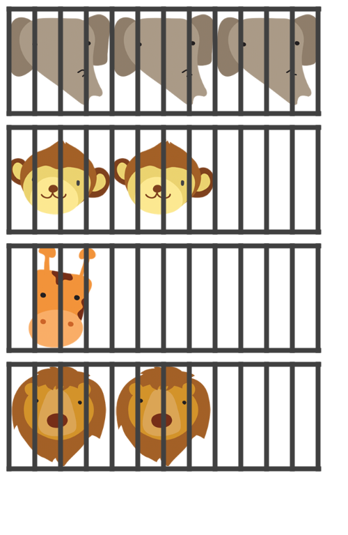

# Zoo
## Difficulty:    

Today we will create a zoo with a certain number of cages. Next we will add animals to these cages (as you might expect 
to see in a zoo.) Only one type of animal may be stored in any given cage. So as soon as an animal is added to the cage, 
only animals of the same type can be added. Each cage has a maximum capacity of 3.

There are four types of animals in our zoo. For each animal, we need to store its gender and its name.
In addition, we need to store some specific attributes of different animals:
- Lions: we need a boolean to indicate whether it is an African lion or a Persian lion. There are no other lions.
- Elephants: the weight in kg.
- Giraffe: the length in cm.
- Monkeys: the species as String.

We want `toString()` methods in each class, so that we can easily print the properties of the different animals and the 
contents of the cages. In addition, provide good error handling. See (and test) the corresponding unit tests.

### Hints:
- Note that the "only the same type of animal can go in the same cage" requirement is the hardest. If you get stuck, skip this first.
- You can determine which class an object is by calling the `getClass()` method (which is available on all classes). You can
  compare the resulting objects using the `equals()` method.

## Extra: Draw (   )
We will now extend the `Cage` class with a `void draw(int x, int y)` method, with which we draw the cage at a certain location.
We will also create a `void draw(int x, int y)`. For each type of animal, an image is provided that you can use when drawing (see the `images` folder).

## Relevant links
* [Java documentation for the SaxionApp](https://saxionapp.hboictlab.nl/nl/saxion/app/SaxionApp.html)
* [Images by Terdpong Pangwong](https://www.vecteezy.com/free-vector/nature)
