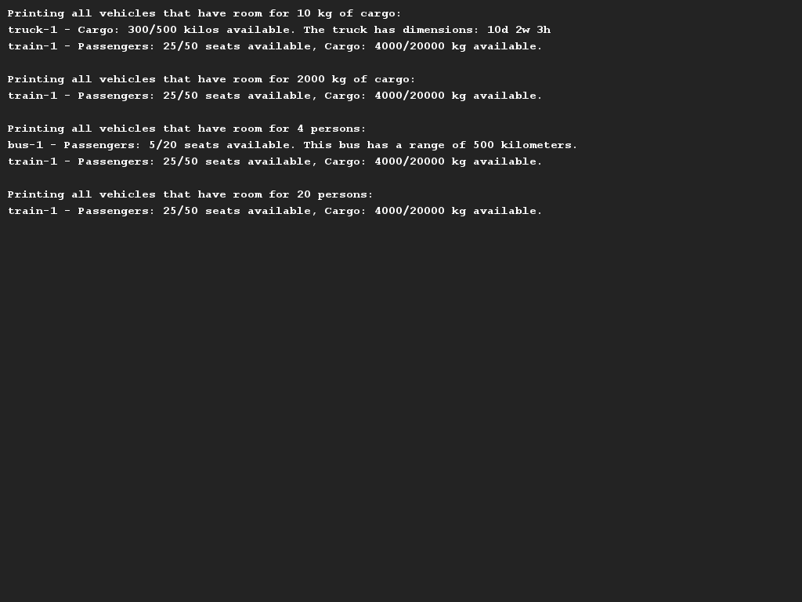
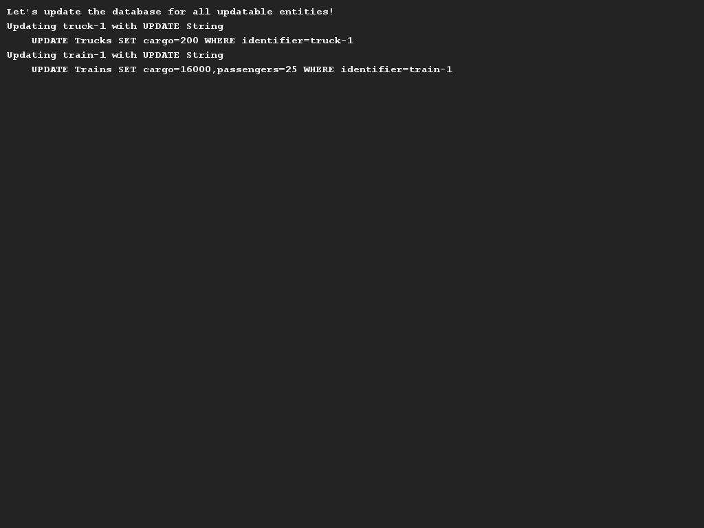

# Rogier's updated transporting company
## Difficulty:    

Besides his work at Saxion, our colleague Rogier also has a small transportation company with which he can transport both 
passengers and goods. In this assignment we are going to write a class `TransportCompany` that contains the most 
functionality that you can expect in such a program.

This assignment is about the data model of the different kind of vehicles and the (possible) use of interfaces. We will
therefore keep the drawing and printing work to a minimum (see examples). We describe the main functionality below:
* It should be possible to add vehicles to the system by creating new instances of type `Vehicle`.
    * All vehicles have a unique identifier (a name or license plate) and all have a maximum capacity (regardless of
      whether this is the number of passengers or the number of kg of goods). So you need to check that there is not too 
      much passengers / goods loaded into a vehicle.
* There are several types of vehicles in the program: Rogier owns "trucks", "busses" and "trains".
    * A `Truck` is only suitable for the transportation of goods and has certain dimensions (height, width, depth)
      which are relevant to store (see output below).
    * A `Bus` is exclusively aimed at transporting passengers and therefore cannot carry cargo. For a bus it is 
      important to store how much range it has on the basis of a (full) tank of diesel.
    * A `Train` is a combination of both and can therefore carry both passengers and cargo. Of a train no further details 
      apart from the amounts of passengers and goods and the identifier.

Finally, Rogier has started to store his transport company in a database. He therefore wants _all trains and trucks_ to implement
a method `getUpdateString()` where an SQL statement is generated for each particular object so that the statements can
easily be entered into the database. (We are not otherwise focusing on the correctness of your SQL statements OR the 
connection with the database).

To get an idea of how the application works, we have already delivered the `Application` class. Also we have
made screenshots to give you an idea of what you should implement, but the focus is mainly on the
the data model.

## Examples

## Original video
Note that this command is based on the description from this video, but also heavily modified. We would like to give you the video
(for the explanation), but follow the precies instructions above.

## Relevant links
* [Java documentation for the SaxionApp](https://saxionapp.hboictlab.nl/nl/saxion/app/SaxionApp.html)
