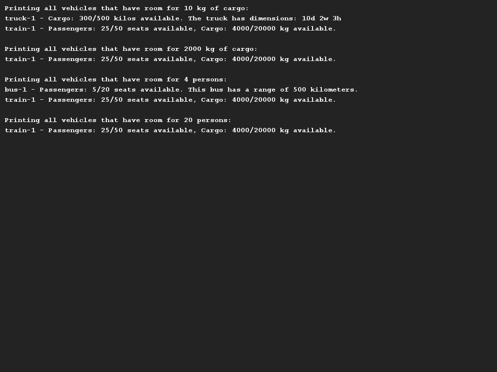
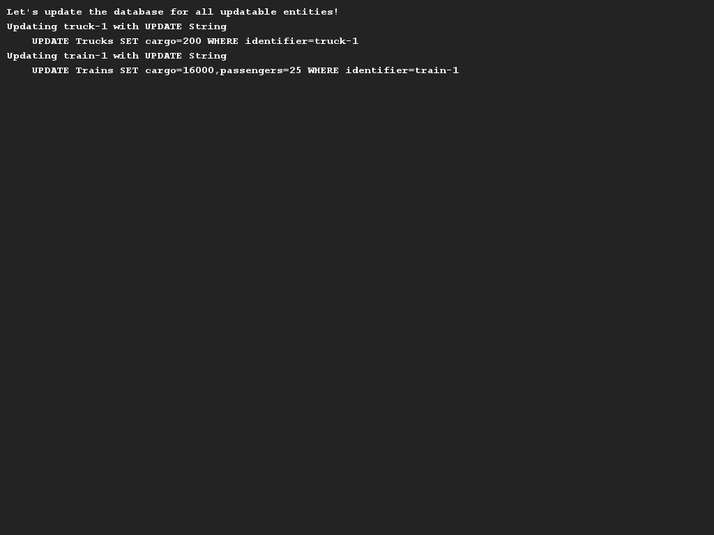

# Ruud's vernieuwde transportbedrijf
## Moeilijkheid:    

Naast zijn werk bij Saxion heeft onze collega Ruud ook nog een klein vervoersbedrijf waarmee hij zowel passagiers als
goederen kan vervoeren. In deze opdracht gaan we een klasse `TransportCompany` schrijven die de meeste functionaliteit
bevat die je in zo'n programma kan verwachten.

Het gaat in deze opdracht over het datamodel van de vervoersmiddelen en het (eventuele) gebruik van interfaces. We houden
daarom het teken- en printwerk tot een minimum (zie voorbeelden). De voornaamste functionaliteit beschrijven we hieronder:
* Het moet mogelijk te zijn om voertuigen toe te voegen aan het systeem door nieuwe instanties van het type `Vehicle` te maken.
  * Alle vervoersmiddelen hebben een unieke identifier (een naam of kenteken) en kennen allen een maximale capaciteit (ongeacht
    of dit nu het aantal passagiers is of het aantal kg aan goederen). Je moet dus controleren of er niet te veel geladen wordt
    in een voertuig.
* Er zijn in het programma meerdere typen vervoersmiddelen te vinden: Ruud heeft "trucks", "busses" en "trains" in zijn bezit.
  * Een `Truck` is uitsluitend geschikt voor het vervoer van goederen en heeft bepaalde dimensies (hoogte, breedte, diepte)
    die relevant zijn om op te slaan.
  * Een `Bus` is uitsluitend gericht op het vervoer van passagiers en kan dus geen cargo vervoeren. Voor een bus is het
    expliciet van belang om op te slaan hoeveel bereik deze heeft op basis van een (volle) tank diesel.
  * Een `Train` is een combinatie van beiden en kan dus zowel passagiers als goederen vervoeren. Van een trein hoeven,
    naast de hoeveelheden passagiers en goederen en de identifier, verder geen details te worden opgeslagen.

Tenslotte is Ruud begonnen om zijn transportbedrijf ook eens goed op te slaan in een database. Hij wil daarom graag dat
_alle treinen en trucks_ de methode `getUpdateString()` waar een SQL-statement uit moet komen om een bepaald object
in de database te updaten. (Wij richten ons verder niet op de correctheid van jullie SQL statements OF de connectie
met de database.)

Om een idee te krijgen hoe de applicatie werkt hebben wij de `Application` klasse reeds opgeleverd. Ook hebben wij
schermvoorbeelden gemaakt zodat je een idee hebt wat je precies moet implementeren, maar de focus ligt dus vooral op
het datamodel.

## Voorbeelden

## Oorspronkelijke video
Merk op dat deze opdracht gebaseerd op de beschrijving uit deze video, maar ook aangepast is. We willen jullie de video
dus graag geven (voor de uitleg), maar de extra formulering kan je hierboven volgen.

## Relevant links
* [Java documentation SaxionApp](https://saxionapp.hboictlab.nl/nl/saxion/app/SaxionApp.html)
