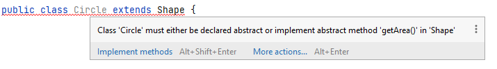
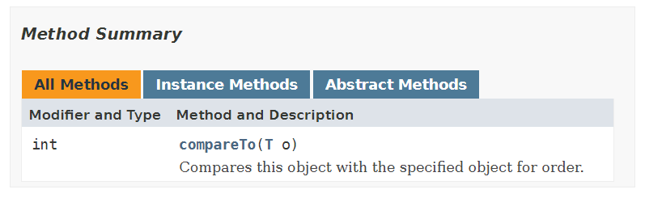
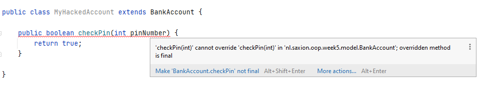

# Inheritance: Abstraction and interfaces
Competence: _I understand what abstraction is and how I can use the keyword `abstract` and interfaces._

Competence: _I can appropriately create variables, methods, and classes using the keyword `final`._

The exercises are in the individual modules. 

# Introduction
In recent weeks, with the help of inheritance, you have ensured that you can prevent code duplication for certain 
shared functionality (e.g. a method 'getName()', in the case of teachers and students) by writing methods in so-called 
_superclasses_ (e.g. the `Person` class in this case). In most cases, this is fairly doable: the attributes you write 
that are required by these methods for (e.g. for getters and setters) are in the same class so implementation is easy. 
Sometimes, however, a "standard implementation" is not that simple possible. In these situations, we have so far chosen 
to return _dummy values_, such as "-1" or an empty String. However, as you might have already figured out, this approach 
is risky and prone to introducing errors in case if you forget to override that "default behaviour".

This week we are going solve this by looking at the last part of inheritance: _how do you deal with classes that have 
methods that you can only implement in subclasses?_. For example whenever the calculation that you need to do, might differ
from subclass to subclass. (Think of the example of the Shape class of recent weeks.) This week we will learn how to
use `abstract` methods (or classes), by which we want to say that a method "needs to filled out" at a later moment 
(e.g. in the subclasses). Using this approach has multiple benefits, first of all: it forces us to not have to implement
classes with _dummy values_, but also secondly: we can force certain classes to implement certain methods (e.g. we can
have all "Teacher" instances and their respective subclasses implement the "getTeacherCode()" method, even tho the 
generation of this code might differ between subtypes of teachers).

We will also, this week, look at how we accomplish some form of _multiple inheritance_ in Java. Multiple inhertiance means
that a class can have more than 1 parent class. Java unfortunately does not support this (- it's not possible to mention 
multiple classes after the word 'extends' -), however it is possible to give classes multiple other types, not using
inheritance. Java has devised _interfaces_ for this purpose, which allows it to respond well to the polymorphism that 
we have talked about before. This week we're going to see how interfaces work, what you can do with it and what impact 
this has on your code.

Finally, there is another topic that we have ignored throughout all programming modules: making something immutable. Almost 
from day 1 we have taught you how to create variables, how to store values in them and that you encapsulate them to 
prevent invalid values from appearing in a variable. However, you can also indicate that a variable should not change 
its value at all. Or that you are not allowed to overwrite a method during inheritance, or that you can't inherit from 
a class. It may sound like these topics are a long way from each other. But within Java all these 3 topics are linked 
together by the same keyword: `final`. This week we're going to what this keyword means and what you can do with it.

However, let's start at the beginning and first focus on _abstraction_ and the use of _interfaces_.

## Abstract methods and classes
When implementing solutions that use inheritance, you may have noticed that giving a "standard implementation" is 
sometimes difficult. Take, for example, the `Shape` class that you have made before. (We show our version here, your 
version may differ slightly, but for this example that should not matter.)

```java
public class Shape {

    protected int x;
    protected int y;

    private Color fillColor;

    public Shape(int x, int y, Color fillColor) {
        this.x = x;
        this.y = y;
        this.fillColor = fillColor;
    }

    public double getArea() {
        return -1; //We don't know how to calculate this yet!
    }

    public double getCircumference() {
        return -1; //We don't know how to calculate this yet!
    }

    public void draw() {
        SaxionApp.setFill(fillColor);
        SaxionApp.turnBorderOff();

        //We don't know how to draw this!
    }
}
```

Note that the methods `getArea()` and `getCircumference()` have a problem: since in this class we talk about a 
"general shape", we cannot calculate these values. Circumference and area calculation differs between `Rectangle`s and 
`Circle`s. However, we have seen both classes as examples of subclasses for the Shape class and to solve this problem, 
we have so far returned a "wrong" _dummy value_ in the `getArea()` and `getCircumference()` methods, such as the "-1". 

In doing so, you have to ask yourself whether you want to allow Objects of type `Shape` to exist in your program as 
separate entities. You have the classes 'Rectangle' and `Circle` which are well implement, but what is a Shape? 
What does one represent? How do you draw a `Shape`? The conclusion should: You don't. And you usually don't want `Shape`
objects to exist in your solution. So we actuall do not want to allow the instantiation of `Shape` classes. And that's 
exactly what you can achieve using the keyword `abstract`.

You can use the keyword `abstract` in mulitple places in your code: when defining a class or in a method.

### Abstract classes
By adding the word `abstract` when defining your class, you indicate that the class is not meant to be instantiated 
(in other words: you cannot turn them into objects). You mainly use abstract classes as basis for inheritance; they 
therefore contain code (variables and methods) that you want to use more often, but never come as individual 
objects (instances) in your program.

Abstracting a class is very easy. You only need to add 1 word for this to a class definition:

```java
public abstract class Shape {
    //omitted rest of the example
}
```

Note that the key word `abstract` is an addition to the definition and not a substitute for other words. You can 
so always add the word `abstract` to your class definitions.
 
By abstracting the `Shape` class, you will now immediately receive an error message when you try to instantiate:


In this example of the `Shape` class, it may make sense to use `abstract`, because the class tries to describe something
that has no real value on it's own (_what is a shape?_). 

However, it is also very common to make classes `abstract` if you just don't want to be able to exist. Take, for example, 
the case of Saxion and its student administration. So far, we've seen how `Student` and `Teacher` objects have been created 
and used, both inheriting a `Person` class. Instances of this `Person` class however, might be undesireable in your program
and thus even tho the `Person` class is fully implemented (and implemented well), you will often see that this class, 
within such an administrative programs, is made `abstract`. This is done intentionally: the programmer *does not* want 
separate `Person` instances to be created. The Saxion administration system knows of students and teachers (and perhaps 
other employees), but "normal persons" do not actually occur in the organization - everyone has role! And so the 
abstraction of the class `Person` is logical: we want to have this class to prevent code duplication, but we don't want
instances to be used in our program. In short: Abstract allows you to "disable" a class for instantiation.

In addition to abstract classes, you also have abstract methods. The next paragraph deals with this.

### Abstract methods
An abstract method is a method without implementation. However, as methods cannot be empty, we need to provide an
implementation somewhere and thus making a method `abstract` causes subclasses to be required to implement certain
functionality. In the case of the `Shape` class, it makes sense to make the `getArea()` methods and `getCircumference()` 
abstract: after all, the `Shape` class cannot give a good implementation for this and therefore we returned a `dummy value`,
so we might as well not give an implementation _at all_ and force subclasses to implement this method for us!

We do this by making these methods `abstract`. Here's what it looks like:

```java
public abstract class Shape {

    protected int x;
    protected int y;

    private Color fillColor;

    public Shape(int x, int y, Color fillColor) {
        this.x = x;
        this.y = y;
        this.fillColor = fillColor;
    }

    public abstract double getArea(); // NOTICE THIS LINE!

    public abstract double getCircumference(); // NOTICE THIS LINE!

    public void draw() {
        SaxionApp.setFill(fillColor);
        SaxionApp.turnBorderOff();

        //We can't do it all the time! But it's useful to have this code here..
    }
}
```

Especially look at the methods `getArea()` and `getCircumference()`. By adding the word `abstract` you indicate 
that the method is not going to implemented in this class, but requires a subclass to do so. In fact, as soon as you 
make a method abstract, it is even impossible to give any implementation: If you do try this, you will immediately receive 
an error message:


(Notice that this is different from regular "overriding" you are already used to.)

However, at some point the methods really have to be implemented. So this is what you have to do in 
a subclass, such as in the Circle class which is a subclass of the `Shape` class.

You will see that IntelliJ also gives you a hint for this when you want to implement a subclass:



(Note: the error message/ hint indicates that you ONLY need to implement `getArea()`, but after you have done this, 
the same error is shown for the `getCircumference()` method.)

In the previous example of `Shape`, the `draw()` method was deliberately **not** made abstract, because here some code 
relevant to all subclasses (in this case, the code on how to handle the color) can be stored. This method can therefore 
be called in the subclasses with the 'super' call as you are already used to:

```java
//Example from "Circle" class
@Override
public void draw() {
    super.draw(); //This wouldn't be possible if draw() was abstract!

    SaxionApp.drawCircle(x, y, radius);
}
```

It is also important to know that you can't have abstract methods in a class that isn't abstract itself 
(as the error message also showed). If the `Circle` class does not (or cannot) give an implementation to abstract 
methods, the class just isn't fully implemented (or "finished") and you can't have any unimplemented parts. If a class
has any methods declared to be `abstract` the class must be be `abstract` itself.

However, you can choose to push the implementation of the method "further down" the inheritance tree by e.g. also making
the `Circle` class abstract, but ultimately there **must** be an implementation for all abstract methods. Java does not 
allow you to instantiate a class of which methods are unimplemented.

The choice whether or not to make a class or method `abstract` is something you have to think about every time. We 
encourage you to use the following guidelines:
* Have you created a class that you would like to use as a base class, but which you do not want to instantiate? Then 
  make this class `abstract`.
* Can't you give a proper default implementation for a class or a method or do you think this method should be implemented
  by subclasses instead? Then make this method (and the class!) `abstract`.
  
## Interfaces
A consequence of the use of abstract methods is that you can, as it were, make a number of methods "mandatory" to 
implement. For example, you saw this in the `Shape` class. This class stipulated that there must be _a method `getArea()` 
and a method `getCircumference()`, but did not give an implementation for this itself. This implementation *had to* be 
written in a subclass.

This principle, which you can prescribe which functionality (methods) should be implemented, in programming is also 
widely used in polymorphism. It's best to imagine this as follows: Imagine a class where you model something that has 
a weight. A human being, an animal, a book, etc. - a lot of things have a weight and can therefore be "weighable". 
Implementing a method `getWeight()` therefore does not sound so crazy for all these classes and thus you might consider
implementing this in any superclass.

So here too we could propose a class `WeighableObject` to hold this method. But what if the class `Book` that you want
to make "Weighable" also inherits from another class and it doesn't make sense at all to add the `getWeight()` method 
to this superclass? 

The problem lies in the fact that you actually want to inherit from multiple classes. And unfortunately, in 
Java this is not possible. There are programming languages in which this is possible (e.g. C++), but Java has another 
solution for this problem known as _interfaces_. An interface is an abstract class that has _exclusively_ abstract 
methods and nothing else; so no (non-static) variables, constructors, etc. In fact, nothing more than a list of "empty" 
methods. Interfaces are therefore designed to give pieces of functionality "to be recorded" in (to be added to) certain classes.

Check out the following interface for the aforementioned weight measurement issue:

```java
public interface WeighableObject {
    double getWeight();
}
```
(Please note: nothing has been omitted from this class. This is the entire file "WeighableObject.java".)

In terms of syntax, you should read this interface as follows: _All classes that are of the `WeighableObject` type 
must have a method `getWeight()` that returns a double_. Think of such an interface as a new type: we can now give 
each class an extra type (and therefore grouping it with other classes with that type) by requiring a class to have a 
number of methods to implement. (For the record: Interfaces can also be empty!)

Let's say we now have a class of `Person`, which we also want to make "weighable". In other words: the class `Person` 
must comply to the requirements set by the `WeighableObject` interface. This class can meet this requirement by 
implementing the method `getWeight()`. (So the `Person` class can also become an instance of `WeighableObject`, only
if it implements the `getWeight()` method.) In Java you enforce this by using the keyword 'implements' in the use of 
the keyword 'extends' at a full subclass. Then this looks like this:

```java
public class Person implements WeighableObject {
    private int weight;
    
    //Common stuff like constructors, getters, etc..
  
    public double getWeight() { // <-- This method is now MANDATORY because Person also wants to be of type "WeighableObject".
      return weight; 
    }
}
```
Note that in Java we are only allowed to use "extends" once per (sub)class, but you can implement multiple interfaces 
at the same time. (You can also combine both "extends" and "implements" at the same time!)

Let's immediately take look at a class 'Train' that we are also going to give a weight:
```java
public class Train implements WeighableObject {
    
    public double getWeight() { // <-- Once again this method is MANDATORY to implement.
        //Let's assume each compartment weighs 500 kg.. and each passenger weighs (on average) 80 kg.
        return 500 * nrOfCompartments + getNrOfPassengers() * 80;
    }
}
```

Because both `Train` and `Person` now implement the `WeighableObject` interface, you can treat them in the same way
in your code, just like you used superclasses last week. The only difference lies in the fact that these classes do not
share a similar parent (other than `Object`). An interface is a completely "stand-alone" something of the regular 
inheritance structure you have seen so far.

We finish this introduction of interfaces with a code example, in which you can see what their use looks like:
```java
ArrayList<WeighableObject> weighableObjects = new ArrayList<>();

Person somePerson = new Person(...);
Train demoTrain = new Train(...);

//Omitted code to fill the train.

weighableObjects.add(somePerson);
weighableObjects.add(demoTrain);

for(WeighableObject w : weighableOBjects) {
    SaxionApp.printLine(w.getWeight()); //Note that we can ONLY use "getWeight()". There is no other method in a WeighableObject.
}
```

This example is a bit unusual, of course, but it shows how to group classes that are initially may not seem "equal." And 
as you learned last week, being able to group types (so you can can approach in the same way) is very nice! After all, 
one of the most important things when writing code is the prevention of code duplication (**DRY: Don't Repeat 
Yourself!! **). And using interfaces helps doing so.

We will continue to develop the use of interfaces in the coming period. However, it is wise to also look
interfaces that Java already offers (and uses!) by default. And probably the best known example of interfaces inside Java 
is the `Comparable` interface. So let's take a closer look at this one.

### The comparable interface
The `Comparable` interface in Java is used to make classes "comparable". Now you might think: _I can already compare_ 
classes, but in recent weeks we have mainly compared internal attributes with each other. So, for example, surnames, 
student numbers, ages, etc. However, with the help of the `Comparable` class, we can compare an *whole* object to 
another object. And that is very useful, for example, if we want to _sort_ (put in order) lists. Consider the following code:

```java
ArrayList<Person> listOfPeople = readFromCSV("persons.csv");

Collections.sort(listOfPeople); //You might have seen/used this already, but this is the official way Java can sort a list for you!

//The list is now sorted.. but we just don't know how!        
for(Person p : listOfPeople) {
    SaxionApp.printLine(p);
}
```
Java already has enough functionality to sort lists itself, but needs to know which criteria you want to sort by. Take 
e.g. a `Person` class with the usual attributes (first name, surname, age, etc.). If we use Java to sort the 
`ArrayList<Person> persons`, Java will not know how to do this: _should we look at the first name, last name, age ...?_. 
And *that* is exactly the problem you can solve using the `Comparable` interface.

The `Comparable` interface in Java consists of just 1 method, so to make something "comparable" we only need to implement 
this one `compareTo(T o)` method.

[](https://docs.oracle.com/en/java/javase/11/docs/api/java.base/java/lang/Comparable.html)
(Click on the image to go to the official Java documentation page!)

The `T` mentioned here as the type of argument is short for "type". The `Comparable` interface is written in such a way 
that it actually works for _all types in Java_. In this case, we also speak of the fact that `Comparable` is generic. Generic 
classes fall outside the scope of this course so we'll only _use_ them. And although this might sound new, you have been
using generic classes since Introduction Programming: the ArrayList is *also* a generic class. The one thing to remember
when using generic classes is that between the `<.. >` characters (a.k.a. diamond operators) the type the list contains
must be specificed. And the same principle also applies to the `Comparable` interface.

It's easiest to just show this. Let's make the `Person` class `Comparable` first:

```java
public class Person implements Comparable<Person> { // <-- Note the <Person> part. We can compare one Person to another!
    //Omitted load of attributes you already know..
  
  public int compareTo(Person o) { // <-- Because we said on line 1 that we are creating a comparison between “Person”’s, the T can now be replaced by “Person"!
      //implement this.
  } 
}
```

The compareTo method then describes how a determined object relates to another and return an `int` value. This sounds 
perhaps complicated, but it's not so bad. In fact, only 3 values need to be returned: a negative number if *this object* 
is less than the object we are comparing to (and thus should come before), a positive number if this is "more" 
(or should go after) argument object and 0 if the objects are the same.

Let's look at an example by "organizing" people based on age. A possible implementation may then be:
```java
//Assume the person has an integer "age"
public int compareTo(Person otherPerson) {
    //You are allowed to look at the other person's private age attribute because it's the same class!
    if(age < otherPerson.age) { 
        return -1;    
    }
    if(age > otherPerson.age) {
        return 1;
    }
    return 0;
}
```
The reason why 'compareTo' returns an int is because there are 3 possible options (and there is no other data type that is 
smaller than an integer that can do this easily). However, in this case, it also offers an opportunity to write the above 
code a lot shorter, since it does not matter what value is returned exactly, as long as it is "negative", 0 or "positive".

The following code is therefore similar in functionality to the previous code:
```java
public int compareTo(Person otherPerson) {
    return age - otherPerson.age; //Just think about this for a second.. 
}
```

Of course you also want to be able to compare on other attributes, e.g. by name (String). Fortunately, the `Comparable` 
interface is also implemented by many other classes (in Java) and the String class is an example of this. So if we use 
our code want to adjust and compare by last name this looks like this:

```java
public int compareTo(Person otherPerson) {
    return lastName.compareTo(otherPerson.lastName); //Let's compare on last name basis!    
}
```

(Note that we just use the `compareTo(String)` implementation that is default in Java to compare Strings. This will
result a "normal" alphabetical comparison as you might expect!)

Of course, there are many more examples to come up with. Students can be sorted by student number, teachers by teacher 
code, so on! However, the lesson you should take with you especially from this example is that by implementing the interface 
`Comparable` the `Person` class also becomes a subtype of `Comparable`, meaning that an implementation of the `compareTo`
method must be provided by either the `Person` class or its subclasses. Doing so increases the functionality (and 
responsibility) of this class, which in turn increases the reusability of this class.

## Final variables, methods and classes 
Finally, we will look at the keyword `final` and what this means for your code. In short; with `final` you can indicate 
that something shouldn't change anymore. For variables, for example, we can use this to create so-called "constants", which 
you may remember mathematics, such as π  (3.14159265...).

But in addition to variables, you can also make methods and classes `final`, which means something else. Today we will list 
all forms of `final` to make this clear to you. We will start at the "highest level" by looking at what happens when you 
make a class `final`. Then we will make a method `final` and finally we'll look at regular variables.

### Final classes
By adding the word `final` to a class definition, you say that you are not supposed to _extend this class_, i.e. this 
is the "last" class in this branch of the hierarchy.

Take the following example where you create a BankAccount class:

```java
public final class BankAccount {
  //Skipped details..
}
```

The word `final` ensures that you can never inherit from this class again. If you try doing this, the compiler will
throw an error message on this:


Of course, you have to think about whether you really want you to be unable to inherit from a certain class. One of the 
most important principles of good object-oriented programming is that you can expand your system by means of inheritance. 
And you can prevent that now by adding 1 small word. We don't expect you to make entire classes `final` that often, but 
it's good that you know it's possible!

### Final methods
By making a method `final`, you can prevent a specific method from being 'overriding' by subclasses. Where we just wrote 
that you will not often make an entire class `final`, you will see that methods regularly become `final`. This is done 
to prevent unwanted behavior from occurring due to inheritance.

Let's look into this with an example. Take the following class and method:

```java
public class BankAccount {
  
    public boolean checkPin(int pinNumber) {
        //Do some fancy checks..
    }
    
    //Omitted rest..
}
```

Due to inheritance, it is now possible to create a new subtype of `BankAccount`, overriding the `checkPin(int)` method. 

This may mean that the following implementation is possible:

```java
public class MyHackedAccount extends BankACcount {
  
    public boolean checkPin(int pin) {
        return true;
    }
    
    //Omitted rest..
}
```

By overriding the `checkPin(int)` method, you may ignore all the protections provided in the `BankAccount` class that are 
included  with regards to checking the pin of an account. It is therefore a good idea to make the method `checkPin(int)` 
`final` in the BankAccount class, so that it cannot be overwritten further. So this looks like this:

```java
public class BankAccount {
  
    public final boolean checkPin(int pinNumber) {
        //Do some fancy checks..
    }
    
    //Omitted rest..
}
```

Now, if you try to override the `checkPin(int)` method in a subclass, you will receive an error message. It is
no longer allowed to re-implement this method!



In short: You can use `final` to make sure no-one messes up your programs (or internal state of your classes) by
not allowing certain methods to be overriden.

### Final variables
Finally, there are `final` variables. In the case of variables, the word `final` indicates that a value of a variable 
may not be changed once you have given it a value. You use `final` for example, to record the maximum capacity of a 
bus or aircraft.

To understand how `final` works on variables, it is important to distinguish between _primitive_ variables
and variables with a reference type. Primitive types are the types you always write in lowercase 
(such as int, double, boolean, etc.) and are stored on the _stack_ while reference types (String, SaxionApp, Person, 
any other class you've written yourself so far) are always capitalized and are created on the _heap_.

#### Final primitive variables
A `final` primitive variable, also called `constant`, which is of course opposite to `variable`, looks usually as follows:
```java
final <type> <name>;

//Example:
private final int MAX_PASSENGERS = 3;
```

The first thing you will probably notice (in addition to the word `final` of course) is that we suddenly capitalize the name 
of the variable, while this is not common. That's because there is an (unwritten) rule between programmers that names of 
_constant values_ (values that should not change) must always be capitalized (e.g. have a look at `Math.PI`). Doing so
makes it easy to tell from the name of a variable whether or not that variable can be changed or is a _constant_. 
However, if you search for this on the Internet, you will soon discover that there is some "discussion" about this rule 
(when to capitalize and when you shouldn't), but we like to keep it simple: primitive variables of which you do not want 
the value to be adjusted, you write in capital letters.

When you add the word `final`, the compiler checks that you are not trying to change the value of the variable somewhere
in your program. If so, you'll get an error:


Note that you do not have to give a `final` variable a value immediately, as shown in the following example:

```java
private final int MAX_PASSENGERS;

public Bus(int maxNrOfPassengers){
    this.MAX_PASSENGERS = maxNrOfPassengers;
}
```

Note that after the value has been placed in the constructor, it can no longer be adjusted. So you can only set a value
for this variable once. 

By using `final` variables you can make your code clearer, so that it is easier for other programmers to read 
becomes. In addition, this makes the code more maintainable. We therefore want to teach you about values that you know 
they can no longer change to store in `final` variables.

The best way to demonstrate this is by means of an example: The legal age of drinking alcohol in the Netherlands 18. You 
can also only drive (independently) when you are 18. In this case, the number "18" is therefore also considered to be the
"legal" age for a lot of things (or better: when you are seen as an adult). It is therefore useful to create a constant
in a `Person` class to store this kind of information.

Study the following (simple) example:

```java
public class person {
    private final int LEGAL_AGE = 18;
    private int age; //Is set by a constructor..
  
    //Omitted other code.
    
    public boolean canDrinkAlcohol() {
        return age>=LEGAL_AGE;    
    }
    
}
```
Note above all that because we have now stored the "official age at which you are an adult" in a separate variable it is 
now easier for us to adjust this. If it is ever decided that the legal age at 21 (or 16, etc.) then we only have to 
adjust this in one place in our code.

#### Final reference variables
If you are going to look at the use of the word `final` for variables that refer to an instance (reference type) is a 
little more difficult to see what exactly is allowed and what is not allowed. The best description we can give is that, 
by means of a variable (of a reference type), using `final` ensures that _the variable is no longer allowed to refer to 
another object_.

Let's take a look at this in the form of an example. Assume that the `Person` class is similar to all other persons you 
have seen before in this course (it describes a normal person):

```java
public class Loan {
    private final Person DEBTOR; //a debtor is someone who OWES the money.
    private String purpose;
    private double amount;
    
    public Loan(String purpose, double amount, Person debtor) {
        this.purpose = purpose;
        this.amount = amount;
        
        this.DEBTOR = debtor;
    }
    
    //Left out other code, such as decreasing/adding money to the loan etc.
}
```
In the preceding example, we describe a class "Loan" that represents a loan (duh). A loan is taken out by a person 
(the debtor) for a specific reason, such as buying a house, car, etc. and that person always remains responsible for 
that loan. So it is usually not intended for you as a programmer to link the loan "to someone else" once a load is created.

In such a case, you can therefore choose to make the _reference_ to the `Person` instance `final`: the loan cannot 
technically be transferred to another person.

However, this means **not** that the `Person` instance cannot now be further modified. In principle, you can still call 
all methods/setters on the instance, so changing a mobile number, age or last name is still possible, but no matter how 
you look at it: the link should still point to the same the same person.

A `final` variable to a reference type is therefore not a trick to make an instance `read-only` or on another way to 
make it more customizable. If you want to achieve something like this, you will have to look at the attributes of the 
class `Person` inidividually and determine whether you can make them final (or that you just need to delete setters). In 
this case, the word `final` refers only to the _reference_ to the object: you just can't associate another object with it.

The code below therefore results in an error message:
```java
//This is NOT allowed:
DEBTOR = new Person(...);

//or

public void setDebtor(Person p) {
    this.DEBTOR = p;
}
```
The code below, on the other hand, is allowed again:
```java
//This IS allowed and will cause the DEBTOR to change some internal attributes:
DEBTOR.setMobileNumber("06-12345678");

//or
        
DEBTOR.setLastName("I changed my name!");
```

# Videos

[](http://www.youtube.com/watch?v=kZmbMkaRIVI)
[](http://www.youtube.com/watch?v=ZdzJMXgeZ6g)

Note: The video below also uses `static`, which is a topic we will cover later in this course. So don't worry if you don't
fully understand what the purpose of `static` is.

[](http://www.youtube.com/watch?v=cihYPwFc8Ig)