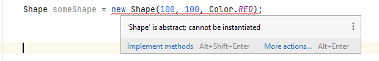
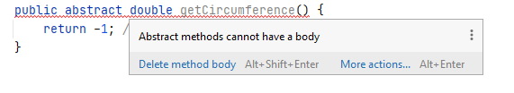
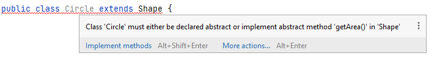
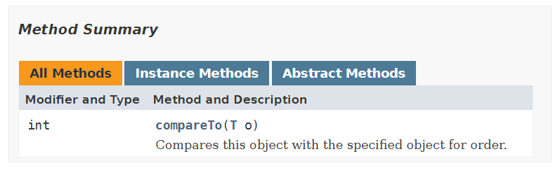
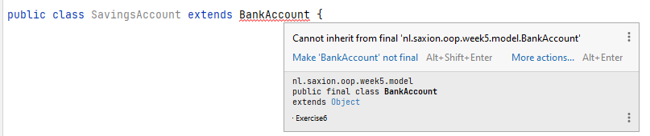
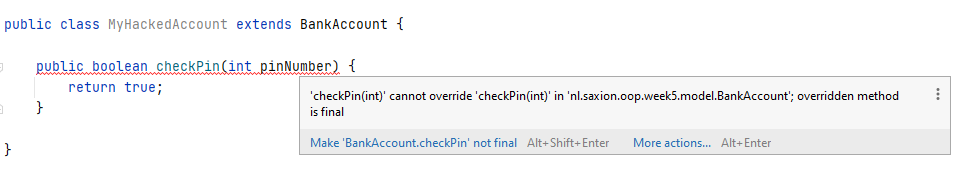
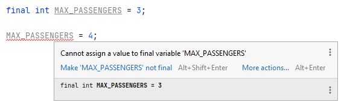

# Overerving: Abstractie en interfaces
Competentie: _Ik begrijp wat abstractie is en hoe ik het keyword `abstract` en interfaces kan gebruiken in mijn code om abstractie toe te voegen._

Competentie: _Ik kan variabelen, methoden en klassen constant maken door middel van het keyword `final` ._

De opdrachten staan in de losse modulen. 

# Introductie
De afgelopen weken heb je met behulp van overerving er voor gezorgd dat je code-duplicatie kan voorkomen door bepaalde gedeelde
functionaliteit (bijv. een methode `getName()`, in het geval van docenten en studenten) in een zogehete _superklasse_ 
(`Person` in dit geval) op te slaan. In de meeste gevallen is dit redelijk goed te doen: de attributen waar je methoden voor schrijft
(bijv. bij getters en setters) staan in dezelfde klasse dus de implementatie is redelijk eenvoudig. Soms echter is een 
"standaardimplementatie" niet altijd mogelijk. In deze situaties hebben we er tot nu toe voor gekozen om bepaalde 
_dummy-waarden_,
zoals bijv. "-1" of een lege String op te leveren. Je snapt misschien echter wel dat dit soms erg onhandig kan werken.

Deze week gaan we hier een oplossing voor verzinnen, door te kijken naar het laatste stukje van overerving: hoe ga je om
met klassen waar je niet alle implementatie van kan geven, bijvoorbeeld omdat je een berekening niet kan maken, omdat je 
informatie mist of dat de methode eigenlijk specifiek geimplementeerd moet worden per subklasse? (Denk bijv. aan het
voorbeeld van de klasse `Shape` van de afgelopen weken.) Deze week gaan we leren hoe we daarom methoden (of klassen) 
`abstract` kunnen maken, waarmee we willen zeggen dat we op een _later_ moment (bijv. in subklassen) een implementatie 
gaan geven; de Java compiler gaat ons ook dwingen deze in te vullen (te implementeren), wanneer we ze willen gebruiken.

Tevens gaan we deze week kijken naar hoe Java, dat geen _meervoudige overerving_ (dat een klasse meer dan 1 ouderklasse 
heeft) toestaat, toch een mogelijkheid biedt om het overerven uit meerdere klassen toe te passen. Het is dus niet 
mogelijk om meerdere klassen te noemen achter het woordje `extends`. Hiervoor heeft Java _interfaces_ bedacht, waarmee je 
wel goed in kan spelen op het _polymorfisme_ waar we het eerder over hebben gehad. Deze week gaan we kijken hoe interfaces
werken, wat je er mee kan doen en wat voor impact dit heeft op je code.

Tenslotte is er nog een onderwerp wat we door alle programmeervakken heen hebben genegeerd: iets onveranderbaar maken. 
Vrijwel vanaf dag 1 hebben wij jullie geleerd hoe je variabelen kan maken, hoe je hier waarden in kan opslaan en dat je 
door middel van encapsulatie kan voorkomen dat er ongeldige waarden in een variabele komen te staan. Je kunt echter ook 
aangeven dat een variabele _überhaupt_ niet van waarde mag veranderen. Of dat je een methode niet mag overschrijven bij 
overerving, of dat je niet van een klasse mag overerven. Het klinkt misschien alsof deze onderwerpen ver van elkaar af 
liggen, maar binnen Java zijn al deze 3 onderwerpen aan elkaar gelinked door het keyword `final`. En deze week gaan we 
in op wat dit keyword betekent en wat je er mee kunt.

Laten we echter beginnen bij het begin en eerst vooral kijken naar _abstractie_ en het gebruik van _interfaces_.

## Abstracte methoden en klassen
Bij het implementeren van oplossingen die gebruik maken van overerving heb je mogelijk al eens gemerkt dat het geven van
een "standaardimplementatie" soms erg lastig is. Neem bijvoorbeeld de klasse `Shape` die je de afgelopen weken zelf
hebt gemaakt. (Wij laten hier onze uitwerking zien, mogelijk wijkt jouw uitwerking iets af, maar dat is voor dit voorbeeld
niet erg.)

```java
public class Shape {

    protected int x;
    protected int y;

    private Color fillColor;

    public Shape(int x, int y, Color fillColor) {
        this.x = x;
        this.y = y;
        this.fillColor = fillColor;
    }

    public double getArea() {
        return -1; // We don't know how to calculate this yet!
    }

    public double getCircumference() {
        return -1; // We don't know how to calculate this yet!
    }

    public void draw() {
        SaxionApp.setFill(fillColor);
        SaxionApp.turnBorderOff();

        // We don't know how to draw this!
    }
}
```

Merk op dat de methoden `getArea()` en `getCircumference()` een probleem hebben: aangezien we in deze klasse spreken over
een "algemene vorm", kunnen we deze waarden niet berekenen. Van een `Rectangle` moet je namelijk op een andere manier de
omtrek en oppervlak berekenen dan bijvoorbeeld van een `Circle`. Beide klassen echter hebben wij eerder gezien als 
voorbeelden van subklassen voor de klasse `Shape`. Dit hebben wij tot nu toe opgelost door één of andere "foute" _dummywaarde_ 
terug te geven, zoals de "-1" die we in het voorbeeld teruggeven of misschien heb je het heel netjes opgelost door een 
`Exception` te gooien.

Daarbij moet je je überhaupt afvragen of je wilt dat je in jouw programma, waarin je bijvoorbeeld de klassen `Rectangle` en
`Circle` wilt gebruiken ook instanties wilt toestaan van de klasse `Shape`. Wat is een `Shape`? En hoe ziet dit er uit als 
je het wilt tekenen? De conclusie is: een instantie van zo'n klasse betekent eigenlijk niets en dus wil je ook niet 
dat er objecten van dit type in je programma gebruikt worden. En dat is precies wat je kunt bereiken door middel van het 
keyword `abstract`.

Het keyword `abstract` kun je op meerdere plekken in je code gebruiken: bij het definiëren van een klasse of in een 
methode.

### Abstracte klassen

Door het toevoegen van het woord `abstract` bij het definiëren van je een klasse geef je aan dat de klasse niet bedoeld 
is om geïnstantieerd te worden (oftewel: je kunt er geen objecten van maken). Je gebruikt abstracte klassen vooral als 
basis voor overerving; ze bevatten dus code (variabelen en methoden) die je vaker wilt gebruiken, maar komen verder nooit als 
individuele objecten (instanties) in je programma voor.

Het abstract maken van een klasse is erg eenvoudig. Je hoeft hier slechts 1 woord voor toe te voegen aan een klassedefinitie:

```java
public abstract class Shape {
    // omitted rest of the example
}
```

Merk op dat het kernwoord `abstract` een toevoeging is op de definitie en geen vervanging van andere woorden. Je kunt het 
woord `abstract` dus altijd gewoon toevoegen.
 
Door het abstract maken van de klasse `Shape` krijg je nu onmiddellijk een foutmelding wanneer je deze ergens in je code 
probeert te instantiëren:



In dit voorbeeld van de klasse `Shape` klinkt het misschien logisch om abstract te gebruiken, omdat de klasse iets 
probeert te beschrijven wat je je misschien slecht kan voorstellen (wat is een _een vorm_?). 

Het is echter ook heel gebruikelijk om klassen `abstract` te maken als je gewoon niet wilt dat als losse instanties van kunnen 
bestaan. Neem bijvoorbeeld het voorbeeld van Saxion en de studentadministratie. Tot nu toe hebben we gezien hoe daar 
`Student` en `Teacher` objecten zijn gemaakt en gebruikt, die erven van de klasse `Person`. De `Person` klasse is 
echter prima ook op zichzelf te gebruiken en _toch_ zul je vaak zien dat deze klasse binnen zo'n administratief programma 
 `abstract` wordt gemaakt. Dit gebeurt opzettelijk: de programmeur wil *niet* dat er losse `Person` instanties
aangemaakt mogen worden. Ze voegen mogelijk "niets toe". De Saxion administratie kent studenten en docenten (en misschien
medewerkers), maar "normale personen" komen eigenlijk niet voor in de organisatie. En dus is het abstract maken van de 
klasse `Person` logisch: we willen de klasse hebben om codeduplicatie te voorkomen, maar ook niet meer dan dat.

Naast abstracte klassen heb je ook abstracte methoden. Hierover gaat de volgende paragraaf.

### Abstracte methoden
Een abstracte methode is een methode waarvan je opzettelijk de implementatie _in die klasse_ achterwege laat, maar eventuele 
subklassen wel verplicht deze te implementeren. In het geval van de klasse `Shape` is het logisch om de methoden `getArea()`
en `getCircumference()` abstract te maken: de klasse `Shape` kan hier immers geen goede implementatie voor geven (en dus
gaven we een _dummywaarde_ terug). 

We kunnen dit oplossen door deze methoden `abstract` te maken. Dit ziet er als volgt uit:

```java
public abstract class Shape {

    protected int x;
    protected int y;

    private Color fillColor;

    public Shape(int x, int y, Color fillColor) {
        this.x = x;
        this.y = y;
        this.fillColor = fillColor;
    }

    public abstract double getArea();

    public abstract double getCircumference();

    public void draw() {
        SaxionApp.setFill(fillColor);
        SaxionApp.turnBorderOff();

        // We can't continue! But it's useful to have this code here..
    }
}
```

Kijk vooral naar de methoden `getArea()` en `getCircumference()`. Door het toevoegen van het woord `abstract` geef je aan 
dat de methode nu geen implementatie gaat krijgen. Je laat het dus over aan eventuele subklassen om een goede invulling 
voor deze methode te geven. Sterker nog: zodra je een methode abstract maakt, is het ook gelijk onmogelijk om een invulling 
te geven. Je krijgt, als je dit toch probeert, gelijk een foutmelding:



Er moet echter op een gegeven moment _wel_ echt een invulling aan de methoden gegeven worden. Dit moet je dus doen in 
een subklasse, zoals bijv. in de klasse `Circle` dat een subklasse is van de klasse `Shape`.

Je zal zien dat IntelliJ je hier ook gelijk een hint voor geeft als de klasse aanmaakt:



(Let op: de foutmelding/ hint geeft aan dat je `getArea()` moet implementeren, maar nadat je dit gedaan hebt wordt 
vervolgens dezelfde foutmelding getoond, maar nu vanwege de eveneens abstracte methode `getCircumference()`.)

In het voorgaande voorbeeld van `Shape` is de methode `draw()` opzettelijk **niet** abstract gemaakt, omdat hier code 
in kan komen te staan die voor alle subklassen relevant is (in dit geval de code over hoe je omgaat met de kleur). Deze
methode is dus in de subklassen gewoon aan te roepen met de `super` aanroep zoals je dit reeds gewend bent:

```java
// Example from "Circle" class
@Override
public void draw() {
    super.draw(); // <-- This wouldn't be possible if draw() was abstract!

    SaxionApp.drawCircle(x, y, radius);
}
```

Wat je verder nog moet weten, is dat je geen abstracte methoden kan hebben in een klasse die zelf niet abstract is 
(zoals de foutmelding ook al liet zien). Als de klasse `Circle` geen invulling geeft (of kan geven) voor de abstracte 
methoden, is de klasse gewoon niet volledig geïmplementeerd en dat kan gewoon niet. Een klasse heeft, òf 
alle abstracte methoden volledig geïmplementeerd (ofwel in de klasse zelf, ofwel door een superklasse), òf de klasse moet 
zelf `abstract` zijn. 
Je kunt er wel voor kiezen om de implementatie van de methode "verder vooruit" te schuiven door bijv. `Circle` ook 
abstract te maken, maar uiteindelijk **moet** er een implementatie voor de klasse gegeven worden voordat deze geïnstantieerd 
kan worden. Java staat je immers niet toe om een klasse te instantiëren waarvan niet alle abstracte methoden zijn 
geïmplementeerd.

De keuze om eem klasse of methode `abstract` te maken is iets waar je elke keer over na moet denken. In principe raden 
we je aan om het volgende richtlijnen te gebruiken:
* Heb je een klasse gemaakt die je graag als basisklasse wilt gebruiken, maar waarvan je verder niet wilt dat deze
  geïnstantieerd wordt? Maak dan deze klasse `abstract`.
* Kun je voor een klasse geen goede implementatie voor een methode geven en vind je wel dat deze "verplicht" moet zijn 
  voor subklassen? Maak deze methode (en de klasse!) dan `abstract`.
  
## Interfaces
Een gevolg van het gebruik van abstracte methoden is dat je als het ware een aantal methode "verplicht" kunt maken om te 
implementeren. Je zag dit bijvoorbeeld bij de klasse `Shape`. Deze klasse schreef namelijk voor dat er _een 
methode `getArea()` en een methode `getCircumference()` moest zijn_, maar gaf hier zelf geen implementatie voor. Deze
implementatie *moest* dus geschreven worden in een subklasse.

Dit principe, dat je kunt voorschrijven welke functionaliteit (methoden dus) geïmplementeerd moet worden, wordt in het 
programmeren ook veel gebruik bij polymorfisme. Je kunt je dit het beste voorstellen als volgt: stel je voor dat je een 
klasse schrijft waarbij je iets modelleert dat een gewicht heeft. Een mens, een dier, een boek, etc. - heel veel van deze 
dingen hebben een gewicht en kunnen dus op zich "weegbaar" zijn. Een methode `getWeight()` klinkt daarom zo gek nog niet.

Als je vervolgens hier even over nadenkt, dan herinner je je misschien de les van vorige week waarin we superklassen 
gebruikten om bepaalde items samen te nemen. Dus ook hier zouden we een klasse `WeighableObject` kunnen voorstellen
die deze methode voorschrijft. Maar wat nu als de klasse `Book` die je weegbaar wil maken ook al erft van een andere 
klasse en het helemaal niet logisch is om de methode `getWeight()` aan deze klasse toe te voegen?

De oplossing voor dit probleem schuilt in het feit dat je eigenlijk van meerdere klassen wilt erven. En helaas is dat in 
Java niet mogelijk. Er zijn programmeertalen waarin dit wel kan (bijv. C++), maar Java heeft hier een andere oplossing voor 
bedacht: _Interfaces_. Een interface is een abstracte klasse die _uitsluitend_ abstracte methoden kent en verder niets; dus ook 
geen variabelen. In feite dus niets meer dan een lijste van "lege" methoden. Interfaces zijn dan ook bedacht om bepaalde 
stukken functionaliteit "vast te leggen" in (toe te voegen aan) bepaalde klassen.

Bekijk de volgende interface eens voor het eerder genoemde probleem van het meten van het gewicht:

```java
public interface WeighableObject {
    double getWeight();
}
```
(Let op: er is echt niets weggelaten uit deze klasse. Dit is het gehele bestand "WeighableObject.java".)

Qua syntax moet je deze interface als volgt lezen: _Alle klassen die van het type WeighableObject zijn, hebben een methode
`getWeight()` die een double opleveren_. Zie zo'n interface als een nieuw type: we kunnen elke klasse nu een extra type geven
(en daarmee het dus ook groeperen met andere klassen met dat type) door een klasse te verplichten een aantal methoden te laten
implementeren.

Stel dat we nu een klasse `Person` hebben, die we ook "weegbaar" willen maken. Oftewel: de klasse `Person` moet voldoen 
aan de eisen die gesteld worden door de interface `WeighableObject`. Deze klasse kan hieraan voldoen door het implementeren 
van de methode `getWeight()`. In Java codeer je dit dan door het gebruik van het keyword `implements` i.t.t. het gebruik van 
het keyword `extends` bij een volledige subklasse. Dan ziet dit er als volgt uit:

```java
public class Person implements WeighableObject {
    private int weight;
    
    // Common stuff like constructors, getters, etc..
  
    public double getWeight() { // <-- This method is now MANDATORY because Person also wants to be of type "WeighableObject".
      return weight; 
    }
}
```
Merk op dat we in Java per (sub)klasse maar eenmaal "extends" mogen gebruiken, maar je mag best van meerdere interfaces 
methoden "implement"-en en dus bijv. meerdere `implement` statements aan een klasse toevoegen.

Laten we gelijk een 2<sup>e</sup> voorbeeld pakken, bijv. een klasse `Train` die we ook een gewicht gaan geven. Dit kan er 
dan uitzien als:
```java
public class Train implements WeighableObject {
    
    public double getWeight() { // <-- Once again this method is MANDATORY to implement.
        // Let's assume each compartment weighs 500 kg.. and each passenger weighs (on average) 80 kg.
        return 500 * nrOfCompartments + getNrOfPassengers() * 80;
    }
}
```

Doordat zowel `Train` als `Person` nu de interface `WeighableObject` implementeren, kun je ze op eenzelfde manier behandelen
in je code, net zoals je vorige week superklassen hebt gebruikt. Het enige verschil zit hem in het feit dat klassen nu niet
van elkaar hoeven te erven. Een interface is een volledig "losstaand" iets van de overervingsstructur.

We maken deze introductie van interfaces af met een codevoorbeeld, waarin je kunt zien hoe het gebruik hiervan eruit ziet:
```java
ArrayList<WeighableObject> weighableObjects = new ArrayList<>();

Person somePerson = new Person(...);
Train demoTrain = new Train(...);

// Omitted code to fill the train.

weighableObjects.add(somePerson);
weighableObjects.add(demoTrain);

for(WeighableObject w : weighableOBjects) {
    SaxionApp.printLine(w.getWeight()); // Note that we can ONLY use "getWeight()". There is no other method in a WeighableObject.
}
```

Dit voorbeeld is natuurlijk een beetje apart, maar het laat zien hoe je klassen kunt groeperen die in eerste instantie 
misschien niet "gelijk" lijken. En zoals je vorige week hebt kunnen leren is het kunnen groeperen van typen (zodat je ze
op eenzelfde manier kunt benaderen) erg fijn! Een van de voornaamste zaken bij het schrijven van code is immers het 
voorkomen van codeduplicatie (**DRY: Don't Repeat Yourself!!**). En dat kan op deze manier relatief eenvoudig.

Het gebruik van interfaces gaan we de komende tijd steeds verder gaan uitwerken. Het is echter verstandig om ook te kijken
naar interfaces die Java standaard al aanbiedt (en gebruikt!). En waarschijnlijk is het bekendste voorbeeld van interfaces binnen
Java de `Comparable` interface. Dus laten we deze maar eens beter gaan bekijken.

### De comparable interface
De `Comparable` interface in Java wordt gebruikt om klassen "vergelijkbaar" te maken. Nu zul je misschien denken: _ik kan
al klassen vergelijken_, maar de afgelopen weken hebben wij vooral interne attributen met elkaar vergeleken. Dus bijvoorbeeld
achternamen, studentnummers, leeftijden, etc. Met behulp van de klasse `Comparable` kunnen we echter een *geheel* object
vergelijkbaar maken met een ander object. En dat is bijvoorbeeld erg handig als we een lijst willen gebruiken en deze willen 
gaan _sorteren_ (lees: op volgorde zetten). Beschouw eens de volgende code:

```java
ArrayList<Person> listOfPeople = readFromCSV("persons.csv");

Collections.sort(listOfPeople); // You might have seen / used this already, but this is the official way Java can sort an array for you!

// The list is now sorted.. but we just don't know how!        
for(Person p : listOfPeople) {
    SaxionApp.printLine(p);
}
```
Java heeft zelf al voldoende functionaliteit om te sorteren, maar moet wel weten op welk criteria je wilt sorteren. Neem 
bijv. een `Person` instantie met de gebruikelijke attributen (voornaam, achternaam, leeftijd, etc.). Als we Java de opdracht 
willen geven om de `ArrayList<Person> persons` te sorteren, zal Java niet weten hoe dat moet: _moet er eerst naar de 
achternaam gekeken worden, of de voornaam, of ...?_. En *dat* is precies wat je met de `Comparable` interface kunt 
aangeven.

De `Comparable` interface in Java bestaat uit slechts 1 methode, dus om iets vergelijkbaars te maken hoeven we alleen deze 
ene methode `compareTo(T o)` implementeren.

[](https://docs.oracle.com/en/java/javase/11/docs/api/java.base/java/lang/Comparable.html)
(Klik op de afbeelding om naar de officiële Java documentatie pagina te gaan!)

De _T_ die hier genoemd wordt als type van het argument staat voor "type". De `Comparable` interface is zo geschreven dat
het eigenlijk werkt voor _alle typen in Java_. We spreken in dit geval ook wel van het feit dat `Comparable` _generiek_ is.
Generieke klassen vallen buiten de scope van dit vak en hier doen we dus verder niets mee, behalve gebruiken. Echter, dit hebben
jullie vanaf Introductie Programmeren ook al gedaan: de ArrayList is namelijk *ook* een generieke klasse. Tussen de `<..>` 
tekens moet je namelijk aangeven welk type de lijst bevat. En datzelfde principe gaat OOK op voor de `Comparable` interface.

Het is het makkelijkst om dit gewoon te laten zien. Laten we de `Person` klasse eerst maar eens `Comparable` maken:

```java
public class Person implements Comparable<Person> { // <-- Note the <Person> part. We can compare one Person to another!
    // Omitted load of attributes you already know..
  
  public int compareTo(Person o) { // <-- Because we said on line 1 that we are creating a comparison between "Person"'s, the T can now be replaced by "Person"!
      // implement this.
  } 
}
```

De methode `compareTo` beschrijft vervolgens hoe een bepaalt object zich verhoudt tot een ander en moet als resultaat 
een `int` opleveren. Dit klinkt ingewikkeld, maar valt reuze mee. Eigenlijk hoeven er maar 3 waarden teruggegeven te worden:
een negatief getal als *dit object* "voor" het argument-object moet komen, een positief getal als het "na" het
argument-object moet komen en 0 als de objecten gelijk zijn.

Laten we eens een voorbeeld bekijken door personen te gaan "ordenen" op basis van leeftijd. Een mogelijke implementatie
kan dan zijn:

```java
// Assume the person has an integer "age"
public int compareTo(Person otherPerson) {
    // You are allowed to look at the other person's private age attribute because it's the same class!
    if(age < otherPerson.age) { 
        return -1;    
    }
    if(age > otherPerson.age) {
        return 1;
    }
    return 0;
}
```
De reden waarom `compareTo` een int terug geeft is omdat er dus 3 mogelijke opties zijn (en er geen ander datatype is wat
dit eenvoudig kan bevatten). In dit geval biedt het echter ook een mogelijkheid om bovenstaande code een stuk korter te schrijven,
aangezien het niet uit maakt welke waarde precies teruggegeven wordt, zolang het maar "negatief", 0 of "positief" is.

De volgende code is dus qua functionaliteit gelijk aan voorgaande code:
```java
public int compareTo(Person otherPerson) {
    return age - otherPerson.age; // Just think about this for a second.. 
}
```

Uiteraard wil je ook op andere attributen kunnen vergelijken, bijv. op naam (String). Gelukkig wordt de `Comparable` interface 
ook door andere klassen (die standaard in Java zitten) geïmplementeerd en String is hier een voorbeeld van. Als we dus onze code
willen aanpassen en op achternaam willen vergelijken ziet dit er als volgt uit:

```java
public int compareTo(Person otherPerson) {
    return lastName.compareTo(otherPerson.lastName); // Let's compare on last name basis!    
}
```

Uiteraard zijn er nog veel meer voorbeelden te verzinnen. Studenten kunnen op studentnummer worden gesorteerd, docenten 
op docentcode, ga zo maar door! De les die je echter vooral moet meenemen van dit voorbeeld is dat de manier waarop _personen
met elkaar vergeleken moeten worden_ nu **ook** vastgelegd wordt in de klasse Person. Er komt dus steeds meer functionaliteit 
(en verantwoordelijkheid) in deze klasse te liggen, wat de herbruikbaarheid van deze klasse weer verhoogt.


## Final variabelen, methoden en klassen
Tenslotte gaan we kijken naar het keyword `final` en wat dit betekent voor je code. In het kort; met `final` kun je aangeven 
dat iets niet meer mag veranderen. Voor variabelen kunnen we dit bijvoorbeeld gebruiken voor zogenaamde "constanten", die
je misschien nog wel kent van de wiskunde, zoals het getal π ofwel 3,14159265... 

Maar behalve voor variabelen kun je ook methoden en klassen `final` maken, wat weer net iets anders betekent. Vandaag zetten 
we alle vormen van `final` op een rijtje. We beginnen daarbij op het "hoogste niveau" door te kijken wat er gebeurt als je een 
gehele klasse `final` maakt. Vervolgens gaan we een methode `final` maken en tenslotte normale variabelen.

### Final klassen
Door het woordje `final` toe te voegen aan een klassedefinitie zeg je dat je _niet mag ervan van deze klasse_, oftewel dit 
is de "laatste" (vergelijk met finale; de laatste wedstrijd) in deze tak van de hierarchie.

Neem het volgende voorbeeld waarbij je een BankAccount klasse aanmaakt:

```java
public final class BankAccount {
  // Skipped details..
}
```

Het woord `final` zorgt er voor dat je nu nooit meer van deze klasse mag overerven. Probeer je dit wel, dan geeft de compiler
hier een foutmelding op:



Je moet natuurlijk wel stilstaan bij het feit of je echt wilt dat je niet meer kan overerven van een bepaalde klasse. Één 
van de belangrijkste principes van goed objectgeoriënteerd programmeren is namelijk dat je je systeem zo uitbreidbaar
mogelijk houdt door middel van overerving. En dat voorkom je nu door het toevoegen van 1 klein woordje. Naar verwachting zul je 
niet zo vaak een klasse `final` maken, maar het is goed dat je weet dat het kan!

### Final methoden
Door een methode `final` te maken kun je voorkomen dat een specifieke methode _overriden_ kan worden. 
Waar we net schreven dat je niet vaak een klasse `final` zal maken, zul je zien dat methoden regelmatig `final` worden 
gemaakt. Dit gebeurt dan om te voorkomen dat door overerving ongewenst gedrag kan ontstaan.

Laten we dit maar eens gaan onderzoeken met een voorbeeld. Neem de volgende klasse:

```java
public class BankAccount {
  
    public boolean checkPin(int pinNumber) {
        // Do some fancy checks..
    }
    
    // Omitted rest..
}
```

Door overerving is het mogelijk om nu een nieuw soort `BankAccount` te maken, waarbij je de methode `checkPin(int)` 
overschrijft. Dit kan betekenen dat een volgende implementatie mogelijk is:

```java
public class MyHackedAccount extends BankACcount {
  
    public boolean checkPin(int pin) {
        return true;
    }
    
    // Omitted rest..
}
```

Door het overschrijven van de `checkPin(int)` methode negeer je mogelijk alle beveiligingen die in de klasse `BankAccount` 
zijn opgenomen m.b.t. het controleren van een pincode. Het is daarom beter om in dit geval de methode `checkPin(int)` 
in de klasse BankAccount `final` te maken, zodat deze niet verder overschreven mag worden. Dit ziet er dus als volgt uit:

```java
public class BankAccount {
  
    public final boolean checkPin(int pinNumber) {
        // Do some fancy checks..
    }
    
    // Omitted rest..
}
```

Als je nu probeert de methode `checkPin(int)` te _overriden_ in een subklasse, krijg je een foutmelding. Het is namelijk 
nu niet meer toegestaan om deze methode een andere invulling te geven!



Natuurlijk zijn er nog veel meer plekken te verzinnen waar `final` op deze manier extra bescherming kan bieden aan de interne
toestand van jouw klassen. Ga voor jezelf na of er mogelijk "ongewenst gedrag" kan ontstaan door het overschrijven van 
bepaalde methoden. 

### Final variabelen
Tenslotte zijn er nog `final` variabelen. Met het woord `final` geef je in het geval van variabelen aan dat een waarde van 
een variabele niet meer gewijzigd mag worden nadat je deze eenmaal een waarde hebt gegeven. Je gebruikt `final` dus 
bijvoorbeeld voor het vastleggen van de maximale capaciteit van een bus of vliegtuig.

Om goed te snappen hoe `final` werkt op variabelen is het belangrijk om een onderscheid te maken tussen _primitieve_ variabelen
en variabelen met een referentie type. Primitieve typen zijn de typen die je altijd met kleine letters schrijft 
(zoals int, double, boolean, etc.) en worden opgeslagen op de _stack_ terwijl referentietypen (String, SaxionApp, Person, 
elke andere klasse die je zelf hebt geschreven tot nu toe) altijd met een hoofdletter worden geschreven en aangemaakt 
worden op de _heap_.

#### Final primitieve variabelen
Een `final` primitieve variabele, ook wel "constante" genoemd, wat natuurlijk tegengesteld aan "variabele" is, ziet er 
meestal als volgt uit:
```java
// final <type> <name>;

// Example:
private final int MAX_PASSENGERS = 3;
```

Het eerste dat je waarschijnlijk op zal vallen (naast het woordje `final` natuurlijk) is dat we de naam van de variabele opeens 
met hoofdletters schrijven, terwijl dit niet gebruikelijk is. Dat komt omdat er een (ongeschreven) regel tussen programmeurs 
bestaat om _constante waarden_ (waarden die niet mogen veranderen) altijd met hoofdletters geschreven moet worden. Op deze
manier is het eenvoudig aan de naam van een variabele te zien dat het een _constante_ is.
Als je hier naar gaat zoeken op Internet ontdek je echter al snel dat er wat "discussie" over deze regel is (wanneer 
schrijf je het nu wel met hoofdletters en wanneer niet), maar wij houden het simpel voor nu: primitieve variabelen waarvan jij 
niet wilt dat de waarde aangepast kan worden, schrijf je met hoofdletters.

Als je het woordje `final` toevoegt controleert de compiler of je de variabele niet ergens anders in je programma 
probeert aan te passen. Als je dit toch doet, krijg je een foutmelding:



Je hoeft een `final` variabele overigens niet onmiddellijk een waarde te geven, zoals wordt getoond in het volgende voorbeeld:

```java
private final int MAX_PASSENGERS;

public Bus(int maxNrOfPassengers){
    this.MAX_PASSENGERS = maxNrOfPassengers;
}
```

Merk op dat nadat de waarde in de constructor gezet is, deze niet meer aan te passen is. Je kunt deze variabele dus maar 1x 
een waarde geven. Dit is een verschil met veel andere talen, waar een constante altijd gelijk een waarde moet krijgen.

Door het gebruik van `final` variabelen kun je je code duidelijker maken, zodat het voor andere programmeurs beter leesbaar 
wordt. Daarnaast wordt de code hierdoor beter onderhoudbaar. Wij willen jullie daarom leren om waarden waarvan je weet dat 
ze niet meer mogen veranderen op te slaan in `final` variabelen.

We kunnen dit het beste demonstreren aan de hand van een voorbeeld: De legale leeftijd om in Nederland alcohol
te mogen drinken is 18. Ook mag je pas (zelfstandig) autorijden vanaf je 18<sup>e</sup>. In dit geval is het getal "18" dus een 
grens
voor een "legale" leeftijd (of beter: wanneer je als volwassen wordt gezien). Het is daarom handig om in een klasse 
"Person" een variabele aan te maken waarin je dit soort informatie opslaat.

Bestudeer het volgende (eenvoudige) voorbeeld:

```java
public class Person {
    private final int LEGAL_AGE = 18;
    private int age; // Is set by a constructor..
  
    // Omitted other code.
    
    public boolean canDrinkAlcohol() {
        return age >= LEGAL_AGE;    
    }
    
}
```
Merk vooral op dat doordat we nu de "officiële leeftijd waarop je volwassen bent" in een losse variabele hebben opgeslagen 
het nu eenvoudiger is voor ons om dit aan te passen. Wanneer ooit besloten wordt dat de wettelijke leeftijd op 21 (of 16, 
etc.) wordt gezet, dan hoeven we dit slechts op 1 plek in onze code aan te passen. Stel je eens voor dat je anders alle code 
moet gaan uitpluizen om overal te kijken of er ergens "18" wordt gebruikt. En dat toen bleek een slimmerik ergens een regel 
tussen gefrommeld te hebben met `return age < 19;` en bleek alleen zoeken op 18 dus niet voldoende te zijn...

#### Final referentie variabelen
Als je gaat kijken naar het gebruik van het woord `final` bij variabelen die verwijzen naar een instantie (referentietype) is 
het iets lastiger om te zien wat er nu precies wel en niet mag. De beste omschrijving die wij kunnen geven is dat, door een 
variabele (van een referentietype) final te maken, dit er voor zorgt dat _de variabele niet meer naar een ander object mag 
verwijzen_.

Laten we dit gelijk maar eens bekijken in de vorm van een voorbeeld. Neem aan dat de klasse "Person" vergelijkbaar is met 
de klasse "Person", die je eerder in dit vak hebt gezien (het beschrijft een normaal persoon):

```java
public class Loan {
    private final Person DEBTOR; // a debtor is someone who OWES the money.
    private String purpose;
    private double amount;
    
    public Loan(String purpose, double amount, Person debtor) {
        this.purpose = purpose;
        this.amount = amount;
        
        this.DEBTOR = debtor;
    }
    
    // Left out other code, such as decreasing / adding money to the loan etc.
}
```
In voorgaand voorbeeld beschrijven we een klasse "Loan" die een lening voorstelt. Een lening wordt afgesloten
door een persoon (de debtor) om een specifieke reden, zoals het kopen van een huis, auto, etc. en die persoon blijft altijd 
verantwoordelijk voor die lening. Het is dus zeer apart als je als programmeur de lening "aan iemand anders" kan koppelen.

In zo'n geval kun je er daarom voor kiezen om de _referentie_ naar de `Person` instantie `final` te maken: hiermee zeg je 
dus dat de lening technisch gezien niet naar een ander persoon kan worden overgedragen.

Dit betekent echter **niet** dat de `Person` instantie nu niet verder aangepast kan worden. In principe kun je nog steeds 
alle methoden / setters aanroepen op de instantie, dus het wijzigen van een mobiel nummer, de leeftijd of achternaam
is nog steeds mogelijk, maar hoe je het ook bekijkt: het blijft dezelfde persoon.

Een `final` variabele naar een referentietypen is dus niet een truc om een instantie "read-only" te maken of op een andere
manier niet meer aanpasbaar te maken. Als je zoiets wilt bereiken zul je naar de attributen van de klasse `Person` moeten kijken
of je die final kunt maken (of setters moet verwijderen). Het woordje `final` slaat in dit geval dus alleen op de _referentie_
naar het object: je mag er gewoon geen ander object aan koppelen.

Onderstaande code resulteert dan ook in een foutmelding:
```java
// This is NOT allowed:
DEBTOR = new Person(...);

// or

public void setDebtor(Person p) {
    this.DEBTOR = p;
}
```
De code hier onder mag daarentegen weer WEL:
```java
// This IS allowed and will cause the DEBTOR to change some internal attributes:
DEBTOR.setMobileNumber("06-12345678");

// or
        
DEBTOR.setLastName("I changed my name!");
```

# Videos

[](http://www.youtube.com/watch?v=NAAR6Tu8LPk)
[](http://www.youtube.com/watch?v=uKrjRV2KOyg)

Let op: Onderstaande video maakt ook gebruik van `static`, een onderwerp wat binnenkort behandeld gaat worden! Het is 
dus niet erg als je dit gebruik nog niet helemaal snapt.

[](http://www.youtube.com/watch?v=HeqAnhhQgwE)