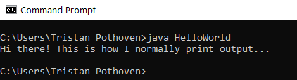
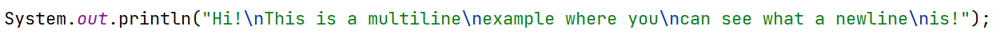
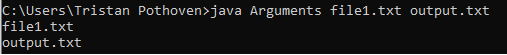
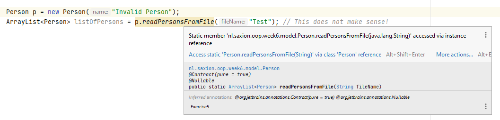
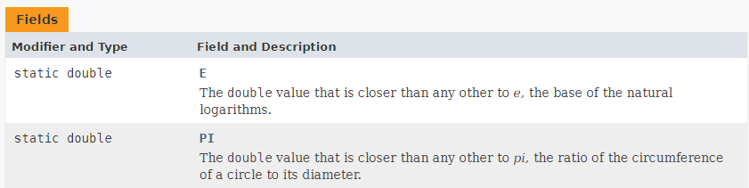

# Bye-bye Saxion-App / Static vs non-static
Competence: _I understand the concepts of static and non-static variables and methods, and can apply these principles to
my own code_.
Competence: _I understand how Java I/O works with regards to the console and how to read data from csv files using the
`Scanner` class_.

# Introduction
All good things come to an end.. and so does the use of the SaxionApp. As you may remember, we introduced this library 
a long time ago as a way in which we could introduce you to the concepts of programming. It is now time to see how 
certain things work without these tools.

Therefore, this week is mostly about phasing out the SaxionApp. We're going to look at how you can have Java output to 
your screen (i.e., "print") directly, how we can handle user input with the help of the `Scanner` class and finally how 
we can read data (in CSV format).

In addition to phasing out the SaxionApp, there are also some smaller topics that we plan to address in the coming weeks.
Today we start by discussing the concept of `static`. Static variables and methods distinguish themselves from "normal" 
variables and methods in that they say something about an entire class rather than about an instance of said class.  Today 
we'll teach you exactly what this means and what you can use `static` like for.

As announced, however, we will begin phasing out the SaxionApp.

# Replacing the SaxionApp
In this chapter we will discuss certain functionality that you have been using over the past few weeks, probably
without thinking about it too much: printing something to the screen was `SaxionApp.printLine(..)`, reading something was
`SaxionApp.readInt()` (depending on the type), etc. However, all these functions were built by us to prevent you 
from having to worry about certain problems that we did yet want you to face. Take for example the `readInt()` method,
which you can use to read in a number from the user. You've probably tried at some point to enter enter a word (`String`), 
letter (`char`) or maybe even a comma number (`double`) instead of the required integer input. The SaxionApp at that moment
would produce an error message before allowing you to enter a different value.

This is, of course, not standard Java behavior: if you type a word, while instructing the computer to read in an
integer, an exception is thrown. Because we didn't want you to worry about this right away during the 
"Introduction to Programming" course, we have captured this error for you in the SaxionApp and built something
around it so that instead the SaxionApp prompts you for new input.

The same goes for printing: we wrote SaxionApp so that you didn't have to worry about printing with with colors and 
(obviously) this is not standard behavior either. To use colors you need something of a (color) screen (which Java
lucikly "kind of" has) on which you can show the text with a certain color. But of course you also want that when you 
print multiple lines they are properly aligned. Because the standard Java screen knows nothing of "lines" (or coordinates) 
we had to implement this. And we can go on like this for a while!

We are trying to make clear that replacing the SaxionApp cannot be done in just a week: much more development time went
into the platform than that. That is why we will limit ourselves today to a few functions that we think every Java 
programmer should master. We will focus on the following:
* Being able to write plain text and any error messages to the "Console".
* Being able to read data of a certain type (`int`, `String`, `double`, etc.) from this "Console".
* Being able to read data from a file. (With this we will replace the `CsvReader` that is also in the SaxionApp.)

Please note that we are not going to build in **any** methods for drawing. The SaxionApp uses the _Java Swing_ framework 
(a library) and to understand this framework properly we should actually offer you a separate course that deals with this.
For those who want to know more about this, see for a short introduction [Wikipedia: Swing (Java)](https://en.wikipedia.org/wiki/Swing_(Java)).
We will therefore stop asking for the "drawing" of lines, rectangles or circles. Similarly we can no longer print texts
using different colors. We are really going back to the _basics_.

And the first step we need to take in these basics is to look at something known as "the Console".

## The console a.k.a. prompt a.k.a terminal a.k.a shell...
By default, Java will use the "console" to get interaction with the user done. This console, which is also called
command line, terminal, prompt, etc., you've no doubt seen before. Within a Windows environment
you simply invoke a console by starting the "Command Prompt" program (search for "CMD"). On a Mac, this
program "Terminal", on Linux machines this is also called a "shell" or sometimes "terminal".



At the command prompt you can give instructions to your operating system and from your code it is possible to print lines
to it. However, since we won't be working with the "Command Prompt" application, we won't go into more details than this.

The reason we don't need to discuss this is because IntelliJ itself has its _own console_, which makes it much easier 
to test your programs. In the past few weeks you have seen this console many times, but probably only rarely
used it. The console in IntelliJ is found (by default) at the bottom of your screen and it is displayed every time
when you start a Java program.


However, the use of the console differs from what you are used to with the SaxionApp. Whereas with the SaxionApp 
you could only write to 1 "output" (the screen), you now suddenly have the ability to do this in multiple ways.

### Writing to the console: System.out and System.err
Writing to the console is relatively easy. You can use the following 2 ways to do this:
* `System.out.println(..)`, the abbreviation within IntelliJ for this is `sout` (just type it in!).
* `System.out.print(..)`, there is no abbreviation for this.

Note that the difference between previous calls is in the addition of "ln" to the first call. The behavior of this
is exactly the same as the difference between `SaxionApp.printLine(..)` and `SaxionApp.print(..)`; in the first version, 
a new line is added at the end of the text (also called `newline`) and the second version does not include this newline.

What is also a difference with the SaxionApp is that you may add `newline` characters yourself in the arguments of these
methods. The newline character `\n` (note: this is a char!) you can include in a String at any place where
you would expect to see an "enter". Note that the "backslash" is used in a `char` or a `String` as a so-called "escape"
character. After this "backslash" follows something with a special meaning, where the "n" stands for `newline`. See also
[Java documentation: Character](https://docs.oracle.com/javase/tutorial/java/data/characters.html) and the following example:



Result:
```text
Hi!
This is a multiline
example where you
can see what a newline
is!
```

The added value of this newline character is best seen when combined with the use of the `toString()` method. Consider 
the following example:

```java
public class StudentGroup {

    private String groupName; // e.g. "EHI1V.Sa" or "DHI1V.So"
    private ArrayList<Student> listOfStudents;

    // Omitted the rest, but you may assume that we load in a list of students with a proper toString implementation.


    @Override
    public String toString() {
        String result = "Student group: " + groupName + "\n";
        
        for(Student s : listOfStudents) {
            result += s; // Note that we now call the "toString" method from Student. You could also write "s.toString()"
        }
        
        return result;
    }
}
```
(Note: officially, it is better to use a `StringBuilder` when creating these kinds of toStrings, but we'll ignore this 
for now! If you want to know more about this, see 
[Java Tutorials: The Stringbuilder Class](https://docs.oracle.com/javase/tutorial/java/data/buffers.html))

For printing to the console, we just used the _public attribute_ `out` of the class `System`_. This always refers to 
the "normal output device" attached to your system: "the console" (which shows it's data on your monitor).

However, in addition to `System.out`, you have another output to potentially print to: `System.err`. You use the same 
methods to write to `System.err` as you use with `System.out`, i.e. `println(..)` and `print(..`). The `err` attribute
however, refers to _the place where you would like to see errors_. By default, this is also your console, but 
IntelliJ displays text that you send to `System.err` in red! This way, you can easily distinguish "normal" output and
possible "errors".

The reason we're pointing out this distinction is that we'd like to you to train yourselves in making this distinction: 
_regular output (such as printouts to the user, overviews, etc.) is printed with `System.out`, all errors (e.g. 
exceptions) should be sent to `System.err`_.

In addition to `System.out` and `System.err`, your system has a third interesting channel that we are going to make use of:
`System.in`. It may not surprise you, but `System.in` is associated with your default input device, which in almost all 
cases, is "your keyboard".

## Using the Scanner to read data from your keyboard
However, the `System.in` class does not allow you to read values with specific types from the console (your keyboard). In 
fact, you can only read the raw bytes that are generated when you type a letter on your keyboard. So some work has to be 
done to turn those keystrokes into values with specific types (like `int`, `String`, etc.).

Fortunately, Java knows the [`Scanner` class](https://docs.oracle.com/javase/10/docs/api/java/util/Scanner.html) (click 
the link to go to the official page!), which can take care of many of these functions for us while reading data. These
methods all conveniently start with `next...`, like `nextInt()`, `nextDouble()`, `nextBoolean()` and also `nextLine()` f
or Strings.

For example, to read out a number you can use the following code:

```java
Scanner consoleScanner = new Scanner(System.in); // Link the "Scanner" to System.in, it will now listen to your keybord.

int value = consoleScanner.nextInt(); // Read a value from the console and (try to) convert this to an integer.
```

The disadvantage of using the `Scanner` class is that it produces error messages quite easily and can sometimes show
unexpected behaviour. For example it throws an `InputMismatchException` when you type something other than a number.

This looks like this:
```java
Scanner s = new Scanner(System.in);
System.out.print("Please enter a numerical value: ");
int input = s.nextInt();
```
If you enter something else than an integer value, the code above will produce an exception.


We'll come back to how to properly handle these kinds of errors later, when we start talking more about exceptions, so for
we'll leave these problems for what they are.

We recommend that, if you are going to read and process a lot of data, you write help methods that you can easily
use in the rest of your application. For example:

```java
public int readInt() {
    Scanner sc = new Scanner(System.in);
    return sc.nextInt();    
}

public String readString() {
    Scanner sc = new Scanner(System.in);
    return sc.nextLine();
}
```
(Note that we deliberately choose to continuously re-create a `Scanner` instance rather than to reuse the same instance. We 
do this intentionally, because the `Scanner` contains an internal buffer, which can sometimes cause unwanted side 
effects. So it is not the most efficient solution, but the easiest (for now)! By using separate methods, it will also be
easy to add the handling of any errors later, without having to change much in your code!)

However, the `Scanner` class can be used for more things, e.g. also to read files. And so we can replace the `CsvReader` 
from the SaxionApp with it.

## Replacing the CsvReader
The idea behind parsing a CSV file is fairly simple: You read the file line by line while trying to split this line
into more useful parts (or potentially even creating objects!). The `CsvReader` class as you have been using over the 
past few weeks contains a number of useful methods for this: for example, you can directly retrieve the value from a specific
column directly (e.g. _Give me the value from column 3 as a `String`._) and the class also ensured that the data was 
delivered to you in the requested type.

But, you might have seen this coming: this is not standard behaviour either. So let's go ahead and see how the same
functionality can be achieved without this class. 

Consider the following piece of CSV data:

```text
firstName;lastName;studentNr
Tristan;Pothoven;001234
Evert;Duipmans;004234
Craig;Bradley;006212
Ruud;Greven;016324
//..etc.
```

If we want to parse a file, line-by-line, using the `Scanner` class, we can do this like:

```java
Scanner fileReader = new Scanner(new File("csv-data.csv"));

// We'll skip the first line (header), so we don't store the output from nextLine!
fileReader.nextLine(); 

while (scanner.hasNext()){ // You can ask the Scanner if there is a next line! Check out the documentation!
    String lineInFile = fileReader.nextLine(); // For every next line, just invoke nextLine() again!
        
    System.out.println(lineInFile); // Just print it for now..
}

fileReader.close(); // Close the file after use.
```

Notice that we are using `new File("csv-data.csv")` now as constructor argument, rather than `System.in`. By doing so,
we are now binding the `Scanner` to a file (`csv-data.csv`), rather than our keyboard. Therefore, this file must
exist (and should be accessible). If not, a `FileNotFoundException` is thrown with which Java says that the
the file cannot be found the specified location. (We'll deal with this exception later!)

Please note that the variable `lineInFile` contains a String (`Tristan,Pothoven,001234`) which we still need to process. 
First, we want to split this total String and then use the individual parts as attributes in our objects. The
class [`String`](https://docs.oracle.com/en/java/javase/11/docs/api/java.base/java/lang/String.html) (click on the link)
fortunately provides some functionality to do so by means of the `split(String regex)` method, where you may read "regex" 
as the separator character. From this method comes a `String[]` with all the individual blocks that we can now use:

```text
// Assume the file reading code is here as well..

String[] lineParts = lineInFile.split(";"); // Split the entire line based on the ; character.
String firstName = lineParts[0]; // "Tristan"
String lastName = lineParts[1]; // "Pothoven"
int studentNumber = Integer.parseInt(lineParts[2]); // 001234, We'll discuss this line next!
```

Because the `split` method returns a `String[]`, processing the first two fields, where we only are looking for `String`
values is not difficult: these are already in the array and are of the right type. However, before treating the the student 
number as an integer the actual `String` needs  be converted (parsed...). And that is something for which you need a 
helper method, and that is what Java by default offers in the form of `Integer.parseInt(String s)`. This method will 
try to turn every possible `String` into a  number. If it cannot do so? Then a `NumberFormatException` is thrown, by which 
Java indicates that it is unable to parse the actual value. (For now, we'll just assume that things are going well! We'll 
come back later on exception handling).

The same `parseXXX(String s)` methods also exist for doubles and booleans in the form of `Double.parseDouble(String s)`
and `Boolean.parseBoolean(String s)`.

Let's finish the example by including the techniques mentioned above:

```java
 public ArrayList<Student> readStudents(String file) {
    ArrayList<Student> result = new ArrayList<>;
    
    try {
        Scanner scanner = new Scanner(new File(file));
    
        // Skip header row
        scanner.nextLine();
    
        while (scanner.hasNext()) { // You can ask the Scanner if there is a next line! Check out the documentation!
            String lineFromScanner = scanner.nextLine();
            String[] lineParts = lineFromScanner.split(";");
    
            String firstName = lineParts[0];
            String lastName = lineParts[1];
            int studentNumber = Integer.parseInt(lineParts[2]);
            
            Student s = new Student(firstName, lastName, studentNumber); // You may assume this constructor exists!
            result.add(s);
        }
        
        scanner.close();
    } catch (FileNotFoundException ex) { // Note that this exception MUST be caught. We'll discuss this next week!
        System.err.println("Cannot find CSV file: " + ex);
    }
    
    return result;
}
```
In contrast to the earlier use of the Scanner (in combination with `System.in`) you might have noticed that for
files, we choose to close the file as soon as we are finished using the `close()` method. This is a matter of 
proper programming: when you connect to something external, you should close it. (However, the reason why we 
**don't** do this for `System.in` is that you are not allowed to open this channel after you have closed it. So once 
you close `System.in` you can't read anything from your keyboard during the rest of the application.. which is often 
undesirable. So, we just forget to close it instead!).

Note that the `FileNotFoundException` **must** be caught. This is because this exception is a so called "checked
exception", but we'll go into this in more detail next week. For now, you may just use this example in your own
assignments.

And that is the whole secret behind the `CsvReader`! Basically, in our version we don't do much different than what is
mentioned above, but we have made the class a little more "friendly" to use. (Think of the `get...(int column)`
methods). However, this is the "basic idea" behind parsing csv data.

Finally, there is one thing left to do: replacing the `public void run()` method, which the SaxionApp uses to find your
code. From now on, we will continue to do this in the `main` method that has been present in all your exercises so far. 
This is because the `main` method is mandatory in any Java program that you wish to execute.

## Starting your program: the `main(...)` method.
Every program you write needs a starting point. And in Java, that starting point is a method called 'main'. You've 
already seen this method in all your exercises so far:

```java
public static void main(String[] args) {
    SaxionApp.start(new Application());
}
```
(Sometimes the `start` invocation might have looked a little different, but it was usually always 1 line!)

It is important that this method always looks the same: Java is very strict about this. Where methods ñormally are 
completely free to design (you can choose the name, arguments and return type), you must follow a certain pattern here. 

So let's dissect the `main` method:

```java
public static void main(String[] args) { .. }
```

The `main` method is a relatively simple method in structure. It does not have a return type (`void`), but it does get
an argument in the form of a `String[]`. In this array, Java stores any _commandline arguments_ that were provided when 
the program was started. As we won't use commandline argument that often, we won't discuss all details about them here,
but it is good to know that you _can_ provide them. For example you could provide file names for files from which data 
should be read or where data should be stored.

An example:

```java
public class Arguments {

    public static void main(String[] args) { 
        for(String argument : args) { // Print everything in the "args" array.
            System.out.println(argument);
        }
        
        // More code could go here..
    }
    
}
```

And if you use this to provide commandline arguments:



From now on, you may write your code directly in the `main` method of your programs. And with that, we really say 
farewell to the SaxionApp!

What we haven't talked about yet is that the `main` method also contains the keyword `static`. This means that the `main`-
method should always be called _on a class_ and not on an individual object. What this actually means is discussed next.

# Static vs non-static
This quartile you have written many methods that are directly related to the instances of this class within which
the methods are defined. For example consider the method `getName()` of a `Person` class: you expect this method to
return the name of the person represented by _that_ instance. We also call this fact that the method is _context 
(this!) dependent_. The values of the attributes in the object determine the value that is returned by the method call.

```java
public class Person {
    private String name; // This attribute will have a value specific to this instance!

    public Person(String name) {
        this.name = name;
    }
    
    public String getName() { // This method is context-specific!
        return name;
    }
}
```

You might imagine that there are also methods that do not depend on the context (or the content) of an object. These 
methods are also called _contextless or static (`static`!) methods_. Most of the methods you wrote in the 
"Introduction to Programming" course belong to this category. Static methods _always_ exhibit the same behavior at 
invocation, no matter what the state of a given object is.

For example, consider the following method:

```text
public static int sum(int[] input) {
  int result = 0;
  
  for(int value : input) {
    result += input;
  }
  
  return result;
}
```

The method `sum(int[] input)`, as shown above, does not depend on any values besides the arguments: The only relevant 
information needed for this method to function is the contents of the argument. And that is exactly the reason why we 
want you to make such methods `static` from now on, meaning that _you confirm the method does not require context_.

In addition to the `sum` method, you can probably imagine that there are some other similar methods that might be useful,
when working with integer arrays, such as for example: `calcAverage` (to calculate an average), `findMin` (to find the 
smallest value), `findMax`, etc. Since we want to use this functionality more often, we obviously should choose to put 
these methods into a so-called _Utils_ (short for _utilities_) class.

```java
public class IntArrayUtils {
    public static int sum(int[] input) { ... }
    
    public static double calcAverage(int[] input) { ... }
    
    public static int findMin(int[] input) { .. } 
    
    public static int findMax(int[] input) { .. } 
}
```

The question you should now ask yourself with this class is: _Why would you want to instantiate this class?_ The class
does not contain any internal attributes and, in fact, the class is just a "repository" for useful methods. The methods
can therefore be made `static` without problems. And thus, you do _not_ need an instance of the class `IntArrayUtils` to 
be able to use the methods. This then looks like this:

```java
int[] numbers = { 5, 2, 7, 7 }; // Suppose these numbers are from some caluation.

int sum = IntArrayUtils.sum(numbers); // Just call the method directly on the class instead of an object!
```

(For completeness: In the case of the class `IntArrayUtils`, it is also advisable to make the class `final` and
even make the constructor `private`. By doing so you ensure that no instance of this class can be created, even 
by specialisation, as this is impossible because of the class being `final`).

In the previous example, we also call the fact that the methods are now _attached to the class_ and not
so much to any objects you can create from the class. It is best to imagine this as a high-level property:
`static` methods (and variables) are linked to classes, `non-static` methods (and variables) to objects (instances).

Now take the class `Person` mentioned above. Suppose you want to provide your program with functionality that allows you 
to read data from a CSV file, e.g. in the form of the method `readPersonsFromFile(String filenName)`. This functionality 
has to do with this `Person` class. Namely, you want to convert `text` (from the CSV file) to different `Person` 
instances. Therefore, for the readability of your program, it is convenient to include this method in the `Person` class. 
Only, the method `readPersonsFromFile(String)` is not bound to a specific instance, in other words, it belongs to the
actuall class and thus you should make this method `static`.

This looks like this:

```java
public class Person {
    private String name; // This attribute will have a value specific to this instance!

    public Person(String name) {
        this.name = name;
    }
    
    public String getName() { // This method is context-specific!
        return name;
    }
    
    public static ArrayList<Person> readPersonsFromFile(String fileName) {
        // See earlier examples on how to use the Scanner to read files!
    }
}
```

Note that the method is still included within actual `Person` class (between the curly brackets): thus, the method is 
really a part of this class, but does function on a different level.

In your code, you can now use this method like:

```java
public class Application {

    public static void main(String[] args) {
        ArrayList<Person> listOfPersons = Person.readPersonsFromFile("persons.csv");
        // Do stuff..
        
    }
}
```

Note that the method is thus called via _the actual class_ `Person` and not via an individual instance. The big advantage 
of this approach is that you do not require any instance and that you can now also just store the functionality that has 
to do with the class `Person` "in the right place". For any further development you do not have to search long to find
this functionality!

You _could_ also call static methods through an instance of the object, but this is strongly discouraged. If you do this in
IntelliJ, you will get the following warning:



In the videos you will see more about static methods and during the exercises you will experiment with them.

The keyword `static` can also be used on attributes of a class. A static attribute can be seen as a variable that is 
shared _by all instances_. This has a couple of useful functions in programming: you can easily set values in your 
program, which can be used in multiple places and you can exchange values _between instances of an object_.
Let's start with the first and see how we can capture certain values.

You might remember the earlier example where we talked about the age of a person and when it is considered
"adult" (and thereby allowed to drink alcohol/get a driver's license). We have already seen how we can make this a
constant of this with the `final` keyword. Only, now every `Person` instance contains this constant value and that
is a bit much: this value does not refer to a single person, but to all persons. In such a case, we can store that 
value as a `static` variable, so that only one copy of it exists in our entire application.

You can do this like this:

```java
public class Person {
    public static final int LEGAL_AGE = 18;
    
    // Omitted other code..
}
```

Which can be used in code like:

```java
int readAgeFromUser = ..; // Determine age via interface or Scanner

if(readAgeFromUser < Person.LEGAL_AGE) {
    // We know now this person is not yet of legal age!    
}
```

Keep in mind that you could have just written this variable as "18", but if the law ever changes, you'll have to replace 
this value in all places, while this way you only have to replace it in one place.

Within Java you may already have seen more places where you encountered static attributes. For example in the (utility!) 
class `Math`. The value of pi is defined in this class and you can use it in all places in your code by using `Math.PI`.
So `PI` is a _public static final_ variable in the class `Math`.



But not all variables that are static must be _final_. Examine the example below, in which the attribute 
`firstAvailableStudentNumber` contains a value associated with the _class_ `Student` and not with an individual object. 
In this case, you may think of the variable as a value that is _shared with all instances of `Student`_:

```java
public class Student extends Person { // Remember the Person class from above!
    private int studentNumber;

    private static int firstAvailableStudentNumber = 100000; // NOTICE STATIC!

    public Student(String firstName, String lastName) {
        super(firstName, lastName);

        // Make a local copy of the first available number in studentNumber and...
        // ...after that update that global number by one for the next instantiation!
        this.studentNumber = firstAvailableStudentNumber++;
    }

    public int getStudentNumber() {
        return studentNumber;
    }
}
```

Because _all_ instances of the `Student` class share the same variable `firstAvailableStudentNumber`, it is now possible 
to keep track of the last issued student number within the class. This means that we can now have the functionality to 
determine _which student number a student gets when it is created_ in the `Student` class. You may read previous code 
as follows: _As soon as a `Student` instance is created, the constructor looks at the static variable 
`firstAvailableStudentNumber` and copies the current value of this variable to the local variable `studentNumber`. As of 
now, this is the student number of this instance. The value of `firstAvailableStudentNumber` (which is linked to the 
class and not to the object!) is then be updated so that the next constructor call finds a different (new) student number._

# Videos

[](http://www.youtube.com/watch?v=oTM4t3AVxxs)

[](http://www.youtube.com/watch?v=Ihxs7vZPIIo)

