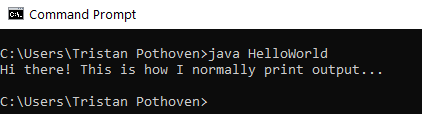
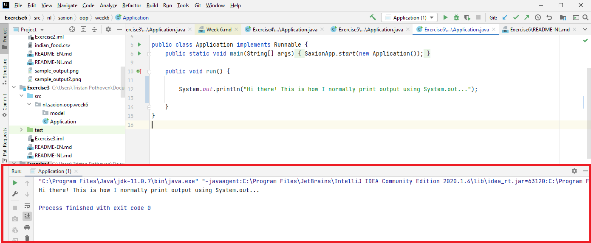
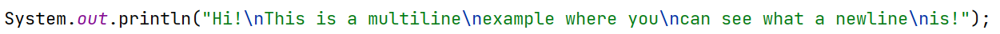
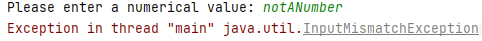
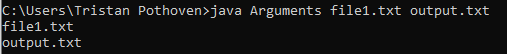
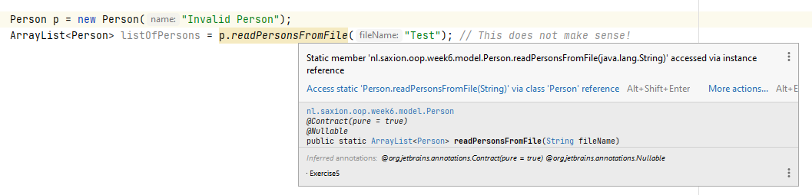
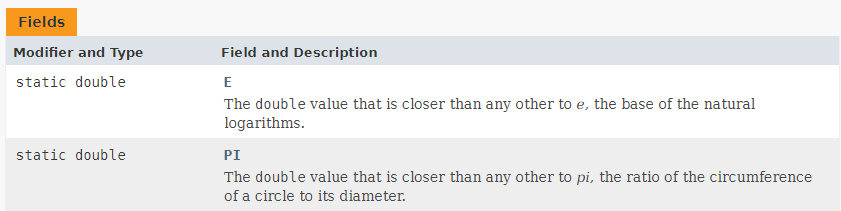

# Bye-bye Saxion-App / Static vs non-static
Competentie: _Ik begrijp de concepten static en non-static en kan deze zelf toepassen._
Competentie: _Ik begrijp hoe ik in Java naar de Console kan schrijven en toetsenbordinvoer kan lezen, tekst in getallen kan 
omzetten en hoe ik zelf CSV bestanden kan lezen._

De opdrachten staan in de losse modulen. 

# Introductie
Aan al het goede komt een eind... en zo ook aan het gebruik van de SaxionApp. Zoals je je misschien kunt herinneren hebben
wij deze bibliotheek ooit geïntroduceerd als een manier waarop wij je op een eenvoudige manier konden laten kennismaken
met de concepten van het programmeren. Het is nu tijd om eens te zien hoe bepaalde zaken werken zonder deze
hulpmiddelen.

Deze week staat daarom vooral in het teken van het uitfaseren van de SaxionApp. We gaan kijken naar hoe je in Java
uitvoer naar je scherm kunt laten sturen (dus "printen"), hoe we gebruikersinvoer kunnen afhandelen met hulp van de `Scanner` 
klasse en tenslotte hoe we data kunnen inlezen (in CSV-formaat).

Naast het uitfaseren van de SaxionApp zijn er ook nog enkele kleinere onderwerpen die we de komende weken willen
gaan behandelen. Vandaag beginnen we met het bespreken van het concept `static`. Static variabelen en methoden onderscheiden
zich van "normale" variabelen en methoden doordat ze iets zeggen over de gehele klasse en niet zozeer van de instanties van de 
klassen afzonderlijk. Vandaag leren we je wat dit precies betekent en waar je `static` zoals voor kan gebruiken.

Zoals aangekondigd echter beginnen we met het uitfaseren van de SaxionApp.

# Het vervangen van de SaxionApp
In dit hoofdstuk bespreken we bepaalde functionaliteit die je de afgelopen weken hebt gebruikt, waarschijnlijk
zonder hier al te lang over na te denken: iets naar het scherm printen was `SaxionApp.printLine(..)`, iets inlezen was
`SaxionApp.readInt()`, etc. Al deze functies zijn echter door ons een keer gebouwd om te voorkomen dat jij je bij het
schrijven van deze code zorgen hoeft te maken over "wat er mis kan gaan". Neem bijvoorbeeld de `readInt()` methode,
die je kunt gebruiken om een getal in te lezen van de gebruiker. Waarschijnlijk heb je ooit wel eens geprobeerd in plaats
van een getal hier een woord (`String`), letter (`char`) of misschien wel eens een kommagetal (`double`) in te voeren. De
SaxionApp produceerde hierop een foutmelding en liet je vervolgens een andere waarde invoeren.

Dit is natuurlijk geen standaardgedrag van Java: als jij een woord intypt, terwijl je de computer instrueert om een 
getal in te lezen, wordt hier een fout op gegeven. Omdat wij niet willen dat jij je hier al direct zorgen over 
hoefde te maken tijdens "Introductie Programmeren", hebben wij in de SaxionApp deze fout voor je afgevangen en er 
iets omheen gebouwd om nieuwe invoer te vragen.

Hetzelfde gaat natuurlijk ook op voor het printen: wij hebben de applicatie zo geschreven dat je je geen zorgen hoefde
te maken over het printen met kleuren en ook dit is dus geen standaardgedrag. Om kleuren te kunnen gebruiken moet je iets
van een (kleuren)scherm gebruiken (die Java op zich standaard al heeft) waarop je de tekst kunt laten zien met een 
bepaalde kleur. Maar je wilt natuurlijk ook dat als je meerdere regels print deze netjes onder elkaar komen. 
Omdat zo'n standaard Java scherm echter niets weet van "regels" (of überhaupt coördinaten) moeten we hier ook weer wat
mee. En zo kunnen we nog wel even doorgaan!

Je snapt misschien dat het vervangen van de SaxionApp niet zomaar even in een weekje te doen is: er zit meer ontwikkeltijd
in dan dat. Daarom gaan we ons vandaag beperken tot enkele functies waarvan wij vinden dat elke Java programmeur deze
moet beheersen. Wij richten ons daarbij op de volgende zaken:
* Het kunnen schrijven van gewone tekst en eventuele foutmeldingen naar de "Console".
* Het kunnen inlezen van data met een bepaald type (`int`, `String`, `double`, etc.) vanaf deze "Console".
* Het kunnen inlezen van data uit een bestand. (Hiermee vervangen we de `CsvReader` die ook in de SaxionApp zit.)

We gaan dus verder **geen** mogelijkheden inbouwen om te tekenen. De SaxionApp maakt hiervoor gebruik van het _Java Swing_
framework (een bibliotheek) en om dit framework goed te begrijpen moet je eigenlijk een los vak hebben dat hier over gaat. 
Voor wie hier meer van wil weten, zie voor een korte introductie [Wikipedia: Swing (Java)](https://en.wikipedia.org/wiki/Swing_(Java)).
We stoppen daarom bij de oefeningen te vragen naar het "tekenen" van grote lijnen, rechthoeken, circles en ook 
gaan we niet langer meer gebruik maken van verschillende soorten kleuren. We gaan echt terug naar de _basis_.

En de eerste stap die we moeten zetten in deze basis is te kijken naar "de Console".

## De console a.k.a. prompt a.k.a. commandline a.k.a terminal...
Standaard zal Java de "Console" gebruiken om interactie met de gebruiker voor elkaar te krijgen. Deze console, die ook wel
commandline, terminal, prompt, etc. wordt genoemd, heb je ongetwijfeld eerder gezien. Binnen een Windows omgeving roep
je eenvoudig een console op door het starten van het programma "Command Prompt" (zoek op "CMD"). (Op een Mac heet dit 
programma "Terminal", op Linux machines wordt dit ook wel een "shell" of soms ook "terminal" genoemd.)



Op de command prompt kun je je besturingssysteem instructies geven en vanuit je code is het mogelijk om hier regels
naar toe te printen. Omdat we echter niet zozeer met de command prompt gaan werken binnen dit vak, gaan we hier
nu niet verder op in.

Dit is ook niet nodig, omdat IntelliJ zelf een _eigen console_ heeft, waardoor het veel eenvoudiger wordt om je 
programma's te kunnen testen. De afgelopen weken heb je deze console al vaak gezien, maar waarschijnlijk nog maar amper
gebruik van gemaakt. De console in IntelliJ is (standaard) te vinden onder aan je scherm en deze wordt iedere keer
wanneer je een Java programma opstart getoond.



Het gebruik van de console verschilt echter met wat je van de SaxionApp gewend bent. Waar je met de SaxionApp eigenlijk
maar naar 1 "uitvoer" kon schrijven (het scherm), heb je nu opeens de mogelijkheid om dit op 2 manieren te doen.

### Naar de console schrijven: System.out en System.err
Naar de console schrijven is relatief eenvoudig. Hier kun je de volgende 2 manieren voor gebruiken:
* `System.out.println(..)`, de afkorting binnen IntelliJ is hiervoor `sout` (type maar eens in!).
* `System.out.print(..)`, hier is verder geen afkorting voor.

Merk op dat het verschil tussen voorgaande aanroepen zit in de toevoeging "ln" van de eerste aanroep. Het gedrag hiervan
is exact hetzelfde als het verschil tussen `SaxionApp.printLine(..)` en `SaxionApp.print(..)`; bij de eerste versie wordt 
aan het einde van de tekst een nieuwe regel toegevoegd (ook wel `newline` genoemd) en bij de tweede versie niet.

Wat ook een verschil is met de SaxionApp is dat je zelf ook `newline` characters mag toevoegen in de argumenten van deze
methoden. Het newline character `'\n'` (let op: dit is een char!) kun je in een String opnemen op elke plek waar 
je een "enter" zou verwachten. N.B. de "backslash" (de \) wordt bij een `char` of een `String` gebruikt als zogenaamd "escape" 
karakter. Na deze "backslash" volgt iets met een speciale betekenis, waarbij de "n" staat voor `newline`. Zie verder ook 
[Java documentation: Character](https://docs.oracle.com/javase/tutorial/java/data/characters.html) en het volgende voorbeeld:



Uitvoer:
```text
Hi!
This is a multiline
example where you
can see what a newline
is!
```

De meerwaarde van dit wordt het beste zichtbaar in combinatie met het gebruik van de `toString()` methode. Neem het volgende
voorbeeld:

```java
public class StudentGroup {

    private String groupName; // e.g. "EHI1V.Sa" or "DHI1V.So"
    private ArrayList<Student> listOfStudents;

    // Omitted the rest, but you may assume that we load in a list of students with a proper toString implementation.


    @Override
    public String toString() {
        String result = "Student group: " + groupName + "\n";
        
        for(Student s : listOfStudents) {
            result += s; // Note that we now call the "toString" method from Student. You could also write "s.toString()"
        }
        
        return result;
    }
}
```
(Let op: officieel is het netter om een `StringBuilder` te gebruiken als je dit soort toStrings maakt, maar dit negeren 
we even op dit moment! Als je hier meer over wilt weten, zie [Java Tutorials: The Stringbuilder Class](https://docs.oracle.com/javase/tutorial/java/data/buffers.html)))

Voor het printen naar de console hebben we zojuist steeds gebruik gemaakt van het _publieke attribuut `out` van de 
klasse `System`_. Dit verwijst altijd naar je het "normale uitvoerapparaat" dat aan je systeem is gekoppeld: "de console" (die 
het op je monitor laat zien).

Naast `System.out` heb je echter nog een andere mogelijk om naar toe te printen: `System.err`. Je gebruikt dezelfde methoden om
naar `System.err` te schrijven als die je bij `System.out` hebt gezien, dus `println(..)` en `print(..`). Het "err" attribuut
verwijst echter naar _de plek waar je fouten graag wilt zien_. Standaard is dit ook je console, maar IntelliJ toont tekst die 
je naar `System.err` stuurt netjes in het rood! Op deze manier kun je dus eenvoudig onderscheid maken tussen "normale" output en
eventuele "fouten".

De reden waarom we je wijzen op dit onderscheid is dus dat we je graag het volgende willen aanleren: _reguliere output 
(zoals printjes naar de gebruiker, overzichtjes, etc.) print je met `System.out`, alle fouten (bijv. exceptions) stuur 
je naar `System.err`_.

Naast `System.out` en `System.err` heeft je systeem nog een derde interessant kanaal waar we gebruik van gaan maken: 
`System.in`. Het zal je misschien niet verrassen, maar `System.in` is gekoppeld aan je standaard invoerapparaat, wat
in bijna alle gevallen "je toetsenbord" is.

## Scanner om waarden uit te lezen via de console
De `System.in` klasse biedt echter niet zomaar de mogelijkheid om eenvoudig waarden uit te lezen van de console (je 
toetsenbord). Je kunt eigenlijk alleen maar de ruwe bytes uitlezen die gegenereerd worden wanneer je een letter
op je toetsenbord intypt. Er moet dus enig werk verricht worden om van die toetsaanslagen goede typen (zoals `int`, `String`, 
etc.) te maken.

Java kent gelukkig de [`Scanner` klasse](https://docs.oracle.com/javase/10/docs/api/java/util/Scanner.html) (klik op de link
om naar de officiële pagina te gaan!), die veel van dit soort functies voor ons kan regelen voor het inlezen van data. Deze 
functies beginnen allemaal met `next...`, zoals `nextInt()`, `nextDouble()`, `nextBoolean()` en ook `nextLine()` voor Strings.
Om bijvoorbeeld een getal uit te lezen kun je de volgende code gebruiken:

```java
Scanner consoleScanner = new Scanner(System.in); // Link the "Scanner" to System.in, it will now listen to your keybord.

int value = consoleScanner.nextInt(); // Read a value from the console and (try to) convert this to an integer.
```

Het nadeel van het gebruik van de `Scanner` klasse is dat deze snel foutmeldingen oplevert en soms apart gedrag kan vertonen. Zo
gooit deze een `InputMismatchException` op als je iets anders intypt dan een getal. Dit ziet er als volgt uit:
```java
Scanner s = new Scanner(System.in);
System.out.print("Please enter a numerical value: ");
int input = s.nextInt();
```
Wanneer je nu geen cijfers intypt maar alleen een "Enter" geeft, krijg je dit als resultaat:



We komen later terug op hoe je "netjes" dit soort fouten afhandelt, wanneer we het meer over exceptions gaan hebben, dus voor 
nu laten we deze problemen even voor wat het zijn.

Wij raden jullie aan om, als je veel data wilt gaan inlezen en verwerken, hulpmethoden te schrijven die je eenvoudig
kunt gebruiken in de rest van je applicatie. Bijvoorbeeld:

```java
public int readInt() {
    Scanner sc = new Scanner(System.in);
    return sc.nextInt();    
}

public String readString() {
    Scanner sc = new Scanner(System.in);
    return sc.nextLine();
}
```
(Merk op dat wij er opzettelijk voor kiezen om een `Scanner` instantie continu opnieuw aan te maken. Dit doen wij bewust,
omdat de `Scanner` een interne buffer bevat, die soms voor ongewenste bijeffecten kan zorgen. Het is dus niet de meest 
efficiënte oplossing, wel de gemakkelijkste (voor nu)! Door het gebruik van losse methoden is het ook in de toekomst redelijk
eenvoudig om de afhandeling van eventuele fouten toe te voegen, zonder dat je daarbij veel in je code hoeft aan te passen!)

De `Scanner` klasse is echter ook voor meer zaken te gebruiken, bijv. ook om bestanden in te lezen. En dus kunnen we
de `CsvReader` uit de SaxionApp hiermee vervangen.

## Het vervangen van de CsvReader
Het idee achter het inlezen van een CSV-bestand is redelijk eenvoudig: Je leest het bestand regel voor regel en "per regel",
probeer je de juiste data op te halen en te vertalen naar variabelen (of zelfs een geheel object!). De `CsvReader` klasse zoals
je deze de afgelopen weken gebruik hebt bevat hier een aantal handige methoden voor: zo kun je de waarden uit specifieke
kolommen direct opvragen (bijv: _Geef mij de waarde uit kolom 3 als een `String`._) en zorgde de klasse ervoor dat ook de 
data in het juiste type werd  opgeleverd.

Je snapt het misschien al een beetje: ook dit is niet standaard. Dus laten we maar eens gaan kijken hoe dezelfde
functionaliteit kunnen bereiken zonder deze klasse. Neem het volgende stukje CSV-data:
```text
firstName;lastName;studentNr
Tristan;Pothoven;001234
Evert;Duipmans;004234
Craig;Bradley;006212
Ruud;Greven;016324
//..etc.
```

Als we deze code regel-voor-regel in willen lezen, kunnen we dat m.b.v. de `Scanner` klasse doen op de volgende 
manier:
```java
Scanner fileReader = new Scanner(new File("csv-data.csv"));

// We'll skip the first line (header), so we don't store the output from nextLine!
fileReader.nextLine(); 

while (scanner.hasNext()){ // You can ask the Scanner if there is a next line! Check out the documentation!
    String lineInFile = fileReader.nextLine(); // For every next line, just invoke nextLine() again!
        
    System.out.println(lineInFile); // Just print it for now..
}

fileReader.close(); // Close the file after use.
```

Merk op dat we het stukje `new File("csv-data.csv")` gebruiken waar net `System.in` in stond. We binden door deze code
de `Scanner` instantie nu niet zozeer aan ons toetsenbord, maar aan een bestand (`csv-data.csv`). Dit bestand moet daarom
wel bestaan en te vinden zijn. Zo niet, dan wordt er een `FileNotFoundException` gegooid waarmee Java zegt dat het
bestand niet gevonden kan worden op de plek waar jij hebt aangeven dat het moet staan. (Dit handelen we later af!)

Bedenk je goed dat de variabele `lineInFile` nu een String bevat (`Tristan,Pothoven,001234`) waar we natuurlijk nog
iets mee moeten. Ten eerste willen we deze totale String gaan splitsen en vervolgens de individuele deeltjes gebruiken. De
klasse [`String`](https://docs.oracle.com/en/java/javase/11/docs/api/java.base/java/lang/String.html) (klik op de link) 
biedt hier gelukkig wat functionaliteit voor met de methode `split(String regex)`, waarbij je "regex" mag lezen als het 
scheidingsteken. Uit deze methode komt een `String[]` met alle individuele blokken die we nu kunnen gebruiken:

```text
// Assume the file reading code is here as well..

String[] lineParts = lineInFile.split(";"); // Split the entire line based on the ; character.
String firstName = lineParts[0]; // "Tristan"
String lastName = lineParts[1]; // "Pothoven"
int studentNumber = Integer.parseInt(lineParts[2]); // 001234, We'll discuss this line next!
```

Omdat de methode `split` een `String[]` oplevert is het verwerken van de eerste twee velden, waarbij we steeds een `String` 
nodig hebben niet zo lastig: deze zitten al gewoon in het array. Echter, voor het inlezen van het studentennummer moet die 
`String` omgezet (het parsen van...) worden naar een `int`. En dat is iets waarvoor je een hulpmethode nodig hebt en die biedt 
Java standaard aan in de vorm van `Integer.parseInt(String s)`. Deze methode zal proberen van elke mogelijke `String` een 
getal te maken. Lukt dit niet? Dan wordt er een `NumberFormatException` gegooid, waarmee Java aangeeft dat het niet is 
gelukt deze tekst om te zetten naar een getal. (Voor nu gaan we er maar even van uit dat het goed gaat! We komen later terug op 
het afhandelen van exception.)

Dezelfde `parseXXX(String s)` methoden bestaan er ook voor doubles en booleans in de vorm van `Double.parseDouble(String s)` 
en `Boolean.parseBoolean(String s)`.

Een totale oplossing voor het inlezen van bestanden kan er dan als volgt uit zien:

```java
 public ArrayList<Student> readStudents(String file) {
    ArrayList<Student> result = new ArrayList<>;
    
    try {
        Scanner scanner = new Scanner(new File(file));
    
        // Skip header row
        scanner.nextLine();
    
        while (scanner.hasNext()) { // You can ask the Scanner if there is a next line! Check out the documentation!
            String lineFromScanner = scanner.nextLine();
            String[] lineParts = lineFromScanner.split(";");
    
            String firstName = lineParts[0];
            String lastName = lineParts[1];
            int studentNumber = Integer.parseInt(lineParts[2]);
            
            Student s = new Student(firstName, lastName, studentNumber); // You may assume this constructor exists!
            result.add(s);
        }
        
        scanner.close();
    } catch (FileNotFoundException ex) { // Note that this exception MUST be caught. We'll discuss this next week!
        System.err.println("Cannot find CSV file: " + ex);
    }
    
    return result;
}
```
In tegenstelling tot het eerdere gebruik van de Scanner (i.c.m. `System.in`) is je misschien opgevallen dat we bij 
bestanden er wel voor kiezen om, zodra we klaar zijn met een bestand de verbinding te verbreken doormiddel van de `close()`
methode. Dit is een kwestie van netjes programmeren: als je een verbinding maakt met iets externs, moet je deze sluiten.
(De reden echter waarom we dit **niet** doen doen voor `System.in` is dat je dit kanaal niet meer mag openen nadat je het
gesloten hebt. Dus als je eenmaal `System.in` gesloten hebt kan je in de rest van de applicatie niets meer inlezen.. wat 
vaak onwenselijk is. Vandaar dat in ons eerdere voorbeeld wij dit niet doen.)

Merk op dat de `FileNotFoundException` afgevangen **moet** worden. Dit komt, omdat deze exception een zogenaamde "checked 
exception" is, maar hier gaan we volgende week verder op in. Voor nu mag je gewoon dit voorbeeld gebruiken in je eigen
opdrachten.

En dat was het gehele geheim van de `CsvReader`! In principe doen wij in deze klasse niet veel anders dan wat hiervoor
genoemd staat, maar hebben wij de klasse iets "vriendelijker" gemaakt in gebruik. (Denk aan de `get...(int column)` 
methoden.) Maar vanaf nu kun je dus ook zelf je eigen CSV-bestanden inlezen.

Tenslotte rest ons nog 1 ding: het vervangen van de `public void run()`-methode, die de SaxionApp gebruikt om onze 
applicatie mee te starten, zeg maar de "hoofdmethode" van onze applicatie. Vanaf nu gaan we dit verder in de `main` 
methode doen. Dit is namelijk een methode die alle Java programma's (verplicht) moeten hebben.

## Het starten van je programma: de `main(...)`-methode.
Elk programma dat je schrijft, heeft een beginpunt nodig. En in Java is dat beginpunt een methode die altijd
hetzelfde heet en er hetzelfde uitziet: de `main` methode. Je hebt deze in al je opdrachten al gezien:

```java
public static void main(String[] args) {
    SaxionApp.start(new Application());
}
```
(Soms gaven we aan de methode `start` ook nog wel een afmeting mee van het scherm)

Het is belangrijk dat deze methode altijd hetzelfde eruit ziet: Java is hier heel strict in. Waar je normaal methoden 
geheel zelf mag verzinnen en ontwerpen, moet je hier een bepaald stramien volgen. Laten we de `main` methode daarom maar 
eens ontleden.

```java
public static void main(String[] args) { .. }
```

De `main` methode is een relatief eenvoudige methode qua opbouw. Het heeft geen return type (`void`), maar krijgt wel 
een argument mee in de vorm van een `String[]`. In deze array slaat Java eventuele _commandline argumenten_ in op die
mee zijn gegeven bij het starten van het programma. We gaan in dit vak niet veel verder in op het gebied van commandline
argumenten, maar je moet je voorstellen dat je hier bijv. bestandsnamen in kunt meegeven waar data van moet worden ingelezen
of waar data naar toe moet worden geschreven.

Een voorbeeld:
```java
public class Arguments {

    public static void main(String[] args) { 
        for(String argument : args) { // Print everything in the "args" array.
            System.out.println(argument);
        }
        
        // More code could go here..
    }
    
}
```

En de uitvoer:



Vanaf nu mag je de code direct gaan schrijven in de `main`-methode van je programma. En daarmee nemen we echt afscheid van 
de SaxionApp!

Waar we het nog niet over gehad hebben is dat de `main` methode ook het keyword `static` bevat. Dit betekent dat de `main`-
methode altijd _op een klasse_ wordt aangeroepen en niet op een individueel object. Wat dit precies betekent leggen we nader
uit in het volgende hoofdstuk.

# Static vs non-static
Dit kwartiel heb je veel methoden geschreven die direct te maken hebben met de instanties van deze klasse waarbinnen 
de methoden gedefinieerd zijn. Neem bijvoorbeeld de methode `getName()` van een `Person` klasse: je verwacht dat deze methode
de naam oplevert van de persoon die wordt gerepresenteerd door _die_ instantie. We spreken in dit geval ook wel over het
feit dat de methode _context (this!) afhankelijk_ is. De waarden van de attributen in het object bepalen de waarde die 
opgeleverd gaat worden door de methode-aanroep.

```java
public class Person {
    private String name; // This attribute will have a value specific to this instance!

    public Person(String name) {
        this.name = name;
    }
    
    public String getName() { // This method is context-specific!
        return name;
    }
}
```

Je kunt je misschien voorstellen dat er ook methoden zijn die niet afhankelijk zijn van een bepaalde context (of de inhoud 
van een object). Dit worden ook wel _contextloze of statische (`static`!) methoden_ genoemd.
De meeste methoden die je in het vak "Introductie Programmeren" hebt geschreven, behoren tot deze categorie. Statische
methoden vertonen _altijd_ hetzelfde gedrag bij de aanroep, ongeacht wat de toestand is van een bepaald object. 

Neem bijvoorbeeld de volgende methode:

```text
public static int sum(int[] input) {
  int result = 0;
  
  for(int value : input) {
    result += input;
  }
  
  return result;
}
```

De methode `sum(int[] input)`, zoals hiervoor is getoond, is niet afhankelijk van de waarden in een bepaald object: de enige 
relevante informatie die nodig is om deze methode te laten functioneren wordt immers meegegeven als argument. En dat is precies 
de reden waarom we een dergelijke methode vanaf nu `static` willen gaan maken.

Naast de `sum` methode kun je je vast voorstellen dat er ook nog wel andere, vergelijkbare methoden nuttig zouden kunnen zijn, 
die werken op een integer-array, zoals bijvoorbeeld: `calcAverage` (om een gemiddelde te bereken), `findMin` (om de kleinste 
waarde te vinden), `findMax`, etc. Omdat we deze functionaliteit vaker willen gaan gebruiken, kiezen we er gelijk voor om deze 
methoden onder te brengen in een zogenaamde _Utils_ (kort voor: _utilities_) klasse.

```java
public class IntArrayUtils {
    public static int sum(int[] input) { ... }
    
    public static double calcAverage(int[] input) { ... }
    
    public static int findMin(int[] input) { .. } 
    
    public static int findMax(int[] input) { .. } 
}
```

De vraag die je je nu bij voorgaande klasse moet stellen is: _waarom zou je deze klasse willen instantiëren?_. De klasse
bevat inhoudelijk geen enkele waarde en feitelijk is de klasse slechts een "opslagplek" voor nuttige methoden. De methoden 
kunnen daarom prima `static` worden gemaakt. Je hebt dus _geen_ instantie nodig van de klasse `IntArrayUtils` om de methoden
te kunnen gebruiken. Dit ziet er dan als volgt uit:

```java
int[] numbers = { 5, 2, 7, 7 }; // Suppose these numbers are from some caluation.

int sum = IntArrayUtils.sum(numbers); // Just call the method directly on the class instead of an object!
```

(Voor de volledigheid: In het geval van de klasse `IntArrayUtils` is het ook adviseerbaar om deze `final` te maken en 
eventueel de constructor `private` te maken. Door deze beide zaken te doen zorg je ervoor dat er nooit een instantie 
van deze klasse gemaakt kan worden, zelfs niet door te specialiseren, want dit is vanwege de `final` immers onmogelijk.)

In het voorgaande voorbeeld spreken we ook wel van het feit dat we de methoden nu aan de _klasse_ hebben gekoppeld en niet 
zozeer aan de objecten die je kunt maken van de klasse. Je kunt je dit het beste voorstellen als een overkoepelend iets: 
`static` methoden (en variabelen) zijn gekoppeld aan klassen, niet-`static` methoden (en variabelen) aan objecten (instanties).

Neem nu de hiervoor genoemde klasse `Person`. Stel dat je je programma wilt voorzien van een stuk code waarmee je
vanuit een CSV-bestand personen kunt inlezen, bijv. in de vorm van de methode `readPersonsFromFile(String filenName)`. Deze 
functionaliteit heeft te maken met deze `Person` klasse. Je wilt namelijk "tekst" (uit het CSV-bestand) omzetten naar 
verschillende `Person` instanties. Voor de leesbaarheid van je programma is het daarom handig om deze functionaliteit op te 
nemen in de klasse `Person`. Alleen is de methode `readPersonsFromFile(String)` niet gebonden aan een specifieke instantie, 
m.a.w. deze is klasse overkoepelend en dus maken we deze methode `static`.

Dit ziet er als volgt uit:

```java
public class Person {
    private String name; // This attribute will have a value specific to this instance!

    public Person(String name) {
        this.name = name;
    }
    
    public String getName() { // This method is context-specific!
        return name;
    }
    
    public static ArrayList<Person> readPersonsFromFile(String fileName) {
        // See earlier examples on how to use the Scanner to read files!
    }
}
```

Merk op dat de methode nog steeds wel binnen de accolades van de klasse `Person` is opgenomen: de methode is dus echt een 
onderdeel van deze klasse, maar functioneert wel op een ander niveau.

In je code kun je deze methode nu als volgt gebruiken:

```java
public class Application {

    public static void main(String[] args) {
        ArrayList<Person> listOfPersons = Person.readPersonsFromFile("persons.csv");
        // Do stuff..
        
    }
}
```

Merk op dat de methode dus op _de klasse_ Person wordt aangeroepen en niet op een individuele instantie. Het grote voordeel 
van deze manier van werken is dat je de functionaliteit die met de klasse `Person` te maken heeft nu ook gewoon kunt opslaan
"op de juiste plek". Voor eventuele verdere ontwikkeling hoef je dus niet lang te zoeken naar _waar die functionaliteit 
ook alweer staat_!

Je _kunt_ static methoden ook via een instantie van het object aanroepen, maar dit wordt sterk afgeraden. Als je dit in 
IntelliJ doet, krijg je hier de volgende waarschuwing voor:



In de videos ga je meer zien over static methoden en tijdens de oefeningen kun je hier meer mee gaan experimenteren.

Het keyword `static` is overigens ook op attributen te gebruiken van een klasse. Een `static` attribuut mag je zien als een 
variabele die _door alle instanties gedeeld wordt_. Dit heeft een paar nuttige functies in het programmeren: je kunt eenvoudig waarden
vastleggen in je programma, die op meerdere plekken te gebruiken zijn en je kunt waarden _tussen instanties van een object_ 
uitwisselen. Laten we beginnen bij het eerste en eens zien hoe we bepaalde waarden vast kunnen leggen.

Misschien herinner je je nog het eerdere voorbeeld waar we spraken over de leeftijd van een persoon en wanneer deze als 
"volwassen" wordt gezien (en daarbij alcohol mag drinken/ een rijbewijs halen). We hebben toen al gezien hoe we hier een 
constante van kunnen maken met het `final` keyword. Alleen, nu bevat iedere `Person` instantie deze constante waarde en dat 
is wel een beetje veel van het goede: deze waarde slaat immers niet zozeer op een enkel persoon, maar op alle personen. In zo'n
geval kunnen we die waarde opslaan als een `static` variabele, zodat er ook maar 1 kopie van bestaat. 

Dit ziet er dan als volgt uit:

```java
public class Person {
    public static final int LEGAL_AGE = 18;
    
    // Omitted other code..
}
```

In je code kun je dit nu als volgt gebruiken:

```java
int readAgeFromUser = ..; // Determine age via interface or Scanner

if(readAgeFromUser < Person.LEGAL_AGE) {
    // We know now this person is not yet of legal age!    
}
```

Bedenk je goed dat je deze variabele natuurlijk ook gewoon als "18" had kunnen uitschrijven, maar mocht de wetgeving ooit
aangepast worden dan moet je dit op allerlei plekken vervangen, terwijl je op deze manier het slechts op 1 plek hoeft te
vervangen.

Binnen Java heb je mogelijk al meer plekken gezien, waar je dit bent tegen gekomen. Bijvoorbeeld in de (utility!) class `Math`.
De waarde van pi is in deze klasse vastgelegd en deze kun je op alle plekken in jouw code gewoon gebruiken d.m.v. `Math.PI`. 
 `PI` is dus een _public static final_ variabele in de klasse `Math`. 



Maar niet alle variabelen die static zijn moeten _final_ zijn. Bestudeer onderstaand voorbeeld, waarin het attribuut
`firstAvailableStudentNumber` een waarde bevat, die gekoppeld is aan de _klasse_ `Student` en niet aan een individueel 
object. In dit geval mag je de variabele zien als een waarde die _gedeeld wordt met alle instanties van `Student`_:

```java
public class Student extends Person { // Remember the Person class from above!
    private int studentNumber;

    private static int firstAvailableStudentNumber = 100000; // NOTICE STATIC!

    public Student(String firstName, String lastName) {
        super(firstName, lastName);

        // Make a local copy of the first available number in studentNumber and...
        // ...after that update that global number by one for the next instantiation!
        this.studentNumber = firstAvailableStudentNumber++;
    }

    public int getStudentNumber() {
        return studentNumber;
    }
}
```

Doordat _alle_ instanties van de klasse `Student` dezelfde variabele `firstAvailableStudentNumber` delen, omdat deze 
`static` is, is het mogelijk om binnen de klasse bij te houden wat het laatst uitgegeven studentnummer is. Dit betekent 
dat we de functionaliteit om te bepalen _welk studentnummer een student krijgt als deze aangemaakt wordt_ nu opeens in 
de klasse `Student` kunnen maken. Je mag voorgaande code als volgt lezen: _Zodra een `Student` instantie wordt aangemaakt, 
kijkt de constructor naar de statische variabele `firstAvailableStudentNumber` en kopieert de huidige waarde van deze 
variabele naar de lokale variabele `studentNumber`. Vanaf nu is dit het studentnummer van deze instantie. De waarde 
van `firstAvailableStudentNumber` (die gekoppeld is aan de klasse en niet aan het object!) moet vervolgens geüpdatet 
worden, zodat de volgende constructor-aanroep een ander (nieuw) studentnummer vindt._

# Videos

[](http://www.youtube.com/watch?v=6YkkKcPgp4c)

[](http://www.youtube.com/watch?v=qxUWeRALGV0)

