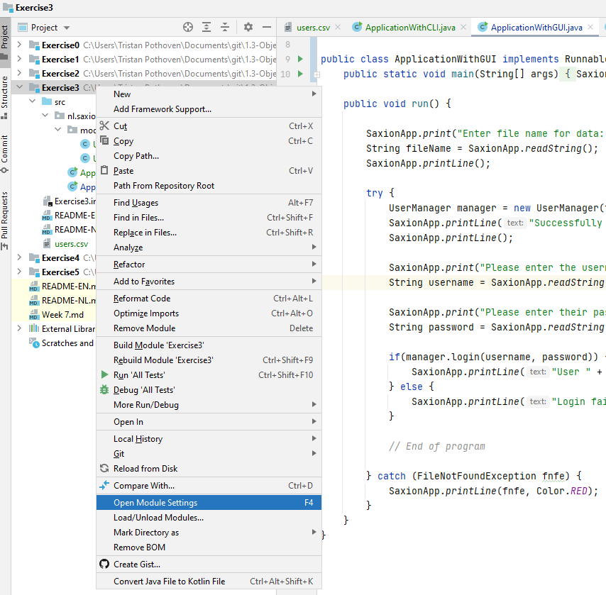
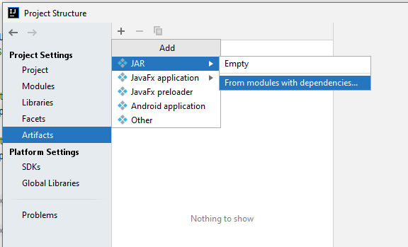
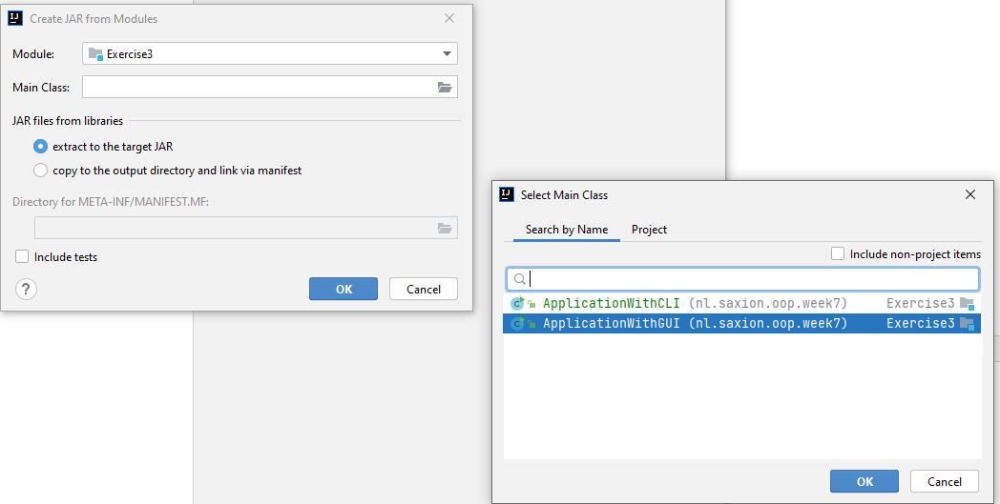
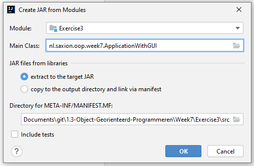
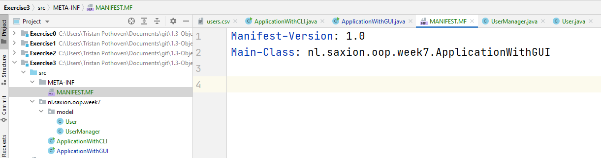
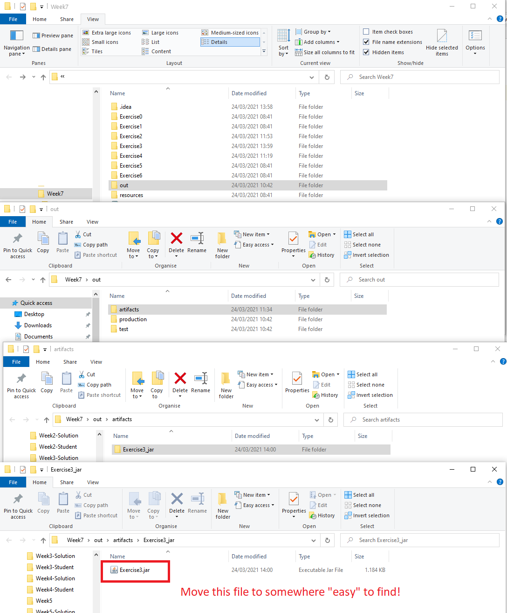
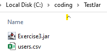
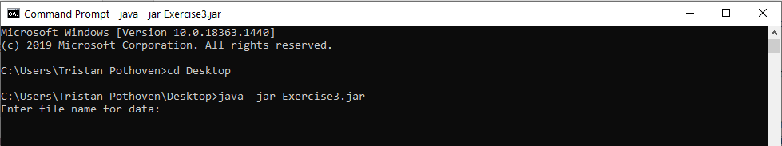

# Building and running your programs without IntelliJ
## Difficulty:   
## (or   , if you have little / no experience with the command line!)

Since we're near the end of the module, it's time for you to see "how the programs" you created are actually usable outside 
of IntelliJ. Depending on the type of program you've written, launching your application outside of IntelliJ may be 
slightly different than what you'll do today, but in general similar steps will be taken. In this
assignment we will take you, step-by-step, through the _configuration of the final built product_, the actual
_building your application to create an executable version_ and concluding with actually _starting the application
outside of IntelliJ_.

To run a program outside of IntelliJ, we obviously need a program to launch first. Therefore, you will first need create 
a small (1-star) program before we can _publish_ it!

## The programming assignment
Write an application in which you implement your own `UserManager` class, which, based on a given csv file generates
user accounts for all people in that csv file. Next, users are allowed to "log in" to the system using these newly
generated user accounts. (So basically, consider the application a "login screen". We'll just focus on username / password
verification part.)

For each person in the csv file, a user account is created with the following information: The last name
of the person will be the user name in lower case. (Thus "O. Mendoza" from the csv file will get "mendoza" as his/her
user name). The password for this user is automatically created by taking the first 3 letters of the street name
the person lives in, again in lowercase. ("O. Mendoza" lives on "Livingstone Street", so his password will be "liv").

We have offered 2 versions of the `Application` class so you don't have to worry about the interface. One version 
uses the SaxionApp, the other uses the "regular Java approach" to printing. Functionally, both versions do exactly 
the same thing (allow users to enter the username and password and check whether they can login), but for exporting 
"complete programs" it is nice to have both versions availble! (The fact that the SaxionApp uses a frame is important
here.)

Note: The `FileNotFoundException` is deliberately handled in the `Application` class. The program is useless if no
user data can be read from the file (and thus may crash if the file cannot be found).

## Exporting the application
The summary of exporting your own application is: _We're going to pack *all* classes that are needed to run your program 
in 1 big "jar" _file._ _Jar_ files (short for "Java archive") files are in Java most of the time the official "end product"
of any project. The major benefit of these jar files is that they can easily be reused in different projects. For example, 
we have always offered the SaxionApp as a _jar_ file in all your projects from this quartile and Introduction to Programming. 
(Just look in the "resources" folder within your IntelliJ project!) You may consider a _jar_ file as a _zip_ file 
containing your created classes_.

IntelliJ can easily turn your entire project into a _jar_ file. But you have to do some configuration before it is able
to do so which we are going to show you right now. First read the entire instruction once and then perform the 
configuration step by step, so you know what is coming.

We are going to take the following 3 steps:
* Configure this IntelliJ project so that a _jar_ file is created as a build _artifact_.
* Actually building this _artifact_, based on the sources find in "Exercise3".
* Star our exported application as a _jar_ file.

(Note: The word _artifact_ is just a difficult term for a "build result". We are going to "build" our code into a working
application" and put the results of that build in a _jar_ file. The _jar_ file is therefore also called a build _artifact_).

### Configuring the project
To configure the project, you must first open the "module settings" page open in IntelliJ for this project. This
can be done by right-clicking on "Exercise3" in the overview of projects.

On this page all the settings of this whole (Week 7) project are shown. Since we want to add an _artifact_,
you have to navigate to this sub-screen and then click on the plus sign at the top of the screen and then select
"JAR" --> "From modules with dependencies".

In the screen that is now in front of you, you have to specify which module (in this case "Exercise3") you want to be
exported and how you are supposed to start this module. Or in other words: You have to point out the class containing the
main method that you want to use when you start the application. (Your program may well have multiple main methods,
but when you build the product you must choose one that is used by default!)

**Please use `ApplicationWithGUI` first. Later we'll rebuild the project using the `ApplicationWithCLI` class.**

Other than that, you may leave the settings as they are. You will see that as soon as you click "OK" an extra folder 
called "META-INF" will appear in your project. This contains the so-called _meta information_ of your built product. This
sounds much more complicated than it actually is, in fact it is just a text file containing the name of the class 
containing the main method.

Even tho the file is really simple, the file is mandatory to build your _artifact_. It is a required part of 
every _jar_ file.

**If you want to rebuild your application later but with ApplicationWithCLI class, it's best to directly
change the class in this text file. However, don't do this just yet!**

The configuration is now ready! Time to build the product!

## Building your project (into a _jar_ file)

Now that the configuration is updated, building is easy. In the menu at the top of IntelliJ click "Build" and select
"Build Artifacts". Next select "Exercise3" in the popup window and confirm by clicking "build" again.

Your project will now be converted to a _jar_ file, which you can then send to anyone who is going to use
your product! We just need to find where exactly this _jar_ file is located.

IntelliJ will create an "out" folder in every project you open (it's not just visible in IntelliJ, so use your operating 
system's file navigator for this, such as explorer / finder / etc.). Your _jar_ file will be found in this _out_ folder.

Below we show you that the _jar_ file for this assignment will be in "Week7/out/artifacts/Exercise3_jar" and
will be named "Exercise3.jar":

**Move this file and the users.csv to an easy to locate directory**

## Running your own application
Once you have found and copied (or moved) the _jar_ file it's time to start the program. This is however a little tricky: 
_Programs with a graphical shell (e.g., anything created with the SaxionApp), you can you can simply start by double-clicking
the jar file._ (Assuming your Java installation is correct, this should be all there is to it!)

However, if you have a program that uses the _command line_ (remember last week?), then you need to start the program 
from the command line as well. Here we show how to do this, using Windows:

Note that it should be possible to run "java" from the command line. If this is not possible for you, you need to
read the text below (and ask your teacher).

In case this line works: Congratulations! You have now officially shipped your first "application".

## In case you get stuck..
The command above assumes that you have certain configuration on your computer. If you run into a problem anywhere in
this assignment, please leave this assignment until the workshop. Your teacher will be happy to help you determine what
exactly the problem is. Unfortunately, it is not possible for us to mention "all" possible problems in this description 
of the assignment. Of course, you can also Google yourself to see what you can do here!