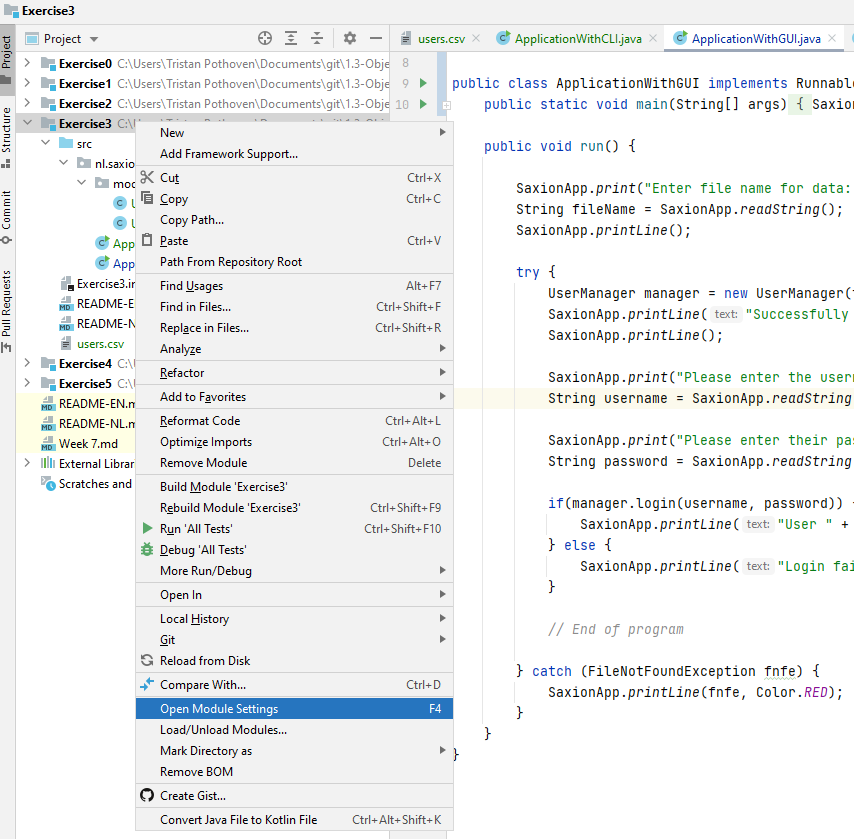
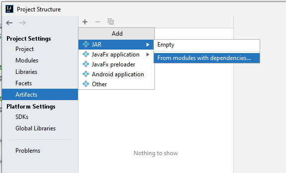
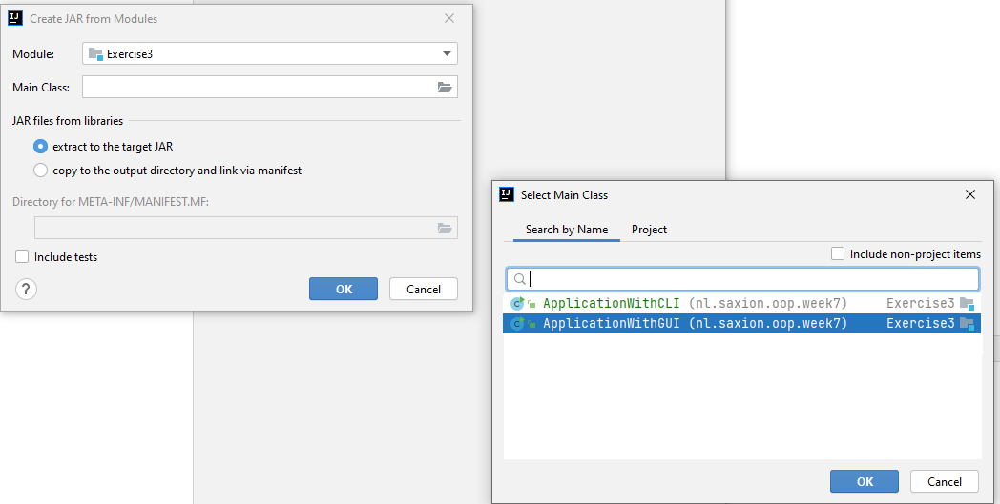
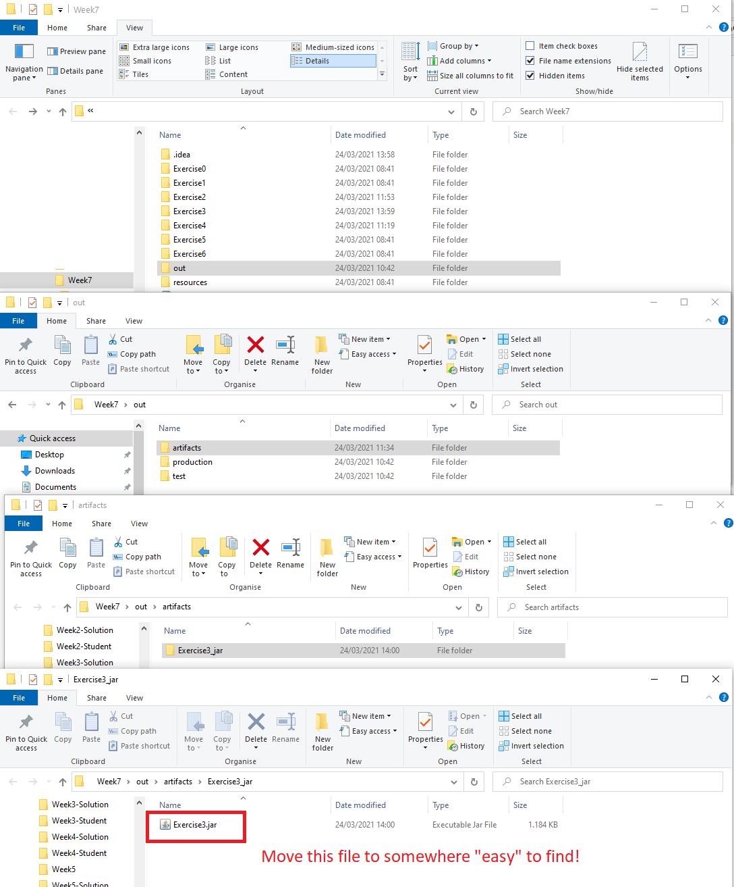
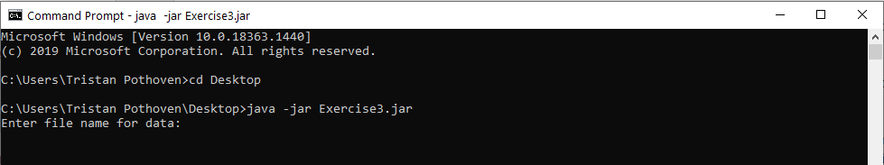

# Programma's runnen zonder IntelliJ
## Moeilijkheid:    
## (of   , als je wat minder handig bent met de commandline!)

Aangezien we redelijk aan het eind van de module zijn, is het tijd dat jullie zien "hoe het programma" dat je net gemaakt
hebt eigenlijk buiten IntelliJ te gebruiken is. Afhankelijk van het soort programma dat je hebt geschreven kan het starten
buiten IntelliJ iets verschillen, maar over het algemeen zal het op eenzelfde manier uitgevoerd moeten worden. In deze
opdracht nemen we je, stap-voor-stap, mee in het _configureren van het uiteindelijke gebouwde product_, het daadwerkelijk
_bouwen van je applicatie naar een uitvoerbare versie_ en sluiten we af met het daadwerkelijk _starten van de applicatie
buiten IntelliJ_.

Om een programma te kunnen runnen buiten IntelliJ hebben we uiteraard eerst een programma nodig. Daarom zul je eerst een
kleine (1-ster) programmeeropdracht moeten doen.

## De programmeeropdracht
Schrijf een applicatie waarin je zelf een `UserManager` klasse implementeert, die op basis van een gegeven CSV-bestand
met gebruikers voor al deze personen een account aanmaakt en de mensen de mogelijkheid biedt om in te loggen
op het systeem. (Beschouw de opdracht dus eigenlijk als een "inlogscherm".)

Voor elk persoon in het CSV-bestand moet een gebruikersaccount instantie worden aangemaakt met de volgende gegevens: de 
achternaam van de persoon wordt de gebruikersnaam in kleine letters. (Dus "O. Mendoza" uit het CSV-bestand krijgt "mendoza" als 
gebruikersnaam.) Het wachtwoord van deze gebruiker wordt automatisch aangemaakt door de eerste 3 letters van de straatnaam 
te pakken, ook weer in kleine letters. ("O. Mendoza" woont op de "Livingstonestraat", dus zijn wachtwoord wordt "liv").

Wij hebben twee versies van de `Application` klasse aangeboden, zodat je je geen zorgen hoeft te maken over de interface. De 
ene versie maakt gebruikt van de SaxionApp, de ander alleen van Java's eigen manier van printen. Functioneel doen beide 
versies precies hetzelfde, maar voor het exporteren naar "complete programma's" is het fijn om beide versies te zien.

De `FileNotFoundException` wordt opzettelijk in de `Application` klasse afgehandeld. Het programma heeft namelijk geen
enkele zin als het inlezen van data niet is gelukt (en mag dus crashen als het bestand niet gevonden kan worden).

## Het exporteren van de applicatie
Als IntelliJ normaal gesproken jouw code gaat uitvoeren gebruikt het de Java-compiler om ieder _.java_-bestand
om te zetten naar een (binaire code) _.class_-bestand. Kijk maar eens in de "out" map die naast alle exercise mappen staan 
van de voorgaande weken. Deze map (en alle mappen daaronder) bevat eigenlijk een kopie van alle "src" mappen van iedere 
Exercise map; alleen waar in de oorspronkelijke _src_-mappen _.java_-bestanden staan, staan in de corresponderende 
_out_-mappen _.class_-bestanden.

Wanneer je nu jouw programma wilt uitvoeren (buiten de IntelliJ om) op een andere computer, dan is het niet handig om die 
gehele mapstructuur te moeten kopiëren. Daarom is het _JAR_(kort voor: "Java ARchive")-bestand uitgevonden; eigenlijk niets 
meer dan een zipje van al deze _.class_-bestanden. Zo hebben wij de SaxionApp bijvoorbeeld altijd als _.jar_-bestand 
aangeboden in al jullie projecten. 

Kijk maar eens in de "resources" map binnen je IntelliJ project! Je kunt deze _SaxionApp.jar_ dan ook gewoon openen met je 
favoriete zip-archive tool (zoals 7-Zip of WinZip). Je kunt ook het bestand hernoemen naar _SaxionApp.zip_,
zodat je het in de Windows Verkenner of de Finder van Mac gewoon kunt openen en zie: die mapstructuur met de _.class_-bestanden 
erin is nog steeds aanwezig! (Vergeet dan niet deze na afloop weer terug te hernoemen!!).

IntelliJ kan eenvoudig van je gehele project een _.jar_-bestand maken. Hier moet je wel even wat voor configureren en
dat gaan we je nu laten zien. Lees eerst de gehele instructie een keer door en voer dan, stap voor stap, deze configuratie
door.

We gaan de volgende 3 stappen zetten:
* Configureren van het project, zodat een _.jar_-bestand aangemaakt wordt als _artifact_.
* Het daadwerkelijk bouwen van dit _artifact_.
* Het starten van onze applicatie met het _.jar_-bestand.

(Let op: het woord _artifact_ is gewoon een moeilijke benaming van een "bouwresultaat". We gaan onze code tot een werkende
applicatie "bouwen" en daar komt een _.jar_-bestand uit. Dit _.jar_-bestand wordt daarom ook wel _artifact_ genoemd.)

### Het configureren van het project
Om het project te configureren moet je eerst de "module settings" pagina voor dit project openen in IntelliJ. Dit
kun je door met je rechtermuisknop te klikken op "Exercise3" in het overzicht van projecten:

Op deze pagina worden alle instellingen van dit gehele project getoond. Omdat wij een _artifact_ willen toevoegen,
moet je naar het "Artifacts" subscherm navigeren en klik je vervolgens op het plusje boven in het scherm en selecteer je 
vervolgens "JAR" --> "From modules with dependencies".

In het scherm dat je nu ziet moet je aangeven welke module (in dit geval "Exercise3") er precies tot een artifact
gebouwd moet worden en hoe je geacht wordt deze module te starten. Oftewel: je moet de klasse aanwijzen waarin de
main-methode staat die je wilt gebruiken als je de artifact start. (Je programma mag best meerdere main-methoden hebben,
maar als je de artifact bouwt moet je er 1 kiezen die standaard wordt gebruikt!)

**Wij raden je aan om eerst "ApplicationWithGUI" te selecteren. ApplicationWithCLI komt later!**

Verder mag je de instellingen laten staan zoals ze staan. Je zult zien dat, zodra je op "OK" klikt, er in je project een 
extra mapje verschijnt genaamd "META-INF". Hier staat de zogenaamde _meta informatie_ van het te bouwen artifact. Dit
klinkt echter veel ingewikkelder dan dat het is: het bestand "MANIFEST.MF" dat daarin staat is gewoon een tekstbestand 
waarin de naam van de klasse staat met de main-methode die je zojuist hebt geselecteerd. Kijk zelf maar!

Het bestand is echter wel nodig om het artifact te kunnen bouwen. Het is een verplicht onderdeel van elk _.jar_-bestand.

**Als je straks je applicatie opnieuw wilt bouwen, maar dan met ApplicationWithCLI, dan kun je dat het beste direct
aanpassen in dit tekstbestand. Dit hoef je echter nu nog niet te doen!**

De configuratie is nu klaar! Tijd om de artifact te gaan bouwen!

## Het bouwen van het project (naar een _.jar_-bestand)

Nu de configuratie goed staat is het bouwen eenvoudig. Klik in het menu bovenin IntelliJ op "Build" --> "Build Artifacts"
en selecteer dan in het popup-schermpje "Exercise3" en bevestig door weer op "build" te klikken.

Je project wordt nu omgezet naar een _.jar_-bestand, dat je vervolgens naar iedereen kunt versturen die gebruik gaat
maken van jouw applicatie! We moeten alleen nog even vinden waar dit _.jar_-bestand precies staat.

IntelliJ maakt in elk project dat je opent een mapje "out" (alleen is deze niet zichtbaar in IntelliJ zelf, dus gebruik 
hiervoor je bestandsnavigator (Verkenner/ Finder enz.)). Je vindt "Exercise3.jar" in een submap van "out" onder 
"artifacts/Excercise3_jar":

**Tip: Zoals het plaatje al laat zien, kopieer / verplaats "Exercise3.jar" even naar een plek waar je er makkelijker bij 
kunt! Bijv. je bureaublad.**

## Het runnen van je eigen applicatie
Als je "Exercise3.jar" hebt gemaakt met als main-class: `ApplicationWithGUI` dan is deze te starten door hierop te 
dubbelklikken vanuit je bestandsnavigator. Als je Java installatie goed is gegaan werkt dit correct (op de 
meeste besturingssystemen die ons bekend zijn)!

Wanneer je echter "Exercise3.jar" hebt gemaakt dat gebruikt maakt van de _command line_ (dus met als main-class: 
`ApplicationWithGUI`), dan moet je de applicatie ook vanaf de commandoregel (terminal, commandprompt) starten. Bij deze 
laten we zien hoe dit moet, gebruikmakend van Windows:

Gefeliciteerd! Je hebt nu echt voor het eerst een applicatie ontwikkeld en echt klaargemaakt om te "publiceren"!

## Mocht je vast komen te zitten...
De opdracht hierboven gaat ervan uit dat je de Java configuratie op je laptop goed hebt staan. Mocht je nou ergens
tegen een foutje aanlopen, laat deze opdracht dan liggen tot in de workshop. Je docent kijkt graag even met je mee wat
hier precies mis gaat! Het is voor ons niet te doen om in deze opdrachtbeschrijving "alle" mogelijke problemen te 
benoemen. Eventueel kun je natuurlijk ook zelf even Google induiken om te kijken wat je hier kan doen!